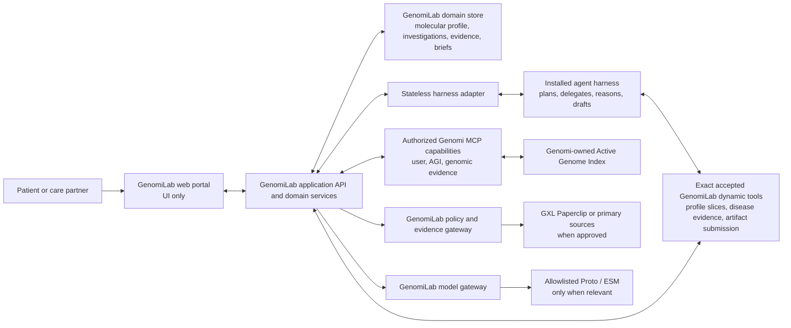

# GenomiLab Overall System Requirements

- **Status:** goal-ready normative system specification
- **Requirements snapshot:** 2026-08-12
- **Supersedes:** the earlier GenomiLab product definition and its developer-preview assumptions
- **Normative terms:** **SHALL**, **SHALL NOT**, **SHOULD**, and **MAY** have their usual requirements meanings

## 0. Goal objective

Build **GenomiLab**, an open-source, patient-facing personal research lab that
investigates disease in the context of the current Genomi user's longitudinal
**Patient Molecular Profile**: their existing Genomi-managed genome, reviewed
phenotypes and health history, reported molecular and pathology findings,
measurements, specimens and assays. GenomiLab SHALL investigate that patient
context against current scientific evidence, which belongs in each
investigation's evidence ledger rather than in the Patient Molecular Profile.

GenomiLab SHALL be a real application and domain system, not merely a UI. It
SHALL provide the molecular-profile, disease-investigation, evidence-ledger,
hypothesis/gap, policy, versioned-brief, and collaboration functionality that
neither base Genomi nor a general agent harness provides. Only the **GenomiLab
web portal** is presentation-only.

The installed harness SHALL own question decomposition, dynamic planning,
agent delegation, tool choice, execution, scientific reasoning, and synthesis
drafts. The GenomiLab domain layer SHALL provide the durable patient-research
objects and typed scientific capabilities the harness reasons over, validate
and commit its artifacts, and retain the investigation independently of any one
harness task. Genomi SHALL remain authoritative for current user identity,
genome intake, the Active Genome Index (AGI), AGI reads/grants, genome-derived
primitive evidence, libraries/jobs, and canonical Genomi evidence envelopes.

The completed system SHALL give one patient an enduring **Research Desk** and
Patient Molecular Profile with many resumable disease investigations over one
reusable, local AGI. It SHALL use **GXL Paperclip** through GenomiLab's evidence
gateway whenever an investigation needs evidence within Paperclip's scope and
the request passes the contractual, privacy, consent, and source-quality gates
in this specification. It SHALL use **Proto** and **Biohub ESM** only for the
narrow analytical or experimental tasks for which those systems are suited,
never as generic patient-interpretation or treatment engines.

The system succeeds when a nontechnical patient can ask or resume a question,
understand what the agents are doing, inspect source-linked evidence and gaps,
and prepare useful questions for a qualified professional without creating a
second patient profile, uploading their genome again, learning genomic file
formats, or interacting with agent/tool internals.

## 1. Product definition

### 1.1 One-paragraph blurb

GenomiLab is an open-source personal research lab that builds a longitudinal,
source-linked molecular profile for the current Genomi user and helps
investigate how that profile relates to disease. It combines reviewed health,
laboratory, molecular, pathology, specimen and assay observations with targeted
reads from the user's existing Genomi Active Genome Index and current public
evidence. The installed agent harness plans and reasons; GenomiLab supplies the
domain capabilities, persists the evidence and investigation, tracks hypotheses
and gaps, and produces versioned patient and clinician views. It supports
research and professional collaboration; it does not diagnose, validate a
laboratory test, or decide treatment.

### 1.2 Product promise

> Help me investigate a disease against my molecular profile, understand which
> personal observations and public evidence support or contradict possible
> mechanisms, see what has not been measured or confirmed, and prepare the best
> next questions for qualified professionals.

The universal output is an **Investigation Brief**. A candidate molecular
mechanism appears only when the evidence supports that shape. “Molecular
driver” SHALL NOT be promised as a routine output from a germline genome and
health history.

### 1.3 Non-negotiable decisions

| Decision | Requirement |
| --- | --- |
| Patient identity | The patient is the **current Genomi user**. GenomiLab SHALL NOT create a parallel patient, profile, or case identity. |
| Genome lifecycle | A genome is supplied to Genomi once and represented by a Genomi-owned AGI. GenomiLab SHALL NOT request a VCF or other genome upload per investigation. |
| Molecular profile | GenomiLab SHALL own one longitudinal Patient Molecular Profile aggregate keyed exclusively to Genomi `user_id`. It is scientific context, not a second identity, and references rather than copies the AGI. |
| Investigation model | GenomiLab SHALL own the durable disease investigation and its versions. One investigation MAY bind to multiple harness tasks/runs over time and pins exact molecular-profile and AGI snapshots. |
| Portal role | The **GenomiLab web portal** is UI. It SHALL NOT directly access domain storage, the harness, Genomi, providers, files, or contain its own planner, tool selector, reasoning engine, or synthesizer. |
| GenomiLab domain role | GenomiLab SHALL own patient molecular observations, approved context/profile snapshots, disease investigations, evidence ledgers, hypothesis/gap registers, brief/review versions, consent/egress policy, provider mediation, and collaboration records. |
| Harness role | The installed harness owns conversation/run state, dynamic planning, agents/subagents, capability choice, reasoning, synthesis drafts, and execution traces. It SHALL NOT be the sole durable owner of the patient research record. |
| Genomi role | Genomi owns current-user and AGI state, genome intake and readiness, AGI reads/grants, genome-derived primitive evidence, genomics capabilities, public libraries, background jobs, and canonical Genomi evidence envelopes. |
| Paperclip role | GXL Paperclip is a first-class, preferred public-evidence provider when it covers the evidence need and its use is allowed. It is not the orchestrator, source of clinical truth, or sole evidence path. |
| Proto/ESM role | Proto and ESM are conditional scientific-computation tools. They SHALL be invoked only after a concrete task demonstrates why the model or design framework is relevant. |
| Clinical boundary | Agents produce research observations, candidate hypotheses, gaps, and professional questions. Qualified clinicians and laboratories own clinical confirmation, diagnosis, and treatment decisions. |
| Omanta relationship | GenomiLab borrows the continuity, depth, evidence organization, gap analysis, and collaboration pattern of a “research lab for one.” It SHALL NOT claim parity with a human scientific or clinical service unless independently demonstrated. |

### 1.4 Explicit non-goals

GenomiLab is not:

- a cosmetic portal around Genomi or a general chat harness;
- a second genome uploader or genome repository;
- a replacement agent harness;
- a fixed medical workflow encoded in the portal;
- an autonomous diagnostic, tumor-board, prescribing, or treatment-selection
  system;
- a clinical laboratory or a substitute for validated pathology, sequencing,
  or other biomarker testing;
- a system that converts a no-hit, unavailable source, uncertain variant, model
  prediction, or sparse genome region into a clinical negative;
- a single flattened “molecular driver,” pathogenicity, actionability, or
  treatment score over heterogeneous evidence;
- a patient-facing protein, antibody, vector, CRISPR, or therapeutic sequence
  generator; or
- a claim that all computation is local when the selected harness, model, or
  evidence provider uses a hosted service.

## 2. Users and jobs to be done

### 2.1 Primary user

The primary user is an adult patient investigator who:

- has a complex, rare, undiagnosed, strongly heritable, medication-related, or
  molecularly characterized condition;
- is already represented by a local Genomi user and may have a ready AGI;
- has health information distributed across memory, reports, patient portals,
  and medication lists;
- is motivated to investigate but is not expected to understand VCFs, genome
  builds, HPO IDs, model names, MCP, or agent architecture;
- wants traceable research and a better professional conversation, not a
  black-box diagnosis; and
- values control over genomic and health information.

The primary job is:

> Turn my genome, relevant health history, and the scientific record into a
> defensible set of observations, hypotheses, gaps, and questions that I can
> understand and take to the right professional.

### 2.2 Secondary users

- A caregiver or family member acting under explicit, recorded authority.
- A genetics-literate patient who wants full technical provenance.
- A clinician, genetic counselor, pathologist, pharmacist, or molecular tumor
  board member reviewing a patient-selected packet.
- A researcher receiving an explicitly separated, nonclinical experimental
  handoff.

### 2.3 Initial product wedge

The first complete patient lane SHOULD answer:

> Could an existing reported genetic finding or candidate help explain this
> condition, what evidence supports or contradicts it, and what remains to be
> confirmed?

Pharmacogenomics, common-disease/polygenic risk, oncology/somatic analysis, and
experimental sequence design are separate lanes with different prerequisites
and safety contracts. They SHALL NOT be hidden behind one generic “health
risk” workflow.

## 3. System ownership and architecture

### 3.1 Component ownership

| Component | Owns | SHALL NOT own |
| --- | --- | --- |
| **GenomiLab web portal** | Navigation, forms, accessible presentation, collection of user decisions, progress rendering, molecular-profile exploration, and brief/review views | Domain records, authorization, direct harness/Genomi/provider/filesystem access, agent orchestration, tool selection, scientific synthesis, or clinical decisions |
| **GenomiLab application/domain services** | Research Desk; Patient Molecular Profile; health facts and reported findings; source artifacts, specimens and assays; approved context/profile snapshots; canonical disease investigations; harness-task/run bindings; evidence ledger; hypothesis/gap register; brief/review versions; consent, egress, collaboration, export/deletion receipts; and public-evidence/model gateways | Raw genome/AGI storage or reads, a fallback LLM/agent loop, dynamic question routing, dynamic tool/agent selection, unsupported clinical confirmation, or treatment decisions |
| **GenomiLab domain store** | Durable versioned domain objects keyed to canonical Genomi `user_id`, including investigation artifacts and policy receipts | Raw genome sources, AGI databases/paths/rows, provider credentials in records, or hidden agent traces |
| **Stateless harness adapter** | Host discovery, capability negotiation, GenomiLab-to-task transport, typed event streaming/replay, and ephemeral correlations/cursors | Canonical investigations, durable mappings or artifacts, authorization, reasoning, duplicate patient/genome state, or evidence policy |
| **Installed agent harness** | Task/run/conversation state, dynamic planning, agent/subagent coordination, capability and tool invocation, scientific reasoning, synthesis drafts, checkpoints, internal messages, and execution traces | Canonical patient identity/profile, canonical investigation/ledger/brief records, Genomi AGI implementation, GenomiLab policy, or direct unapproved provider access |
| **Genomi** | Current user; user-to-genome relationship; source intake; AGI lifecycle, immutable AGI revisions, reader and grants; genome-derived primitive evidence; genomics capabilities; libraries; background jobs; and original Genomi evidence envelopes | Patient Molecular Profile, longitudinal health history, disease investigations, hypotheses, briefs, collaboration, or whole-question routing |
| **External evidence/model providers** | Their declared public corpus, source records, or model outputs | Patient identity, authorization, durable canonical memory, final synthesis, clinical validation, or treatment decisions |

The Patient Molecular Profile SHALL be a GenomiLab domain aggregate keyed to
the Genomi `user_id`; it SHALL NOT create an independently selectable identity.
The harness receives approved immutable profile slices and writes proposed
domain artifacts through GenomiLab capabilities. It does not receive direct
write access to the domain store.

### 3.2 Required topology



### 3.3 Architecture requirements

- **ARCH-001:** GenomiLab SHALL comprise its application/domain services,
  domain store, web portal, policy/evidence gateways, and adapter to the harness
  in which Genomi is installed. It SHALL NOT silently start an unrelated
  embedded agent.
- **ARCH-002:** The portal SHALL call only the GenomiLab application API. The
  domain layer SHALL bind approved work to the harness and expose committed
  events and artifacts back to the portal.
- **ARCH-003:** Question classification, plan construction, agent delegation,
  dynamic tool selection, and scientific synthesis SHALL be absent from portal
  and GenomiLab domain business logic. The domain MAY validate required
  artifact structure, provenance, consent, and safety invariants.
- **ARCH-004:** Genomi SHALL remain authoritative for current `user_id`, AGI
  identity, readiness, selection, and access state.
- **ARCH-005:** The bridge SHALL use host adapters and capability negotiation;
  it SHALL NOT claim a host feature that the installed harness cannot provide.
- **ARCH-006:** A supported-host adapter SHALL be replaceable without changing
  Genomi's capability contracts or the patient-facing information architecture.
- **ARCH-007:** GenomiLab domain services SHALL be authoritative for Patient
  Molecular Profile and disease-investigation records. No durable patient or
  investigation state SHALL live solely in a browser or harness task.
- **ARCH-008:** The portal SHALL display whether the harness and each invoked
  provider execute locally or remotely. “Local-first” SHALL describe the actual
  data path, not the location of the UI.
- **ARCH-009:** The harness adapter SHALL be stateless apart from ephemeral
  transport state. Rebuilding it SHALL recover canonical mappings and artifacts
  from GenomiLab, execution state from the harness, and genome state from
  Genomi.
- **ARCH-010:** The harness and ordinary investigation portal SHALL have no
  provider credentials or direct provider route. A dedicated same-origin,
  loopback-only setup form MAY transiently collect a credential solely to hand
  it to the GenomiLab application for immediate OS-credential-store insertion;
  the browser SHALL neither retain nor use it, and every response SHALL be
  redacted. External evidence/model calls SHALL still traverse a GenomiLab
  gateway that enforces deployment policy, consent, egress, provenance, and
  result normalization.
- **ARCH-011:** GenomiLab domain capabilities SHALL be exposed to every
  supported installed harness through typed host-compatible tools and focused
  guidance. Switching harness adapters SHALL not change the molecular-profile,
  evidence, investigation or brief contracts.
- **ARCH-012:** Planning and execution SHALL be separate harness-owned tasks.
  The planning task is tool-free. Accepting its exact plan SHALL only persist
  acceptance. A separately previewed and approved execution-task disclosure
  SHALL bind the exact plan version/hash, request IDs, profile snapshot, consent,
  user, investigation and workspace session; only that execution task may invoke
  those requests. GenomiLab SHALL NOT execute an accepted plan through a domain
  bulk loop or a portal-initiated capability endpoint.

## 4. Canonical data model

### 4.1 Core objects

| Object | Owner | Canonical identity and purpose |
| --- | --- | --- |
| Current Genomi user | Genomi | `user_id`; the only patient identity whose workspace is open |
| Active Genome Index | Genomi | `agi_id`; logical genome/index identity associated with a user |
| AGI snapshot | Genomi | `agi_snapshot_id`; immutable AGI revision containing source/content and artifact hashes, build, schema, readiness, and creation time |
| Research workspace | GenomiLab | One patient-research workspace keyed one-to-one to `user_id`; not a separate identity |
| Patient Molecular Profile | GenomiLab | Longitudinal aggregate of typed, source-linked patient observations and modality coverage keyed to `user_id`; references but does not copy AGI data |
| Molecular observation revision | GenomiLab | `observation_revision_id`; immutable reviewed or review-pending phenotype, measurement, reported finding, pathology/molecular result, medication/exposure, or specimen/assay fact |
| Source artifact | GenomiLab | `artifact_id`; local report/document reference, hash, source metadata, and precise locator without promoting extracted text to fact |
| Specimen and assay | GenomiLab | `specimen_id` and `assay_id`; subject/site/time, tumor-normal relationship, lab/platform/pipeline, scope, QC and detection limits |
| Molecular Profile Snapshot | GenomiLab | `patient_molecular_snapshot_id`; immutable, approved, purpose-scoped manifest of exact observation revisions, artifact/specimen/assay references, modality coverage, consent receipt, and optional exact `agi_id`/`agi_snapshot_id` |
| Disease investigation | GenomiLab | `investigation_id`; canonical question, disease scope, status, pinned profile/evidence/brief versions, and 0..N harness task/run bindings |
| Harness task/run | Harness | `task_id` and `run_id`; execution, conversation, plan, agents, reasoning, checkpoints and drafts for an investigation |
| Evidence record | GenomiLab | Immutable ledger record that references/snapshots Genomi or provider results, preserves source/version/scope/limitations, and embeds the original Genomi envelope unchanged when applicable |
| Disease-mechanism relation | GenomiLab | Typed local record linking one public, non-model source prior to the exact pinned patient observation revisions and disease scope, with relation kind/direction, source-reported strength, population/tissue/specimen context, conflicts and uncertainty |
| Hypothesis and gap | GenomiLab | Versioned candidate mechanism or unresolved evidence need linked to exact patient observations, supporting/counterevidence, uncertainty and confirmation requirements |
| Brief version | GenomiLab | Immutable accepted synthesis drafted by the harness and committed only after provenance, policy and safety validation; later updates create a new version and change summary |
| Review packet | GenomiLab | Patient-selected brief content, citations, questions and disclosure receipt for a named recipient or review room |

```text
Genomi user 1 ─── 0..N AGIs
AGI 1 ─── 1..N immutable AGI snapshots
Genomi user 1 ─── 1 GenomiLab research workspace
Research workspace 1 ─── 1 Patient Molecular Profile
Patient Molecular Profile 1 ─── 0..N observation revisions
Patient Molecular Profile 1 ─── 0..N immutable profile snapshots
Research workspace 1 ─── 0..N disease investigations
Disease investigation 1 ─── 1 pinned patient_molecular_snapshot_id
Disease investigation 1 ─── 0..N harness tasks/runs
Disease investigation 1 ─── 0..N evidence, hypothesis, gap and brief versions
```

There is no parallel patient identity, selectable patient/case profile,
investigation-owned genome, or `profile_id -> agi_id` assignment. The required
Patient Molecular Profile is a scientific aggregate addressed only by the
canonical Genomi `user_id`; deleting it SHALL NOT implicitly delete the Genomi
user or AGI.

### 4.2 Patient Molecular Profile

The Patient Molecular Profile SHALL contain patient observations, not public
literature, agent notes, unaccepted mechanism hypotheses, model-inferred
diagnoses, or treatment recommendations. A professionally issued conclusion MAY
be recorded as an attributed source observation.

Every observation SHALL declare a modality and whether it applies to the
patient generally or to an exact `specimen_id`. Supported modality contracts
SHALL include:

- **Germline genome context:** only `agi_id`, `agi_snapshot_id`, build,
  readiness and QC references—never reader-returned findings, a copied VCF,
  bulk variant table, source path, AGI row, or full sequence. Targeted Genomi
  reader results belong once in the investigation evidence ledger.
- **Phenotype and clinical context:** symptoms/HPO terms, diagnoses as reported,
  onset/course, family history/pedigree assertions, medications, exposures,
  procedures, and outcomes.
- **Quantitative measurements:** routine labs and biomarkers with values,
  units, reference intervals, method and collection time.
- **Issued molecular/pathology records:** exact reported germline or somatic
  variants, CNV/SV/fusion, expression/protein biomarkers, cytogenetics,
  pathology and staging assertions, with their assay scope and limitations.
  “The report states X” is distinct from validating X.
- **Specimen and assay context:** specimen type/site/time/disease state,
  tumor-normal relationship, accession, laboratory, platform, pipeline,
  reference build, coverage, limit of detection, QC and validation/accreditation
  metadata.
- **Future raw/derived multi-omics:** tumor genomics, RNA
  expression/splicing/fusions, proteomics/phosphoproteomics, metabolomics,
  epigenomics/methylation, HLA and immune data through separate modality-owned
  stores/readers and grants—not the germline AGI.

Modality coverage SHALL distinguish `observed`,
`explicitly_not_detected_within_declared_assay_scope`, `not_measured`,
`not_provided`, `unavailable`, and `out_of_scope`. Missing profile data SHALL
never appear as a biological negative.

Each observation revision SHALL minimally preserve:

- type and normalized code/term when available;
- the patient's original wording;
- value, units, present/absent/unknown status, onset/event time, and recorded
  time as applicable;
- source class/author, source identifier or local artifact hash, and exact
  page/table/field locator when applicable;
- assertion author: patient, caregiver, clinician, imported record, or model;
- subject/specimen and assay identifiers, units/reference range, method,
  genome build/transcript and QC where applicable;
- extraction/import/normalization software and versions;
- verification state: unreviewed, user-confirmed, record-confirmed, or
  clinician-confirmed, independently of evidence modality and clinical stage;
- supersession/reconciliation links instead of destructive overwrite;
- approved investigation uses and disclosure history; and
- provenance for any normalization or extraction.

`record-confirmed` means the normalized observation faithfully matches its
source record; it does not validate the underlying diagnosis, assay,
pathogenicity or actionability. Model/document extraction MAY create a review
candidate. It SHALL NOT create an accepted diagnosis, medication, pathology
stage, or clinically confirmed finding without the required human/provenance
step. A patient confirmation cannot promote a result to clinically confirmed,
and an explicit negative requires declared assay scope and detection limits.

### 4.3 Molecular Profile Snapshots

A `patient_molecular_snapshot_id` SHALL be an immutable manifest containing:

- `user_id`, creation time and manifest hash;
- exact observation revision IDs;
- source-artifact, specimen and assay references;
- modality coverage;
- exact `agi_id` and `agi_snapshot_id` when germline context is included;
- declared purpose and investigation scope; and
- the consent receipt authorizing the selected private slices.

It is a reproducible view, not an identity, authorization token, diagnosis, or
flattened feature vector. Possession of its ID grants nothing. Before approval,
GenomiLab MAY assemble a mutable candidate selection from the current profile
state, but it SHALL NOT silently default that candidate to the whole current
profile. For a first context or refresh, the patient SHALL explicitly select a
non-empty set of current observation revisions in the portal; renewal preserves
the exact pinned selection. That selection is not a snapshot and authorizes no read. A snapshot
is minted only after its purpose, investigation scope, exact contents and
consent receipt are approved. Updating a fact, adding a report or making a
newer AGI revision available marks affected candidate selections or refresh
offers as changed; it SHALL NOT automatically mint a purpose-scoped snapshot
or alter an existing investigation. A changed scope or explicit refresh
requires a new approval and snapshot. Old investigations remain reproducible,
and comparison or rerun is explicit.

### 4.4 Investigation invariants

- A GenomiLab investigation belongs to exactly one canonical `user_id` and
  exactly one pinned `patient_molecular_snapshot_id` per committed context
  version.
- A harness task/run is an execution binding, not the canonical investigation.
  Replacing or losing it SHALL NOT delete the investigation, ledger or briefs.
- Personal genome evidence and every AGI-reading invocation SHALL bind to the
  exact `agi_id` and immutable `agi_snapshot_id` used.
- When a pinned Molecular Profile Snapshot includes germline context, the
  investigation's AGI revision SHALL equal the `agi_id` and `agi_snapshot_id`
  in that snapshot. The investigation SHALL NOT independently select a second
  AGI revision.
- Targeted AGI reader results SHALL be committed once as investigation evidence
  records with their original Genomi provenance and envelope. They SHALL NOT be
  copied into the Patient Molecular Profile or its pinned snapshot.
- Changing the current AGI SHALL NOT silently alter an existing investigation.
- Reparsing or rebuilding the same logical AGI SHALL create a new
  `agi_snapshot_id`; it SHALL NOT mutate the revision used by an old
  investigation.
- A refresh SHALL create a new evidence snapshot and brief version; it SHALL NOT
  rewrite history.
- Every accepted hypothesis SHALL link to exact patient observation revisions
  and exact supporting/counterevidence records. No personal overlap, association
  or model output alone may promote answer-readiness.
- Deleting or revoking one investigation SHALL NOT delete the user's AGI.
- Deleting a genome or user SHALL route through explicit Genomi operations,
  with impact preview for dependent investigations.

## 5. User experience and information architecture

### 5.1 Research Desk

The home screen SHALL show:

- the current Genomi user;
- active AGI, genome build, readiness, and current access state;
- Patient Molecular Profile coverage, latest reviewed changes, and material
  gaps for active investigations;
- a prominent **Ask or continue** input;
- active and recent investigations;
- new evidence, completed briefs, and items needing attention;
- pending approvals or questions from agents; and
- upcoming clinician or review-room activity.

The primary action SHALL be **Ask or continue**, never **Upload a genome**.

### 5.2 Primary navigation

1. **Research Desk** — questions, updates, active investigations, and attention
   items.
2. **Investigations** — brief, plan/progress, evidence ledger, unresolved
   questions, review room, and version history for each task.
3. **My Molecular Profile** — reviewed health/phenotype observations, labs,
   reports/findings, specimens/assays, modality coverage, version history, and
   the Genomi-owned genome panel with **Manage genome in Genomi**.
4. **Evidence Library** — reusable citations and source records, separated by
   source family and version.
5. **Collaborate** — selective clinician/genetic-counselor/tumor-board packets,
   questions, decisions, and follow-up items.
6. **Privacy & Activity** — AGI grants, provider disclosures, access history,
   exports, revocation, and owner-routed deletion.

### 5.3 End-to-end walkthrough

1. **Open the Research Desk.** The GenomiLab application resolves the current
   Genomi user, opens that user's molecular-profile aggregate, reads
   non-sensitive AGI metadata from Genomi, and attaches its stateless adapter to
   the installed harness. The portal does not ask the patient to create another
   identity.
2. **Resolve genome readiness once.** If no query-ready AGI exists, the portal
   presents a Genomi-managed setup handoff and Genomi job progress. Intake is a
   user-level action, not part of an investigation.
3. **Ask or resume.** The patient enters a natural-language disease question or
   opens an existing investigation. GenomiLab creates/resumes the canonical
   investigation and asks the patient to select the current profile observations
   needed for this question; it does not create another patient, default to the
   whole profile, or ask for another genome upload.
4. **Approve scoped profile access.** GenomiLab records approval for the exact
   molecular observation revisions, mints the purpose-scoped Molecular Profile
   Snapshot, and compiles the versioned investigation context. Genomi separately
   enforces a matching exact-AGI authorization bound to that investigation,
   snapshot and consent receipt. The snapshot pins what this investigation may
   use.
5. **Review and accept a tool-free plan.** In a separately approved harness
   planning task, the installed harness proposes the questions it will pursue,
   specialist agents, exact typed capability requests, potential outbound
   destinations, and material missing information. Accepting the plan records
   acceptance of that exact version and hash; it does not execute capabilities.
6. **Approve harness-owned execution.** The portal previews a fresh harness-task
   disclosure bound to the accepted plan, profile snapshot, consent receipt,
   current user, investigation and session. Only after the patient approves that
   exact payload does the adapter create the execution task and expose the exact
   accepted capability requests as tools. GenomiLab has no alternate bulk
   executor for the plan.
7. **Investigate the disease against the profile.** The harness invokes only the
   exact accepted GenomiLab dynamic tools. At that domain boundary, GenomiLab
   validates each call and, when required, performs an authorized targeted
   Genomi capability through Genomi MCP to relate phenotype, measurements,
   reported molecular findings, targeted AGI observations, tissues/pathways,
   functional evidence, literature, trials and regulatory evidence. GenomiLab
   commits source-separated evidence, hypotheses and gaps. A provider request
   that needs separate egress approval pauses at a reviewable disclosure; the
   portal may approve only that recorded continuation, never initiate an
   unrequested capability. The harness has no direct unrestricted Genomi or AGI
   route.
8. **Follow work.** The portal renders completed, running, waiting, blocked,
   in-scope-empty, out-of-scope, and source-unavailable states without exposing
   raw agent chatter by default.
9. **Inspect the living brief.** The patient sees observations, possible meaning,
   support, counterevidence, uncertainties, what not to conclude, confirmation
   needs, and professional questions. Technical detail is one level deeper.
10. **Collaborate (P1).** Once the collaboration capability is enabled, the
   patient selects what to share and prepares a concise review packet.
   Professional decisions are attributed to the professional, not the agents.
   P0 exposes this action as unavailable rather than simulating delivery.
11. **Continue over time.** Follow-ups stay in the same investigation. New
   evidence creates a dated change summary. New questions can create separate
   investigations over the same AGI.
12. **Handle a new profile or genome version.** Existing investigations retain
   their pinned Molecular Profile and AGI snapshots. GenomiLab offers an
   explicit profile diff and compare/rerun action rather than silently changing
   the evidence basis.

## 6. Functional requirements

### 6.1 GenomiLab application, portal and harness contracts

The portal SHALL call only a versioned GenomiLab application API. It SHALL
expose operations equivalent to:

- `bootstrap_workspace`
- `read_molecular_profile`
- `add_profile_observation`
- `review_or_supersede_observation`
- `create_or_compare_profile_snapshot`
- `list_investigations`
- `create_investigation`
- `resume_investigation`
- `send_investigation_message`
- `approve_private_context`
- `approve_outbound_disclosure`
- `revoke_private_context`
- `close_workspace_session`
- `refresh_investigation`
- `cancel_background_work`
- `list_research_tool_connections`
- `connect_or_replace_research_tool_credentials`
- `verify_research_tool_connection`
- `disconnect_research_tool`
- `prepare_review_packet` *(P1; P0 returns typed `capability_unavailable`)*

The GenomiLab domain service SHALL persist the canonical command result and
domain event before exposing it to the portal. Direct portal access to harness,
Genomi, providers, domain-store tables or the filesystem is prohibited.

Research-tool setup SHALL be global to the local installation/OS user rather
than copied into a patient profile or investigation. It SHALL use a fixed
provider allowlist and fixed provider endpoints; it SHALL accept no caller URL,
command, model name, tool name, or executable operation. Credential records
SHALL be complete, atomically replaced, stored only in the OS credential store,
and absent from the GenomiLab domain database, browser storage, harness
messages, environment, URLs, logs, errors, and API responses. Connection
listing SHALL be network-free. Only an explicit verify action MAY make one of
the fixed connection probes below:

- Paperclip SHALL use a fixed, public, non-patient search and SHALL be labeled
  before invocation as potentially using API credits.
- Biohub ESM MAY call the exact pinned JSON `/api/v1/encode` route with
  GenomiLab's fixed synthetic 20-residue amino-acid alphabet and compare the
  response with the exact pinned token sequence. Redirects, alternate response
  shapes other than the top-level payload or the pinned SDK's exact
  `{"data": <payload>}` Next.js wrapper, caller sequences, patient-derived
  sequences, and binary/pickle model responses are prohibited. The action SHALL
  be labeled as potentially using API credits and SHALL enable no scientific
  operation.
- Proto MAY use the pinned Modal client with only the credentials supplied from
  the OS credential store to authenticate and confirm the exact saved Modal
  environment. The check SHALL run in a disposable isolated child process with
  a fixed official Modal endpoint, a nonexistent temporary Modal configuration
  path, no inherited Modal, proxy, custom-CA, or credential environment, and a
  hard 15-second total timeout that terminates the child. Credentials SHALL be
  passed only through the child's private standard input. It SHALL NOT import
  the Proto catalog, create an environment, discover arbitrary tools, deploy,
  start, or execute a Proto operation, and SHALL enable no scientific
  operation.

Saving any provider credential SHALL NOT run a network or compute probe.
Credential presence and validity SHALL be displayed separately from deployment,
contract, patient-data, task-validation, expert-mode, and per-request disclosure
eligibility. No setup route SHALL perform user-directed scientific research or
use patient data. Credits or an ambiently importable SDK/runtime alone SHALL NOT
establish operation readiness. ESM and Proto scientific operations remain
unavailable until their P3 gates are met.

For a ready Paperclip connection, the portal SHALL display the exact eligible
`source_family -> operations` routes and the purposes shared by deployment and
patient-data policy. It SHALL NOT flatten a restricted route into a generic
operation or use static copy that implies unapproved literature, regulatory, or
trial coverage. Reconciliation or any non-ready state SHALL advertise no route
or purpose.

The internal stateless harness adapter SHALL implement a separate versioned,
host-neutral protocol with operations equivalent to `start_task_run`,
`resume_task_run`, `send_task_message`, `cancel_task_work`, and
`replace_task_binding`. Every command SHALL carry `protocol_version`,
`workspace_session_id`, globally unique `command_id`, applicable `user_id`,
GenomiLab `investigation_id`, harness `task_id`/`run_id` when assigned, an
expected domain/task revision when mutating state, and a typed payload.
`command_id` SHALL be the idempotency key. Responses SHALL return the
accepted/current revision and a typed result or typed error; stale expected
revisions SHALL fail as conflicts rather than overwrite newer state.

The adapter SHALL transport harness events equivalent to:

- `plan_proposed`
- `approval_required`
- `agent_started`
- `agent_progress`
- `evidence_returned`
- `source_unavailable`
- `job_in_progress`
- `needs_user_input`
- `brief_completed`
- `brief_updated`
- `cancelled`
- `failed`

Every harness event SHALL include `protocol_version`, globally unique `event_id`,
`workspace_session_id`, host/task identity, `investigation_id`, `user_id`, a
monotonic per-investigation sequence/cursor, correlation ID, optional job ID,
status, timestamp, safe transport payload, and proposed artifact references.
GenomiLab SHALL validate and commit accepted events/artifacts, assign their
domain versions, and emit separate safe portal events. The harness protocol
SHALL support replay from a cursor, deduplication by `event_id`,
and an explicit snapshot-required response when the replay window has expired.
Cancellation SHALL report `cancelled`, `already_completed`, `not_cancellable`,
or `failed`; it SHALL never imply that an external job stopped unless confirmed.
Genomi results SHALL retain their original `evidence_envelope`; neither adapter
nor GenomiLab SHALL reinterpret an empty or blocked state.

The negotiated capability manifest SHALL minimally declare supported protocol
versions; task create/resume; event streaming and replay; artifact kinds;
background-job attach/cancel behavior; approved-context delivery; and
workspace-session persistence. GenomiLab's separate capability manifest SHALL
declare domain, collaboration, evidence-provider and model availability. An
operation scheduled for a later phase SHALL return a typed
`capability_unavailable` result until enabled. The conformance suite SHALL run
the same state, idempotency, ordering, replay, conflict, cancellation, and error
cases against every host adapter.

### 6.2 Genomi user and AGI requirements

- **GEN-001:** Startup SHALL resolve the current Genomi user. No portal-created
  substitute is allowed.
- **GEN-002:** The portal MAY display AGI identity/readiness metadata without
  reading AGI records.
- **GEN-003:** Genome source selection, upload/path intake, parsing, assignment,
  readiness, reparse, selection, and deletion SHALL use existing or extended
  Genomi lifecycle operations.
- **GEN-004:** Investigation forms and APIs SHALL NOT accept a VCF, gVCF, BAM,
  FASTQ, consumer genotype file, genome bundle, or genome source path.
- **GEN-005:** Multiple investigations SHALL reuse a ready AGI without another
  parse.
- **GEN-006:** All AGI reads SHALL pass through the AGI reader boundary and an
  explicit valid Genomi-enforced grant bound to the immutable
  `agi_snapshot_id`.
- **GEN-007:** Genomi SHALL own and enforce an AGI access authorization keyed by
  `workspace_session_id`, `user_id`, `investigation_id`,
  `patient_molecular_snapshot_id`, GenomiLab consent-receipt ID, `agi_id`,
  `agi_snapshot_id`, purpose, and declared genomic data scope. Every private
  Genomi call SHALL present a Genomi-validated authorization for that exact
  tuple. A grant SHALL NOT authorize another investigation, snapshot, purpose,
  task outside the session, user, AGI revision, expanded scope, or outbound
  disclosure.
- **GEN-008:** A host that cannot safely carry the exact investigation-bound
  authorization across a replacement task binding SHALL request approval again
  rather than simulate reuse.
- **GEN-009:** Long-running parse and evidence work SHALL resume by job ID and
  SHALL NOT be duplicated.
- **GEN-010:** GenomiLab SHALL own and enforce molecular-profile/context
  approvals scoped to an `investigation_id`, exact observation revisions,
  purpose, duration and an immutable manifest. The harness receives the
  approved snapshot through narrow GenomiLab reads, not unrestricted store
  access.
- **GEN-011:** The portal collects an approval decision through the GenomiLab
  API; GenomiLab records/enforces it and requests a matching Genomi grant when
  AGI access is included. Neither the portal, adapter nor harness may mint,
  widen, or persist an authorization independently.
- **GEN-012:** GenomiLab SHALL own outbound approvals and disclosure receipts
  keyed to exact provider, destination, purpose and payload manifest, subject to
  the independent deployment contract policy. Changing any of them requires a
  new decision. The harness chooses a useful evidence capability but has no
  provider credentials or bypass route.
- **GEN-013:** A browser reconnect while the workspace session remains alive
  MAY resume its event cursor and valid grant. A full harness/app restart MAY
  restore tasks and jobs, but the prior AGI grant is revoked; further private
  reads wait for renewed approval.
- **GEN-014:** Local Genomi capabilities MAY be invoked through Genomi MCP only
  with the authorization in GEN-007. Any Genomi capability that would send a
  patient-influenced query or payload to a network source SHALL additionally
  cross the GenomiLab outbound-egress gateway and satisfy its provider policy
  and disclosure receipt; a direct harness-to-Genomi network path is
  prohibited.

### 6.3 GenomiLab molecular-profile and disease-investigation capabilities

GenomiLab SHALL expose typed domain capabilities to the harness. These
capabilities structure and retrieve declared data; they SHALL NOT contain an
embedded agent loop, infer user intent, dynamically select other tools, or
return a universal “interpret this profile” answer.

Required capability groups are:

1. **Molecular Profile service** — create, review, supersede and read typed
   observations; manage source artifacts, specimens, assays and modality
   coverage; create and compare immutable profile snapshots.
2. **Investigation Context Compiler** — bind the original question, disease
   scope, exact profile snapshot, exact AGI revision, approvals and policy into
   a versioned harness task specification.
3. **Investigation Profile Projector** — derive the disease-relevant projection
   of approved observations from the pinned snapshot, including coverage and
   missing-data states. It MAY link to targeted Genomi reader results already
   committed in the evidence ledger, but SHALL NOT insert those results into
   the Patient Molecular Profile or snapshot or duplicate their domain record.
4. **Disease-mechanism evidence capabilities** — retrieve typed, cited,
   source-specific relations among patient anchors, phenotype, disease, variant,
   transcript/protein consequence, inheritance/segregation, gene, tissue/cell
   expression, eQTL/sQTL, pathway, perturbation/screen, protein function,
   biomarker, drug target, regulatory status and trial evidence.
5. **Evidence ledger** — commit immutable source-separated records, source
   versions, defaults, conflicts, corrections/retractions, coverage and typed
   unavailable/empty/out-of-scope states.
6. **Hypothesis and gap register** — store harness-proposed candidate mechanisms,
   counterevidence, uncertainty, status, missing measurements and confirmation
   requirements as versioned domain artifacts.
7. **Brief/version service** — validate that every harness draft claim is linked
   to ledger evidence and the pinned profile snapshot, then commit immutable
   brief versions and refresh diffs. Validation MAY reject or request repair of
   a malformed draft; it SHALL NOT replace the harness's scientific reasoning
   with hidden GenomiLab synthesis.
8. **Policy and collaboration services** — enforce private-context use,
   provider egress and sharing; create review packets, professional attribution,
   access/disclosure history and owner-routed export/deletion receipts.

Each disease-mechanism evidence result SHALL preserve patient-observation
anchors, source family/prior, direction, source-supplied quality/strength,
population/tissue/specimen context, date/version, consulted coverage, conflicts,
negative-inference limits and the canonical evidence envelope. These functions
are substantive GenomiLab functionality beyond base Genomi and the harness.
The harness decides which functions are relevant and performs cross-source
reasoning; GenomiLab enforces the domain and evidence contracts.

The public evidence provider SHALL receive only the approved biomedical query;
it SHALL NOT receive profile revisions, profile-snapshot identifiers, AGI
identifiers, patient specimen identifiers or genotype data. GenomiLab SHALL
create the patient-specific relation locally after public evidence is committed.
A candidate mechanism and a candidate-hypothesis brief claim SHALL cite at
least one supportive, non-personal, non-model typed relation whose disease
scope and patient-observation anchor set exactly match the cited claim. A
personal-genome overlap, model result, generic public document, wrong-disease
relation, refuting relation or union of partial relations SHALL NOT pass this
gate.

#### Investigation requirements

- **INV-001:** Every new question SHALL create or deliberately continue a
  canonical GenomiLab investigation and bind a harness task/run. The portal
  SHALL not execute a fixed tool call as a substitute.
- **INV-002:** The original patient wording SHALL be retained beside normalized
  entities and search terms.
- **INV-003:** The harness SHALL propose a visible, editable plan before broad
  private-data or external-provider use.
- **INV-004:** The plan SHALL use the smallest relevant capability first and add
  orthogonal evidence when needed.
- **INV-005:** Source priors SHALL remain separate. ClinVar, gene–disease,
  phenotype, GWAS, functional, pathway, pharmacogenomic, literature, trial,
  regulatory, and model evidence SHALL NOT collapse into one universal score.
- **INV-006:** Agent notes, proposed hypotheses and accepted hypotheses SHALL
  remain distinct from source evidence and from one another.
- **INV-007:** Resuming the portal SHALL load the canonical GenomiLab
  investigation and resume or replace its harness binding and active jobs rather
  than replaying completed work. Harness loss SHALL not lose domain artifacts.
- **INV-008:** The patient SHALL be able to stop work, answer a request, revise
  scope, refresh evidence, or branch a separate question without losing the
  prior record.

### 6.4 Molecular Profile Snapshot and genome boundary requirements

- **MOL-001:** GenomiLab SHALL key its molecular-profile aggregate only by the
  current Genomi `user_id`; no independent profile selector or identity is
  allowed.
- **MOL-002:** Profile schemas and persistence SHALL reject genome source files,
  paths, AGI database paths, bulk AGI rows and full patient-derived sequences.
- **MOL-003:** Every genome-derived evidence record SHALL originate from a
  Genomi reader result under a valid exact-snapshot grant and retain its AGI
  query, coverage and evidence-envelope provenance. Reader results SHALL reside
  once in the investigation evidence ledger, not in the Patient Molecular
  Profile.
- **MOL-004:** The harness SHALL receive only the approved profile slice and
  minimal targeted genome evidence required for the investigation, never direct
  domain-store or AGI access.
- **MOL-005:** Updating/reviewing a fact or making a new AGI revision available
  SHALL mark affected candidate selections or refresh offers as changed. It
  SHALL create a new profile snapshot only after explicit purpose, scope and
  consent approval, and SHALL NOT change the evidence basis of an existing
  investigation.
- **MOL-006:** A revoked profile-context receipt or Genomi grant SHALL block
  subsequent reads without deleting the pinned historical manifest.
- **MOL-007:** A disease investigation SHALL be able to use the same AGI
  revision as another investigation while selecting a different subset of
  health/molecular observations and producing a different profile snapshot.
- **MOL-008:** Explicit negative molecular observations require declared assay
  scope, coverage and detection limits; `not_measured`, `not_provided`,
  `unavailable` and `out_of_scope` cannot be converted to absence.
- **MOL-009:** If germline context is included, an investigation and its pinned
  profile snapshot SHALL name the same `agi_id` and `agi_snapshot_id`. A
  mismatch SHALL fail validation rather than create an implicit second genome
  context.

### 6.5 Evidence and GXL Paperclip requirements

GXL Paperclip SHALL be implemented as a first-class provider behind GenomiLab's
provider-neutral public-evidence gateway. When Paperclip is installed,
authorized, covers the requested source family, and passes the gates below, the
harness SHOULD select the GenomiLab public-evidence capability and the gateway
SHALL prefer Paperclip for the typed source-operation routes that the installed
transport actually declares. The initial transport covers literature search
and lookup plus regulatory and trial search. UniProt, PDB, ChEMBL, full-text,
figure, and claim-verification routes remain unavailable until separately typed
and validated. Direct primary-source adapters SHALL remain available for
validation, gaps, and provider failure.

An appropriate Paperclip use is one in which:

1. the task is public scientific evidence retrieval, document inspection,
   figure inspection, source collection, or textual-support checking;
2. the necessary source type is within Paperclip's declared coverage;
3. the proposed query and any document sent are permitted under the active
   privacy, consent, contract, and egress policy;
4. provider output can be traced back to an original source; and
5. the harness—not Paperclip—will judge relevance, reconcile other evidence,
   and synthesize the brief.

While the patient-data gate is closed, Paperclip SHALL NOT receive any query,
document, entity, paraphrase, or derived term influenced by an AGI, Personal
Molecular Profile, patient report, or private investigation. This prohibition does
not depend on whether a developer believes the payload is identifiable.

As of this requirements snapshot, GXL's standard public terms do not by
themselves authorize the required product-development, commercial integration,
local retention, transformation, display, export, or third-party sharing. Live
Paperclip use—including public or synthetic development/evaluation use—SHALL
therefore fail closed unless GenomiLab has written GXL authorization or a
documented legal determination covering that exact use. Without that approval,
the adapter SHALL be developed and tested with contract fixtures/mocks and
direct-primary-source paths, and the live provider SHALL remain disabled.

Patient-facing use requires a separately approved agreement that expressly
authorizes automated API integration; permitted data classes and purposes;
commercial use; local caching and audit retention; normalized/derivative
records; patient and clinician display; report export and third-party sharing;
and portability. It SHALL also include an appropriate DPA and processing role,
contractual no-training/no-secondary-use terms, retention/deletion including
backups, subprocessors and international transfers, security and incident
notification, service expectations, and a BAA where applicable. These provider
rights do not override copyright or license restrictions on an underlying
paper, figure, database, or regulatory document.

Two independent gates SHALL pass before any future patient-derived request:

1. a deployment-owner-controlled, fail-closed contract policy for the exact
   provider, feature, data classes, purposes, and terms; and
2. just-in-time patient approval of the exact provider, payload/query, purpose,
   data categories, destination, and disclosed retention/training state.

The receipt SHALL record the contract, privacy-notice, and acceptable-use-policy
versions. Patient consent SHALL NOT override a missing organizational contract.
Expiry, revocation, or a material provider-policy change SHALL automatically
close the gate until it is reviewed; any expansion of provider, payload,
purpose, data class, or policy requires renewed approval.

The Paperclip adapter SHALL:

- expose only typed, allowlisted operations. The initial live transport SHALL
  expose structured `search` and `lookup`; read/extract, figure inspection, and
  claim verification SHALL remain unavailable until each has exact typed input,
  original-source provenance, license-aware retention, and bounded result
  handling;
- exclude arbitrary remote shell, generic `execute`, and equivalent escape
  hatches from every production capability surface. Developer experiments, if
  retained, require a separate sandbox and credential;
- receive credentials explicitly from the approved secret store and SHALL NOT
  fall back to a user's saved `~/.paperclip` credentials;
- distinguish full text, abstract-only, preprint, peer-reviewed publication,
  regulatory document, trial registry, and structured database record;
- retain DOI/PMID/PMCID/registry/database identifiers, original URL, source
  type, title, version/publication date, retrieval time, query terms, filters,
  consulted coverage, misses, and failures;
- retain exact supporting spans or figure references when available;
- default durable storage and display to source identifiers, metadata, links,
  and short excerpts permitted by the original source license. Full text and
  figures SHALL NOT be persisted or redistributed unless that source's license
  expressly permits it;
- record Paperclip search/result/repository/commit/model metadata as process
  provenance, never as the only durable source identity;
- treat `map`, `reduce`, figure answers, and claim-verification commits as
  model-assisted extraction/checking rather than independent scientific
  replication;
- validate consequential patient-visible claims against the current original
  source record and retain index/retrieval date, license, corrections,
  retractions, superseded regulatory versions, trial-record changes,
  preprint-to-publication transitions, and conflicts;
- normalize provider results into the GenomiLab evidence ledger and the
  canonical evidence-envelope shape while preserving provider/source
  provenance;
- treat retrieved documents as untrusted content that cannot change system
  instructions, consent, tools, or agent permissions;
- return typed authentication, quota, rate-limit, timeout, network, server,
  unavailable-source, and not-found states; and
- be removable without losing the local investigation, citations, or brief.

A trial-registry entry SHALL NOT be presented as a trial result. A Paperclip
no-hit SHALL describe only Paperclip's successfully consulted scope and SHALL
NOT imply absence from the wider literature.

Paperclip's documented source and repo capabilities are described in the
[official documentation](https://paperclip.gxl.ai/docs). Its current public
[terms](https://gxl.ai/terms-of-service/) and
[privacy notice](https://gxl.ai/privacy-notice/) are the basis for the shipping
gate above. The Apache-2.0 client license does not grant rights to the hosted
corpus, service, or output.

### 6.6 Investigation Brief and evidence presentation

Every brief SHALL present, in this order:

1. the question and scope;
2. what was observed;
3. what the observations could mean;
4. supporting evidence and counterevidence by source family;
5. conflicts, missing evidence, untested assumptions, and unavailable sources;
6. what the patient should not conclude;
7. clinical or laboratory confirmation needed;
8. questions for the next professional conversation; and
9. evidence currency and change history.

Every answer-shaped claim SHALL link to its evidence record. The UI SHALL
preserve Genomi's distinctions among `data_returned`, `in_scope_empty`,
`out_of_scope_for_input`, blocked/missing library, source unavailable, and work
in progress. No-hit or unavailable evidence SHALL NOT appear as a broad
negative.

Patient-visible statements SHALL be labeled as exactly one of:

1. **Research observation**
2. **Candidate hypothesis**
3. **Clinically confirmed result**
4. **Clinical decision**

Agents may create stages 1 and 2. Stage 3 requires appropriate authenticated
clinical/laboratory provenance. Stage 4 belongs to clinical care and may only
be recorded with attribution.

Evidence-origin and modality badges—such as **personal genome**, **public
source**, **reported record**, or **computational model prediction**—are an
orthogonal axis, not a fifth stage and not a replacement for Genomi's
`evidence_envelope`. A raw model output is a research observation with a model
badge; any interpretation of it is a candidate hypothesis with that same badge.
A model badge SHALL NOT promote answer-readiness or clinical stage by itself.

### 6.7 Collaboration requirements

The following are P1 requirements. Until the collaboration capability is
enabled, P0 SHALL advertise it as unavailable and SHALL NOT create, deliver or
claim to revoke a review packet.

- The patient SHALL preview and select every fact included in a review packet.
- A packet SHALL include a short front section, technical appendix, citations,
  unresolved questions, and confirmation requests.
- The system SHALL record recipient, contents, time, method, and revocation or
  supersession state in a disclosure receipt.
- “AI-generated; not clinically reviewed” SHALL remain visible unless an
  identifiable professional completed a recorded review.
- Agents SHALL NOT use titles or personas that imply medical or scientific
  credentials they do not possess.
- A professional review room MAY record decisions, tasks, and sign-off, but the
  AI SHALL NOT impersonate a molecular tumor board or mark its own output as
  professional review.

### 6.8 Oncology and molecular-tumor lane

GenomiLab MAY support the following workflow, with these exact boundaries:

| Need | Supported software function | Required human/laboratory function |
| --- | --- | --- |
| Pathology, stage, and standard options | Import or record source documents, reconcile stated facts, retrieve dated guideline/regulatory literature, identify conflicts, and draft questions | Pathologist/oncologist confirms pathology and stage and determines applicable standard care |
| Tumor profiling | Record and interpret outputs from validated tumor testing; track missing modalities and tissue/specimen metadata | Accredited laboratory orders/performs/validates tumor panel, tumor/normal WGS, RNA, CNV/SV, or other assays |
| Molecular tumor board | Prepare a source-linked case packet, evidence categories, uncertainty, and questions; host a review room | Qualified board reviews the actual case and owns conclusions |
| Result categories | Draft evidence into approved-treatment evidence, potential off-label evidence, trial possibilities, hereditary implications, and currently non-actionable findings, each dated and jurisdiction/source-qualified | Clinician confirms applicability, contraindications, treatment, and trial eligibility |
| Personalized immunotherapy investigation | Identify why HLA, RNA, protein, pathology, and immune-function evidence may be missing; record validated results; perform separately validated research analyses | Specialists select tests, validate biomarkers, assess feasibility/safety, and make treatment decisions |

The germline AGI SHALL NOT be treated as a tumor genome. A production oncology
lane requires separate somatic, tumor/normal, RNA, protein, pathology, specimen,
HLA, and assay-quality contracts. Software can confirm that a report says a
fact; it cannot clinically confirm the underlying pathology, stage, or assay.

### 6.9 Proto and Biohub ESM requirements

The system SHALL use these tools only when the task passes the following
fitness test:

| Task | Appropriate system | Requirement |
| --- | --- | --- |
| Public literature, trials, regulatory or protein/drug records | GXL Paperclip | Use when source, contract, and disclosure gates pass |
| Personal genome observation and established genetics evidence | Genomi | Use Genomi capabilities and AGI reader |
| Analytical representation or predicted-structure artifact for an exact, already established candidate protein/isoform | Local ESMC or ESMFold2 | Optional model-prediction modality; an interpretation requires a named downstream readout and exact-task validation |
| Generation or optimization of DNA/RNA/protein sequences for a defined experimental program | Proto, optionally with ESM models | Separate expert/researcher mode only |
| Diagnosis, pathogenicity classification, treatment choice, dose, or trial eligibility | None of Proto/ESM | Qualified clinical process required |

#### ESM

- ESMC or ESMFold2 MAY be invoked only to refine a concrete mechanistic question
  already grounded by source evidence and tied to an exact protein
  sequence/isoform. It SHALL NOT be invoked merely because source evidence is
  missing.
- An ESMC embedding, distance, logit, or generic head is an analytical artifact,
  not a biological conclusion. Any patient-facing interpretation requires a
  named downstream estimator/readout validated for that exact endpoint;
  otherwise the system SHALL return the artifact without answer-shaped prose.
- Patient-derived sequence inference SHALL run locally with network access
  disabled. Under this requirements snapshot there is no hosted patient-data
  exception and no silent cloud fallback. A future hosted path requires a
  revised specification plus an appropriate DPA, explicit no-training and
  no-service-improvement terms, retention/deletion and backup commitments,
  subprocessors, incident terms, jurisdiction/security review, and explicit
  destination consent.
- Model code, weights, and dependencies SHALL be installed through Genomi's
  library manager with user-approved disk, GPU, network, time, and license
  preview; exact revisions and checksums are required. No model adapter may
  silently download weights, create an unmanaged cache, enable telemetry, or
  fall back to hosted inference.
- Each result SHALL preserve a reference and hash for the encrypted local input
  sequence artifact, model and weight revision, code revision, settings, seed,
  hardware/runtime, output artifact hash, citations, license, and limitations.
  It SHALL NOT duplicate a full patient-derived sequence in result cards, logs,
  or caches.
- pLDDT, pTM, ipTM, embedding distance, logits, and similar values SHALL be
  presented as model metrics, not clinical probabilities.
- ESM results SHALL be labeled **computational model prediction** and SHALL NOT
  establish causality, pathogenicity, actionability, druggability, safety,
  efficacy, or treatment response.
- An ESM result SHALL NOT raise answer-readiness without orthogonal source or
  experimental evidence.
- Before patient display, the exact downstream task SHALL have a predeclared
  endpoint, held-out or time-split public/synthetic benchmark, baseline
  comparator, reproducibility tolerance, calibration and out-of-distribution
  criteria, failure thresholds, and independent review. Validation on a
  different task does not transfer.
- Generative ESM3 and inverse-folding, binder, or antibody design SHALL remain
  in the separate P3 expert/researcher mode.

#### Proto

- The default patient workspace SHALL NOT expose a general Proto design
  surface.
- The system SHALL NOT integrate the entire Proto/proto-tools catalog as a
  trusted capability. It MAY wrap a specific allowlisted operation only after
  scope, license, data path, model provenance, validation, and failure behavior
  are reviewed. Every Proto or proto-tools operation—analytical or
  generative—belongs to P3 or a later explicitly approved phase.
- Proto's local stdio/MCP interface SHALL NOT be assumed to mean local compute.
  Patient-derived inputs require an explicitly local backend, networking
  disabled during inference, `deploy_tool` and `run_on=modal` unavailable, and
  an egress manifest for every dependency.
- Proto code, models, tools, caches, and dependencies SHALL use the Genomi
  library-manager lifecycle with explicit revision/checksum, disk/GPU/network,
  time, license, and egress preview. No independent `PROTO_HOME` or unmanaged
  patient-data cache is allowed.
- Full Proto sequence generation/optimization belongs to a separate expert
  research mode after a target, experimental objective, constraints, and
  validation plan are defined.
- Every design run requires compute/egress preview, qualified expert approval,
  biosafety screening, immutable provenance, and wet-lab validation.
- Generated designs SHALL remain separate from the patient's AGI, clinical
  findings, and clinician packet and SHALL NOT be presented as a treatment.

Proto's purpose and design primitives are documented by the
[official project](https://proto.evodesign.org/about) and its
[preprint](https://www.biorxiv.org/content/10.64898/2026.06.22.733870v1).
Biohub documents local ESM execution and model capabilities in the
[official ESM repository](https://github.com/Biohub/esm); its own
[limitations](https://biohub.ai/resources/limitations),
[terms](https://biohub.org/terms-of-use/), and
[privacy policy](https://biohub.org/privacy-policy/) govern hosted use.

## 7. Current Genomi support to retain

The current repository already provides the following foundations. The goal
SHALL reuse and extend them rather than build portal-specific substitutes.

| Area | Current Genomi support | GenomiLab use |
| --- | --- | --- |
| Host integration | MCP server, focused skills, tool discovery, and `genomi.invoke` | Keep the installed harness in control |
| Genome intake | VCF/gVCF, BAM, paired FASTQ, major consumer arrays, compressed/archive inputs, and `.genome/1.0` bundles | Use once through Genomi-managed setup |
| AGI | Local indexed genome, readiness, callability, exact allele/region queries, QC, lifecycle and background jobs | Shared personal-genome substrate across investigations; immutable `agi_snapshot_id` revision identity is new P0 work |
| User context | User nicknames, assignment/selection, default user, and explicit AGI access approval/revocation | Canonical patient identity and genome selection; extend rather than duplicate |
| Variant/clinical sources | Variant resolution, ClinVar matching, candidate scanning, gene and frequency context | Existing-finding and hereditary evidence streams |
| Phenotype/disease | HPO normalization/comparison, GenCC, Open Targets, trait/gene and risk-investigation operations | Condition and rare-disease streams |
| Pharmacogenomics | Medication review, ClinPGx/FDA/PGxDB, PharmCAT workflows and requirement reporting | Separate medication lane |
| PRS/ancestry | PGS search/calculation boundaries and 1000 Genomes reference-panel context | Optional, explicitly bounded common-disease context |
| GWAS/functional evidence | GWAS Catalog, perturbation screens, pathway, cell-type, and region grounding | Source-separated mechanism evidence |
| Sequence utilities | Deterministic sequence checks and translation | Supporting analysis, not design or clinical classification |
| Research memory | Target packets, source records, evidence-scoped journal and export | Retain original Genomi records and source-linked notes; GenomiLab owns the disease ledger/brief versions while harness agent notes remain non-evidence |
| Evidence envelope | Canonical answer-readiness, scope, observations, guidance, negative-inference rules, defaults and next actions | Required behind every Genomi-derived evidence card |
| Libraries/jobs | Managed public libraries, install states, source-unavailable states, and resumable jobs | Transparent dependency and progress UX |
| Dashboard components | Local visual panels and adapters | Reuse presentation patterns where appropriate, not the old portal workflow |

Current Genomi does **not** yet provide the GenomiLab Patient Molecular Profile,
disease-investigation dossier, source-artifact/specimen/assay contracts,
immutable `patient_molecular_snapshot_id`, hypothesis/gap register, versioned
brief/collaboration services, host-neutral application/harness contract, broad
verified-literature gateway, validated genome-wide clinical interpretation, or
full somatic/multi-omic oncology model. These are substantive GenomiLab
application capabilities to be developed, not responsibilities delegated to a
generic harness.

## 8. New development and migration requirements

### 8.1 P0 — architectural correction and vertical slice

1. Replace the legacy selectable GenomiLab patient/profile and per-profile
   genome-upload model with one GenomiLab research workspace and Patient
   Molecular Profile keyed exclusively to the current Genomi `user_id`.
2. Remove portal profile creation/selection and all per-investigation genome
   intake APIs/UI. Do not retain backward-compatible aliases or shims.
3. Implement the GenomiLab application/domain layer and store for molecular
   observations, source artifacts, specimen/assay context, profile snapshots,
   canonical investigations, evidence ledgers, hypothesis/gap registers, brief
   versions, approvals and receipts.
4. Implement reviewed phenotype/condition, family-history, medication and one
   existing reported germline-finding workflow, plus references to the existing
   Genomi AGI. Extraction remains review-pending until explicitly reviewed.
5. Add immutable `agi_snapshot_id` revisions in Genomi and immutable
   `patient_molecular_snapshot_id` manifests in GenomiLab; require every
   personal-genome invocation and investigation to name the exact revisions.
6. Implement typed profile operations for create, review, supersede, read
   approved slice, create snapshot and compare snapshots, with coverage and
   provenance contracts.
7. Define the GenomiLab application API, stateless harness-adapter protocol and
   domain capability tools; implement one real installed-harness adapter end to
   end and a conformance kit for other hosts.
8. Map one canonical GenomiLab investigation to 0..N replaceable harness
   tasks/runs and prove that domain artifacts survive harness loss.
9. Build the Research Desk, My Molecular Profile, investigation progress,
   source-separated evidence ledger, hypothesis/gap view and first versioned
   Investigation Brief.
10. Implement the first existing-finding/rare-condition disease investigation
    across a pinned molecular-profile/AGI snapshot using source-specific Genomi
    and GenomiLab mechanism-evidence capabilities.
11. Implement the GXL Paperclip provider adapter inside the GenomiLab evidence
   gateway and exercise its full contract
   with mocks/fixtures and direct-source fallbacks, including provenance,
   provider failures, licensing, and prompt-injection tests. Run a live public
   or synthetic evaluation only if the exact development use has written GXL
   authorization or a documented legal determination; otherwise prove the live
   provider is hard-disabled.
12. Add baseline application/portal/adapter security: loopback-only binding,
    workspace-session authentication, CSRF protection, path and user isolation,
    at-rest encryption with tested key handling, OS credential storage, explicit
    secret injection, and sensitive log/event redaction.
13. Add public/synthetic end-to-end evaluations for profile/AGI isolation,
    disease-investigation behavior, privacy, evidence fidelity,
    resumption, safe presentation semantics, and failure recovery.

### 8.2 P1 — patient MVP

- Add reviewed longitudinal entry/import for symptoms, routine labs/biomarkers,
  medications/exposures and issued genetic, molecular and pathology reports,
  including unresolved transcript/coding/protein HGVS, build and assay
  ambiguity.
- Add source-artifact preview/correction, conflicts/supersession, verification,
  modality coverage and profile/evidence change diffs.
- Support selective context approval, outbound disclosure preview, access
  history, export, deletion, and recovery.
- Add a GenomiLab deletion coordinator that inventories patient-data copies in
  the domain store, harness conversations/checkpoints/attachments, temporary
  and model artifacts, provider retention, exports and backups; previews
  dependencies; invokes each owner's deletion interface; leaves the separately
  controlled Genomi AGI untouched unless explicitly selected; and receipts
  deleted, retained-by-choice-or-law, pending and unreachable copies.
- Add clinician/genetic-counselor review packets and review rooms.
- Add refresh-on-demand and evidence/source change diffs.
- Add a second real harness adapter and pass the same conformance tests.
- Add signed local distribution, local-authentication recovery, backup/restore
  controls and independent security review.
- Validate accessibility and comprehension with representative nontechnical
  users.

### 8.3 P2 — additional clinical-research lanes

- FHIR/US Core and GA4GH Phenopacket import/export with mandatory fact review.
- Reviewed PDF/CSV extraction, caregiver/proxy workflows, and family context.
- Separate pharmacogenomics and calibrated common-disease/PRS workflows.
- A somatic/multi-omic oncology data model and research workflow that does not
  conflate tumor data with the germline AGI.
- Professional molecular tumor-board packet and sign-off workflow.
- Patient-facing GXL Paperclip use only after the shipping gate is satisfied.

### 8.4 P3 — mechanism and experimental lab

- Allowlisted, locally executed ESMC/ESMFold2 model-prediction streams after
  measurable exact-task validation.
- All Proto/proto-tools operations, including an explicitly separate expert
  research mode for defined sequence-design experiments with biosafety and
  wet-lab gates.
- Generative ESM3, inverse-folding, binder, and antibody design only inside the
  same expert/researcher boundary.
- Optional non-patient experimental handoff to a research data/lab platform.
- No Proto or ESM function graduates into the patient path merely because the
  integration runs; it must improve a validated task without weakening safety,
  privacy, or evidence fidelity.

## 9. Privacy, security, and clinical-safety requirements

- Raw genome sources and AGI storage SHALL remain local to Genomi.
- The portal, GenomiLab application, adapter, harness, Genomi, model provider,
  and evidence provider SHALL each declare their actual data path. Hosted
  harness/model processing is external processing and SHALL be disclosed as
  such.
- The harness SHALL receive only the minimum personal evidence needed for the
  active investigation through approved GenomiLab/Genomi capabilities; direct
  domain-store access, raw AGI export and full-history prompts are prohibited by
  default.
- Genome reads, molecular-profile reads, harness/model egress, Paperclip
  queries, other provider queries, sharing, monitoring, secondary findings, and
  research/model-improvement use SHALL have separable consent scopes.
- Secrets SHALL use the OS credential store or equivalent, never URLs, command
  arguments, browser storage, logs, reports, or evidence records.
- Personal data SHALL be encrypted at rest, protected by least-privilege file
  permissions, and excluded from telemetry by default.
- Every external disclosure SHALL be previewable and recorded.
- Every private Genomi invocation SHALL be authorized for the exact
  investigation, profile snapshot, consent receipt, AGI snapshot, purpose and
  scope. Network-backed Genomi work with patient-influenced input SHALL pass the
  same GenomiLab egress gate as any other provider call.
- The harness SHALL NOT bypass the GenomiLab policy/evidence/model gateways with
  its own network, shell, plugin, MCP, or ambient credential for a
  patient-influenced external request.
- Retrieved documents and uploaded reports SHALL be treated as untrusted data,
  not instructions.
- Secondary/incidental findings SHALL default off and require category-specific
  opt-in.
- A variant of uncertain significance SHALL NOT be presented as actionable.
- Medication and treatment content SHALL be informational and SHALL NOT tell a
  patient to start, stop, change, or dose a treatment.
- The interface SHALL retain an urgent-care route for symptoms that should not
  wait for research.
- Legal, privacy, and regulatory status SHALL be assessed function by function
  before public patient distribution; a disclaimer is not a substitute.
- Before P1 patient release, deletion SHALL be coordinated across every system
  that can retain a copy and report deleted, retained, pending and unreachable
  states; deletion of GenomiLab data SHALL NOT silently delete the Genomi user
  or AGI.

## 10. Non-functional requirements

| Area | Requirement |
| --- | --- |
| Accessibility | All primary workflows SHALL meet WCAG 2.2 AA and work with keyboard and screen reader. |
| Resilience | Long work SHALL be asynchronous, resumable, idempotent, and visibly cancellable. Provider or model failure SHALL preserve the investigation. |
| Auditability | Every claim SHALL be traceable to inputs, source records, versions, defaults, tools/models, and brief version. |
| Reproducibility | The system SHALL pin relevant library, provider-client, model, weight, and code revisions for material outputs. |
| Portability | The GenomiLab harness-adapter contract SHALL support multiple installed harnesses. Unsupported hosts SHALL receive an honest unsupported/read-only state, never a hidden embedded substitute. |
| Performance | The local portal SHALL remain interactive while agents, genome jobs, evidence retrieval, or models run. Progress SHALL stream without polling the entire workspace. |
| Data minimization | UI caches, events, logs, and notifications SHALL contain only the minimum safe display data. |
| Evolvability | New evidence or model systems SHALL enter through typed, scoped capabilities and SHALL NOT add whole-question routing or hidden reasoning to Genomi, GenomiLab domain services, or the portal. |
| Testing | Public and synthetic fixtures SHALL cover success, empty, blocked, unavailable, interrupted, privacy, and adversarial-content states. Private genome files SHALL not enter shared tests. |

## 11. Definition of done and acceptance criteria

The initial implementation goal is complete only when all P0 requirements and
all **P0** rows below pass. P1–P3 rows are future release gates; they become
part of the active goal only when that phase is explicitly brought into scope.

| ID | Phase | Acceptance criterion |
| --- | --- | --- |
| **AC-01** | P0 | Opening GenomiLab creates/opens exactly one Patient Molecular Profile aggregate keyed to Genomi's current `user_id`; there is no independent patient identity or profile selector. |
| **AC-02** | P0 | With no current Genomi user, private work is blocked and the UI offers Genomi-managed setup; it does not create a substitute identity. |
| **AC-03** | P0 | Portal network/call traces contain only GenomiLab application API calls. Profile/investigation schemas reject genome files, source/AGI paths and raw AGI rows; genome intake succeeds only through Genomi lifecycle operations. |
| **AC-04** | P0 | Genome intake uses Genomi's existing lifecycle and creates/selects a Genomi-owned AGI and immutable `agi_snapshot_id` independently of the profile and investigations; all AGI reads go through Genomi's reader under an exact grant. |
| **AC-05** | P0 | A Molecular Profile Snapshot is created only after purpose, investigation scope, exact contents and consent are approved; it round-trips to exact observation, artifact, specimen/assay and AGI revisions, coverage and consent receipt without containing raw genome data. Two investigations can reuse the same AGI revision with different approved profile snapshots and no reparse, and each investigation's AGI revision equals the revision in its pinned snapshot. |
| **AC-06** | P0 | Revising a profile observation or rebuilding the same logical AGI makes a changed candidate selection or refresh available but does not mint a snapshot without explicit approval; an approved refresh creates a new immutable snapshot, while existing investigations remain unchanged and compare/rerun is explicit. Extracted facts cannot self-verify, and explicit negative findings require assay scope and detection limits. |
| **AC-07** | P0 | GenomiLab receipts enforce exact profile slices and external payloads; every private Genomi call presents an independently validated authorization bound to workspace session, user, investigation, profile snapshot, consent receipt, AGI snapshot, purpose and scope. Revocation or expansion of any bound field, provider, destination or payload fails closed until reapproved, and network-backed Genomi work also crosses the GenomiLab egress gate. |
| **AC-08** | P0 | Creating an investigation creates one canonical GenomiLab `investigation_id` and at most one active harness-task binding per idempotent command. Browser reconnect resumes events; harness loss/replacement preserves the dossier, ledger and briefs and can resume through a new task, while a full restart pauses private reads pending renewed grants. |
| **AC-09** | P0 | Harness traces demonstrate tool-free dynamic planning, agent delegation, accepted-plan capability invocation and synthesis drafts. Plan acceptance causes no capability side effect; execution begins only in a separately approved harness execution task exposing the exact accepted requests. GenomiLab supplies/validates domain contracts but contains no fallback LLM, agent loop or plan bulk-execution path; the harness cannot directly mutate profile facts, consent, source evidence, clinical stage or committed brief history. |
| **AC-10** | P0 | At least one real harness adapter and a simulated second adapter pass the same factory-driven host-adapter conformance suite for manifest, identity, idempotency, revision conflict, event ordering/deduplication/replay, cancellation and typed failure behavior. |
| **AC-11** | P0 | With a synthetic user, reviewed phenotype/condition context, reported germline finding and AGI snapshot, one end-to-end disease investigation executed through the installed harness produces an approved pinned Molecular Profile Snapshot, targeted profile projection, source-separated evidence ledger containing each targeted Genomi result exactly once, hypothesis/gap register and versioned Investigation Brief. |
| **AC-12** | P0 | Every molecular-profile observation and brief/hypothesis claim resolves to immutable evidence and profile revisions; every Genomi record retains its original envelope and returned, empty, out-of-scope, blocked, unavailable and running states remain distinct. |
| **AC-13** | P0 | The Paperclip adapter passes its provider contract with fixtures/mocks, direct-source fallback, local evidence retention, and a verified hard-disabled live state. If the exact evaluation use is authorized, a representative live public/synthetic call must additionally retain provenance and survive provider loss; lack of that authorization does not fail P0. |
| **AC-14** | P0 | Call audits prove the portal and harness have no provider credentials/direct route and all provider traffic crosses the GenomiLab gateway. Data-flow tests prove no query, entity, paraphrase, document or derived term influenced by patient data reaches Paperclip while its patient gate is closed. |
| **AC-15** | P0 | Fixture tests prove that abstract-only, preprint, trial-registration, unavailable, no-hit, and model-verification states cannot independently become answer-ready clinical claims. |
| **AC-16** | P0 | Retrieved prompt-injection content cannot change consent, tools, agent policy, or system instructions; a static capability manifest exposes only typed allowlisted provider operations and no arbitrary shell/execute path or ambient credential fallback. |
| **AC-17** | P0 | A patient-workflow sequence-design request is refused or explicitly routed to unavailable expert mode, and any synthetic design artifact is ineligible for AGI ingestion, patient evidence, treatment content, or clinician export. |
| **AC-18** | P0 | ESM is disabled by default; the eligibility gate rejects ungrounded tasks and every remote patient-sequence path, and tests prove no Biohub API client can receive a patient-derived sequence. |
| **AC-19** | P0 | The brief preserves both axes: exactly one clinical stage and any applicable evidence-modality badges. Neither an uncertain variant nor model output can become actionable or raise answer-readiness by itself. |
| **AC-20** | P1 | A nontechnical participant can ask, follow, resume, inspect, and selectively export the supported investigation without knowing genomic file formats, identifiers, MCP, optional libraries, Paperclip, Proto, ESM, or the harness architecture. |
| **AC-21** | P1 | Keyboard-only and screen-reader testing passes the Research Desk, investigation, consent, evidence, and sharing workflows at WCAG 2.2 AA. |
| **AC-22** | P0 | Automated security tests cover loopback-only binding, workspace-session authentication, CSRF, cross-user/path/profile isolation, at-rest encryption and key handling, OS credential storage, explicit secret injection and log/event redaction; switching Genomi users exposes no prior user's profile, snapshots, investigations or artifacts. |
| **AC-23** | P1 | Future patient-provider use requires both a valid deployment contract policy and just-in-time payload approval; policy expiry/change closes access, consent cannot override a missing contract, and receipts pin the applicable contract/privacy/AUP versions. |
| **AC-24** | P1 | Every consequential provider-derived claim is rechecked against the current primary record with index/retrieval dates, source license, corrections/retractions, regulatory/trial versions, preprint-publication linkage, and conflicts retained. |
| **AC-25** | P1 | A patient can preview and selectively export/share or request deletion of GenomiLab-owned profile/investigation artifacts without deleting the Genomi user or AGI. The deletion coordinator inventories and routes deletion across the domain store, harness conversations/checkpoints/attachments, provider retention, temporary/model artifacts, exports and backups, and receipts deleted, retained-by-choice-or-law, pending and unreachable copies. Genome export/deletion uses separate explicit Genomi operations with dependent-investigation impact preview. |
| **AC-26** | P3 | An enabled ESM task has a predeclared endpoint, named readout, held-out/time-split benchmark, baseline, reproducibility tolerance, calibration/OOD/failure thresholds, and independent review; inference is local and provenance-complete, and a negative control proves it cannot create pathogenicity, actionability, or answer-readiness without orthogonal evidence. |
| **AC-27** | P3 | An enabled Proto/proto-tools task is allowlisted, Genomi-library-managed, local for patient-derived data, egress-tested, provenance-complete, expert-approved, biosafety-reviewed when generative, and segregated from the AGI, patient findings, treatment content, and clinician packet. |
| **AC-28** | P1 | Independent security tests additionally cover local-authentication recovery, coordinated deletion, backup/restore, disclosure controls, key recovery/rotation and cross-user isolation under realistic deployment. |

Patient-release gates beyond P0:

- at least 80% of representative participants complete the supported workflow
  without facilitator intervention;
- at least 90% correctly distinguish personal observation, public association,
  model prediction/hypothesis, and clinical confirmation;
- consequential misunderstandings trigger clarification before sharing;
- blinded professional review finds every front-section claim traceable and
  every material limitation retained; and
- independent security, privacy, accessibility, clinical-safety, and regulatory
  reviews are complete for the functions being released.

## 12. Goal execution sequence

1. Inspect and preserve the latest Genomi contracts and unrelated user changes.
2. Remove the superseded profile/upload/fixed-tool portal architecture without
   compatibility shims.
3. Freeze the GenomiLab domain objects, Patient Molecular Profile, snapshot,
   application API and harness-adapter contracts with positive behavioral tests.
4. Implement the GenomiLab domain/application layer and store over the current
   Genomi user and existing AGI, then put the Research Desk portal on that API.
5. Implement molecular observations, artifact/specimen/assay provenance,
   profile snapshots, canonical investigations, harness bindings, typed events,
   evidence ledgers, hypothesis/gap registers and versioned briefs.
6. Implement and test the first existing-finding disease investigation using a
   pinned Patient Molecular Profile, a tool-free installed-harness planning
   task, a separately approved installed-harness execution task, and exact
   Genomi/GenomiLab source-specific capabilities. The final vertical-slice test
   SHALL run through the real installed harness rather than substituting the
   simulated adapter or calling the capability executor directly.
7. Add GXL Paperclip through the GenomiLab evidence gateway as the preferred
   gated provider contract for covered public evidence, with primary-source
   normalization and fallback. Keep live calls disabled unless the exact use is
   authorized under Section 6.5.
8. Implement privacy, disclosure, provider mediation, prompt-injection,
   resumption, accessibility and patient-comprehension evaluations.
9. Run independent functionality reviews for molecular-profile behavior, AGI
   access, GenomiLab/harness ownership, evidence fidelity/Paperclip, patient
   isolation/security and UX.
10. Do not enable Proto, ESM, oncology, or other later scientific-operation
    lanes until their stated prerequisites and task-specific acceptance criteria
    are met. The fixed synthetic/connection-only checks in Section 6.1 do not
    enable those lanes.

## 13. External systems selected

| System | Decision |
| --- | --- |
| **GXL Paperclip** | Build inside GenomiLab's evidence gateway as the preferred, first-class public-evidence provider contract. Live public/synthetic development use is conditional on authorization for that exact use; patient-facing use has the additional contract and consent gates in Section 6.5. |
| **Proto / proto-tools** | Permit only an explicit-credential Modal account/environment check during onboarding; it runs no Proto tool. Use scientific operations only in P3 through a reviewed allowlist or a separate expert experimental-design mode. Not part of the default patient investigation. |
| **Biohub ESM** | Permit only the fixed synthetic JSON encode check during onboarding. Use local ESMC/ESMFold2 for a validated candidate-protein question in P3. Keep ESM3 and generative ESM/Proto design in expert mode. No hosted patient data under this specification. |
| **BenchFlow** | Suitable as development/evaluation infrastructure for agent trajectories, privacy, evidence correctness, recovery, and task completion using public/synthetic fixtures. It is not a patient feature. |
| **Benchling** | Not a patient-data dependency. Consider only a future, explicitly approved non-patient experimental handoff under suitable contractual terms. |
| **Omanta** | UX and service-model comparator only; no integration or unverified equivalence claim. |

## 14. Source basis

- [GXL Paperclip documentation](https://paperclip.gxl.ai/docs) and
  [official client repository](https://github.com/GXL-ai/paperclip)
- [GXL Terms of Service](https://gxl.ai/terms-of-service/) and
  [Privacy Notice](https://gxl.ai/privacy-notice/)
- [Proto overview](https://proto.evodesign.org/about),
  [documentation](https://proto.evodesign.org/docs/introduction),
  [MCP/backend documentation](https://proto.evodesign.org/docs/mcp/introduction),
  [language repository](https://github.com/evo-design/proto-language),
  [tools repository](https://github.com/evo-design/proto-tools), and
  [preprint](https://www.biorxiv.org/content/10.64898/2026.06.22.733870v1)
- [Biohub ESM repository](https://github.com/Biohub/esm),
  [ESMC model card](https://huggingface.co/biohub/ESMC-6B),
  [ESMFold2 model card](https://huggingface.co/biohub/ESMFold2),
  [limitations](https://biohub.ai/resources/limitations),
  [terms](https://biohub.org/terms-of-use/),
  [privacy policy](https://biohub.org/privacy-policy/), and
  [acceptable use policy](https://biohub.org/acceptable-use-policy/)
- [Omanta patient experience](https://omanta.com/) and
  [clinician workflow](https://omanta.com/clinicians.html)
- [BenchFlow repository](https://github.com/benchflow-ai/benchflow)
- Repository contracts in `AGENTS.md`, `SKILL.md`, `README.md`, Genomi tool
  catalogs, the AGI reader/access implementation, and evidence-envelope code.
