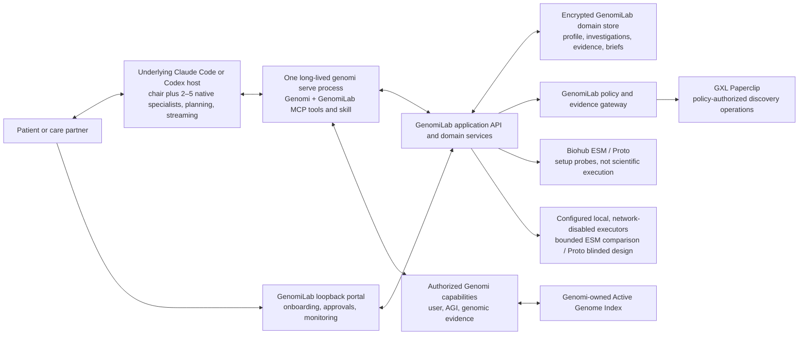

# GenomiLab Overall System Requirements

- **Status:** goal-ready normative system specification
- **Requirements snapshot:** 2026-08-15
- **Supersedes:** the earlier GenomiLab product definition and its developer-preview assumptions
- **Normative terms:** **SHALL**, **SHALL NOT**, **SHOULD**, and **MAY** have their usual requirements meanings

## 0. Goal objective

Build **GenomiLab**, an open-source, patient-facing personal research lab that
investigates disease in the context of the current Genomi user's longitudinal
**Patient Molecular Profile**: their existing Genomi-managed genome, reviewed
phenotypes and health history, reported molecular and pathology findings,
measurements, specimens and assays. GenomiLab SHALL investigate that patient
context against current scientific evidence, which belongs in each
investigation's evidence ledger rather than in the Patient Molecular Profile.

GenomiLab SHALL be a real application and domain system, not merely a UI. It
SHALL provide the molecular-profile, disease-investigation, evidence-ledger,
hypothesis/gap, policy, versioned-brief, and collaboration functionality that
neither base Genomi nor a general agent harness provides. Only the **GenomiLab
web portal** is presentation-only.

The underlying Claude Code, Codex, or other compatible MCP host SHALL own the
conversation, native task lifecycle, question decomposition, dynamic planning,
agent/subagent delegation, tool choice, execution, event streaming, follow-ups,
resume/cancellation, scientific reasoning, and synthesis drafts. GenomiLab
SHALL NOT discover or start a second embedded agent server. Its focused skill
and typed domain capabilities SHALL give that host durable patient-research
objects, scoped approvals, scientific operations, and validated artifact
commit boundaries. Genomi SHALL remain authoritative for current user identity,
genome intake, the Active Genome Index (AGI), AGI reads/grants, genome-derived
primitive evidence, libraries/jobs, and canonical Genomi evidence envelopes.

For every new investigation, the main host agent SHALL chair a native board of
2–5 adaptive, non-overlapping domain specialist subagents. The chair SHALL own
patient interaction, authorization, private AGI access, and canonical research
commits; GenomiLab SHALL persist only the board's safe logical definition and
meaningful milestone states for portal monitoring.

The completed system SHALL give one patient an enduring **Research Desk** and
Patient Molecular Profile with many resumable disease investigations over one
reusable, local AGI. It SHALL support secure **GXL Paperclip** API-key setup and
a fixed public connection probe. Every Paperclip evidence operation in this
release is investigation-scoped and SHALL pass the deployment-authorization,
patient-data-contract, exact-disclosure, privacy, consent, and source-quality
gates in this specification. **Proto** and **Biohub ESM** connection checks
SHALL remain credential/environment or fixed synthetic setup verification;
those checks SHALL NOT enable, perform, or count as scientific execution.
Separately, GenomiLab MAY advertise its bounded ESM substitution-comparison and
Proto blinded-experiment-design operations only when the respective configured
scientific executor is local and network-disabled. A missing executor SHALL
produce an explicit unavailable state and no artifact. A completed operation
SHALL produce only a round-bound nonclinical research artifact, never an
evidence record or answer-readiness input.

The system succeeds when a nontechnical patient can ask or resume a question,
understand what the agents are doing, inspect source-linked evidence and gaps,
and prepare useful questions for a qualified professional without creating a
second patient profile, uploading their genome again, learning genomic file
formats, or interacting with agent/tool internals.

## 1. Product definition

### 1.1 One-paragraph blurb

GenomiLab is an open-source personal research lab that builds a longitudinal,
source-linked molecular profile for the current Genomi user and helps
investigate how that profile relates to disease. It combines reviewed health,
laboratory, molecular, pathology, specimen and assay observations with targeted
reads from the user's existing Genomi Active Genome Index and current public
evidence. The underlying host agent plans, delegates, streams progress, reasons,
and responds in its existing task; GenomiLab supplies the focused guidance and
domain capabilities, persists the evidence and investigation, tracks hypotheses
and gaps, validates versioned patient/clinician views, and provides a portal for
patient onboarding, approvals, and monitoring. It supports research and
professional collaboration; it does not diagnose, validate a
laboratory test, or decide treatment.

### 1.2 Product promise

> Help me investigate a disease against my molecular profile, understand which
> personal observations and public evidence support or contradict possible
> mechanisms, see what has not been measured or confirmed, and prepare the best
> next questions for qualified professionals.

The universal output is an **Investigation Brief**. A candidate molecular
mechanism appears only when the evidence supports that shape. “Molecular
driver” SHALL NOT be promised as a routine output from a germline genome and
health history.

### 1.3 Non-negotiable decisions

| Decision | Requirement |
| --- | --- |
| Patient identity | The patient is the **current Genomi user**. GenomiLab SHALL NOT create a parallel patient, profile, or case identity. |
| Genome lifecycle | A genome is supplied to Genomi once and represented by a Genomi-owned AGI. GenomiLab SHALL NOT request a VCF or other genome upload per investigation. |
| Molecular profile | GenomiLab SHALL own one longitudinal Patient Molecular Profile aggregate keyed exclusively to Genomi `user_id`. It is scientific context, not a second identity, and references rather than copies the AGI. |
| Launch prerequisite | A current Genomi user and query-ready selected AGI are required to open the Research Desk. VCF and other genome-source intake stays in core Genomi and is performed once through the underlying host agent. |
| Investigation model | GenomiLab SHALL own the durable disease investigation and its versions. One investigation MAY be continued from host tasks over time and pins exact molecular-profile and AGI snapshots; GenomiLab does not own or broker those native tasks. |
| Specialist board | Every new investigation SHALL use one host-native board of 2–5 adaptive, non-overlapping domain specialists chaired by the main agent. Stable specialist identities are reused across explicit plan-version rounds; GenomiLab stores round assignments, meaningful milestones, and immutable findings-and-gaps reports, not native task identifiers or hidden traces. |
| Portal role | The **GenomiLab web portal** handles patient onboarding, molecular-profile input, scoped approvals, provider setup, and rendering committed domain events and artifacts. It SHALL NOT directly access domain storage, the host task, Genomi, providers, files, or contain its own planner, task/message/cancel controls, tool selector, reasoning engine, or synthesizer. |
| GenomiLab domain role | GenomiLab SHALL own patient molecular observations, approved context/profile snapshots, disease investigations, evidence ledgers, hypothesis/gap registers, brief/review versions, consent/egress policy, provider mediation, and collaboration records. |
| Host role | The underlying Claude Code, Codex, or other compatible MCP host owns conversation/run state, native start/resume/cancel, dynamic planning, agents/subagents, capability choice, calls, progress streaming, follow-ups, reasoning, synthesis drafts, and execution traces. It SHALL NOT be the sole durable owner of the patient research record. |
| Genomi role | Genomi owns current-user and AGI state, genome intake and readiness, AGI reads/grants, genome-derived primitive evidence, genomics capabilities, public libraries, background jobs, and canonical Genomi evidence envelopes. |
| Paperclip role | GXL Paperclip is a first-class, preferred public-evidence provider when it covers the evidence need and its use is allowed. It is not the orchestrator, source of clinical truth, or sole evidence path. |
| Proto/ESM role | Biohub ESM and Proto setup checks report connection state but never scientific execution. Separate bounded ESM substitution-comparison and Proto blinded-experiment-design operations are available only through configured local, network-disabled executors; absence is explicit, and outputs remain nonclinical, non-evidence research artifacts. |
| Clinical boundary | Agents produce research observations, candidate hypotheses, gaps, and professional questions. Qualified clinicians and laboratories own clinical confirmation, diagnosis, and treatment decisions. |
| Omanta relationship | GenomiLab borrows the continuity, depth, evidence organization, gap analysis, and collaboration pattern of a “research lab for one.” It SHALL NOT claim parity with a human scientific or clinical service unless independently demonstrated. |

### 1.4 Explicit non-goals

GenomiLab is not:

- a cosmetic portal around Genomi or a general chat harness;
- a second genome uploader or genome repository;
- a replacement agent harness;
- a fixed medical workflow encoded in the portal;
- an autonomous diagnostic, tumor-board, prescribing, or treatment-selection
  system;
- a clinical laboratory or a substitute for validated pathology, sequencing,
  or other biomarker testing;
- a system that converts a no-hit, unavailable source, uncertain variant, model
  prediction, or sparse genome region into a clinical negative;
- a single flattened “molecular driver,” pathogenicity, actionability, or
  treatment score over heterogeneous evidence;
- a patient-facing protein, antibody, vector, CRISPR, or therapeutic sequence
  generator; or
- a claim that all computation is local when the selected host, model, or
  evidence provider uses a hosted service.

## 2. Users and jobs to be done

### 2.1 Primary user

The primary user is an adult patient investigator who:

- has a complex, rare, undiagnosed, strongly heritable, medication-related, or
  molecularly characterized condition;
- is already represented by a local Genomi user and has a query-ready selected
  AGI before opening GenomiLab;
- has health information distributed across memory, reports, patient portals,
  and medication lists;
- is motivated to investigate but is not expected to understand VCFs, genome
  builds, HPO IDs, model names, MCP, or agent architecture;
- wants traceable research and a better professional conversation, not a
  black-box diagnosis; and
- values control over genomic and health information.

The primary job is:

> Turn my genome, relevant health history, and the scientific record into a
> defensible set of observations, hypotheses, gaps, and questions that I can
> understand and take to the right professional.

### 2.2 Secondary users

- A caregiver or family member acting under explicit, recorded authority.
- A genetics-literate patient who wants full technical provenance.
- A clinician, genetic counselor, pathologist, pharmacist, or molecular tumor
  board member reviewing a patient-selected packet.
- A researcher receiving an explicitly separated, nonclinical experimental
  handoff.

### 2.3 Initial product wedge

The first complete patient lane SHOULD answer:

> Could an existing reported genetic finding or candidate help explain this
> condition, what evidence supports or contradicts it, and what remains to be
> confirmed?

Pharmacogenomics, common-disease/polygenic risk, oncology/somatic analysis, and
experimental sequence design are separate lanes with different prerequisites
and safety contracts. They SHALL NOT be hidden behind one generic “health
risk” workflow.

## 3. System ownership and architecture

### 3.1 Component ownership

| Component | Owns | SHALL NOT own |
| --- | --- | --- |
| **GenomiLab web portal** | Patient onboarding, profile forms, scoped approval decisions, provider setup, accessible committed-event monitoring, molecular-profile exploration, and brief/review views | Domain records, direct host-task/Genomi/provider/filesystem access, agent orchestration, native start/message/cancel controls, tool selection, scientific synthesis, or clinical decisions |
| **GenomiLab application/domain services** | Research Desk; Patient Molecular Profile; health facts and reported findings; source artifacts, specimens and assays; approved context/profile snapshots; canonical disease investigations; evidence ledger; hypothesis/gap register; brief/review versions; consent, egress, collaboration, export/deletion receipts; typed agent operations; and the Paperclip evidence gateway | Raw genome/AGI storage or direct reads, a fallback LLM/agent loop, host-task creation/transport, dynamic question routing, dynamic tool/agent selection, unsupported clinical confirmation, or treatment decisions |
| **GenomiLab domain store** | Durable versioned domain objects keyed to canonical Genomi `user_id`, including investigation artifacts and policy receipts | Raw genome sources, AGI databases/paths/rows, provider credentials in records, or hidden agent traces |
| **Underlying agent host** | Task/run/conversation state, native lifecycle and cancellation, main-agent chairing of the required 2–5 specialist board, dynamic planning, agent/subagent coordination, capability invocation, progress streaming, follow-ups, scientific reasoning, synthesis drafts, checkpoints, internal messages, and execution traces | Canonical patient identity/profile, canonical investigation/ledger/brief records, Genomi AGI implementation, GenomiLab policy, or direct unapproved provider access |
| **Genomi** | Current user; user-to-genome relationship; source intake; AGI lifecycle, immutable AGI revisions, reader and grants; genome-derived primitive evidence; genomics capabilities; libraries; background jobs; and original Genomi evidence envelopes | Patient Molecular Profile, longitudinal health history, disease investigations, hypotheses, briefs, collaboration, or whole-question routing |
| **External research connections** | Paperclip's declared discovery corpus; fixed non-patient Biohub ESM and Proto connection probes | Patient identity, authorization, durable canonical memory, final synthesis, clinical validation, treatment decisions, or scientific execution inferred from connection state |
| **Configured local scientific executors** | One bounded, network-disabled ESM reference-versus-substitution comparison and one bounded, network-disabled Proto blinded experiment-design operation when explicitly supplied to the GenomiLab service | Provider setup, hosted fallback, general model/tool discovery, evidence records, answer-readiness, clinical conclusions, treatment content, or clinician export |

The Patient Molecular Profile SHALL be a GenomiLab domain aggregate keyed to
the Genomi `user_id`; it SHALL NOT create an independently selectable identity.
The underlying host receives approved immutable profile slices and writes proposed
domain artifacts through GenomiLab capabilities. It does not receive direct
write access to the domain store.

### 3.2 Required topology



### 3.3 Architecture requirements

- **ARCH-001:** GenomiLab SHALL comprise focused host guidance, typed MCP
  operations, application/domain services, an encrypted domain store, a
  loopback web portal, and policy/evidence gateways. It SHALL NOT discover,
  launch, or require an embedded Codex app-server, Claude process, or other
  second agent runtime.
- **ARCH-002:** The underlying host SHALL call GenomiLab through the existing
  `genomi serve` MCP process. That same long-lived process SHALL own the
  session-scoped AGI handle, GenomiLab service/store, and loopback portal so
  private authority is not reconstructed across detached workers. Every local
  stdio MCP `initialize` handshake SHALL begin a new GenomiLab workspace
  session and close any prior session in that process, including when the
  client metadata is unchanged; client name and version SHALL NOT serve as a
  session identity. HTTP MCP initialization SHALL expose public tools only and
  SHALL NOT create, replace, or close the private GenomiLab runtime session.
- **ARCH-003:** The portal SHALL call only the GenomiLab application API and
  render committed domain events/artifacts. It SHALL collect patient onboarding
  data and exact decisions, but SHALL NOT start, message, resume, stream hidden
  reasoning from, or cancel a native host task.
- **ARCH-004:** Question classification, plan construction, agent delegation,
  dynamic tool selection, and scientific synthesis SHALL be absent from portal
  and GenomiLab domain business logic. The domain MAY validate required
  artifact structure, provenance, consent, and safety invariants.
- **ARCH-005:** Genomi SHALL remain authoritative for current `user_id`, AGI
  identity, readiness, selection, and access state. A query-ready selected AGI
  SHALL be a hard launch prerequisite for the Research Desk. Genome-source
  intake SHALL remain in core Genomi, where the user may point the host at a VCF
  or other supported local source once.
- **ARCH-006:** GenomiLab tools and focused guidance SHALL work through Claude
  Code, Codex, and other compatible MCP hosts without changing domain or AGI
  contracts. A host SHALL use its own native task, subagent, streaming,
  follow-up, resume, and cancellation facilities.
- **ARCH-007:** GenomiLab domain services SHALL be authoritative for Patient
  Molecular Profile and disease-investigation records. No durable patient or
  investigation state SHALL live solely in a browser or native host task.
- **ARCH-008:** The portal SHALL display whether the underlying host and each invoked
  provider execute locally or remotely. “Local-first” SHALL describe the actual
  data path, not the location of the UI.
- **ARCH-009:** GenomiLab SHALL persist only safe, typed domain events and
  accepted artifacts for portal monitoring. Native host messages, chain of
  thought, token streams, task cursors, and hidden execution traces SHALL remain
  host-owned and SHALL NOT be mirrored into the domain store.
- **ARCH-010:** The underlying host and ordinary investigation portal SHALL have no
  provider credentials or direct provider route. A dedicated same-origin,
  loopback-only setup form MAY transiently collect a credential solely to hand
  it to the GenomiLab application for immediate OS-credential-store insertion;
  the browser SHALL neither retain nor use it, and every response SHALL be
  redacted. External evidence/model calls SHALL still traverse a GenomiLab
  gateway that enforces deployment policy, consent, egress, provenance, and
  result normalization.
- **ARCH-011:** GenomiLab domain capabilities SHALL be exposed to every
  supported compatible host through typed MCP tools and focused
  guidance. Switching compatible hosts SHALL not change the molecular-profile,
  evidence, investigation or brief contracts, and no mandatory processing-
  destination CLI label SHALL substitute for the host identity reported by the
  MCP session.
- **ARCH-012:** One patient-approved investigation authorization SHALL bind the
  exact profile snapshot, consent, user, investigation, workspace session,
  underlying-agent recipient/destination, genome snapshot/scope, and routine
  local investigation intents; it SHALL include no external provider. While
  those bindings remain unchanged, the host MAY plan, call accepted operations,
  follow up, revise hypotheses, and submit revised briefs without repeated
  patient prompts. A changed profile/AGI snapshot or scope SHALL require a new
  context decision. Every external-provider payload SHALL remain subject to its
  own just-in-time exact disclosure approval.
- **ARCH-013:** For each new investigation, the main host agent SHALL form and
  chair one board of 2–5 native, adaptive, non-overlapping domain specialist
  subagents with explicit roles and bounded tasks. The chair SHALL own the
  patient conversation, approvals, every private AGI read, and canonical plan,
  hypothesis, gap, and brief commits. Specialists SHALL receive public
  questions or only minimized approved evidence and SHALL NOT directly access
  the AGI or portal. The host SHALL record the logical board and meaningful
  `assigned`, `working`, `blocked`, or `completed` milestones through typed
  GenomiLab operations. GenomiLab and the portal SHALL NOT receive native task
  identifiers, raw messages, chain of thought, token streams, or per-call
  progress chatter. A resumed investigation SHALL reuse its existing board
  rather than form another one.

## 4. Canonical data model

### 4.1 Core objects

| Object | Owner | Canonical identity and purpose |
| --- | --- | --- |
| Current Genomi user | Genomi | `user_id`; the only patient identity whose workspace is open |
| Active Genome Index | Genomi | `agi_id`; logical genome/index identity associated with a user |
| AGI snapshot | Genomi | `agi_snapshot_id`; immutable AGI revision containing source/content and artifact hashes, build, schema, readiness, and creation time |
| Research workspace | GenomiLab | One patient-research workspace keyed one-to-one to `user_id`; not a separate identity |
| Patient Molecular Profile | GenomiLab | Longitudinal aggregate of typed, source-linked patient observations and modality coverage keyed to `user_id`; references but does not copy AGI data |
| Molecular observation revision | GenomiLab | `observation_revision_id`; immutable reviewed or review-pending phenotype, measurement, reported finding, pathology/molecular result, medication/exposure, or specimen/assay fact |
| Source artifact | GenomiLab | `artifact_id`; local report/document reference, hash, source metadata, and precise locator without promoting extracted text to fact |
| Specimen and assay | GenomiLab | `specimen_id` and `assay_id`; subject/site/time, tumor-normal relationship, lab/platform/pipeline, scope, QC and detection limits |
| Molecular Profile Snapshot | GenomiLab | `patient_molecular_snapshot_id`; immutable, approved, purpose-scoped manifest of exact observation revisions, artifact/specimen/assay references, modality coverage, consent receipt, and optional exact `agi_id`/`agi_snapshot_id` |
| Disease investigation | GenomiLab | `investigation_id`; canonical question, disease scope, status, context history, and pinned profile/evidence/brief versions |
| Specialist board | GenomiLab monitoring projection + underlying host execution | One immutable logical set of 2–5 persistent `specialist_id`, role, and initial-task records per investigation; native subagent identities and messages remain host-only |
| Investigation round | GenomiLab | One immutable round per accepted `plan_version_id`, pinned to that plan's molecular-profile snapshot, with one bounded assignment and at most one immutable findings-and-gaps report per persistent specialist |
| Host task/run | Underlying host | Native execution, conversation, plan, agents, reasoning, checkpoints and drafts; it may carry an `investigation_id` while calling GenomiLab but is not a GenomiLab binding |
| Evidence record | GenomiLab | Immutable ledger record that references/snapshots Genomi or provider results, preserves source/version/scope/limitations, and embeds the original Genomi envelope unchanged when applicable |
| Disease-mechanism relation | GenomiLab | Typed local record linking one public, non-model source prior to the exact pinned patient observation revisions and disease scope, with relation kind/direction, source-reported strength, population/tissue/specimen context, conflicts and uncertainty |
| Hypothesis and gap | GenomiLab | Versioned candidate mechanism or unresolved evidence need linked to exact patient observations, supporting/counterevidence, uncertainty and confirmation requirements |
| Brief version | GenomiLab | Immutable accepted synthesis drafted by the underlying host and committed only after provenance, policy and safety validation; later updates create a new version and change summary |
| Review packet | GenomiLab | Patient-selected brief content, citations, questions and disclosure receipt for a named recipient or review room |

```text
Genomi user 1 ─── 0..N AGIs
AGI 1 ─── 1..N immutable AGI snapshots
Genomi user 1 ─── 1 GenomiLab research workspace
Research workspace 1 ─── 1 Patient Molecular Profile
Patient Molecular Profile 1 ─── 0..N observation revisions
Patient Molecular Profile 1 ─── 0..N immutable profile snapshots
Research workspace 1 ─── 0..N disease investigations
Disease investigation 1 ─── 1 pinned patient_molecular_snapshot_id
Disease investigation 1 ─── 1 logical specialist board
Disease investigation 1 ─── 0..N immutable plan-version rounds
Disease investigation 1 ─── 0..N evidence, hypothesis, gap and brief versions
Underlying host task ─── calls typed operations for ─── disease investigation
```

There is no parallel patient identity, selectable patient/case profile,
investigation-owned genome, or `profile_id -> agi_id` assignment. The required
Patient Molecular Profile is a scientific aggregate addressed only by the
canonical Genomi `user_id`; deleting it SHALL NOT implicitly delete the Genomi
user or AGI.

### 4.2 Patient Molecular Profile

The Patient Molecular Profile SHALL contain patient observations, not public
literature, agent notes, unaccepted mechanism hypotheses, model-inferred
diagnoses, or treatment recommendations. A professionally issued conclusion MAY
be recorded as an attributed source observation.

Every observation SHALL declare a modality and whether it applies to the
patient generally or to an exact `specimen_id`. Supported modality contracts
SHALL include:

- **Germline genome context:** only `agi_id`, `agi_snapshot_id`, build,
  readiness and QC references—never reader-returned findings, a copied VCF,
  bulk variant table, source path, AGI row, or full sequence. Targeted Genomi
  reader results belong once in the investigation evidence ledger.
- **Phenotype and clinical context:** symptoms/HPO terms, diagnoses as reported,
  onset/course, family history/pedigree assertions, medications, exposures,
  procedures, and outcomes.
- **Quantitative measurements:** routine labs and biomarkers with values,
  units, reference intervals, method and collection time.
- **Issued molecular/pathology records:** exact reported germline or somatic
  variants, CNV/SV/fusion, expression/protein biomarkers, cytogenetics,
  pathology and staging assertions, with their assay scope and limitations.
  “The report states X” is distinct from validating X.
- **Specimen and assay context:** specimen type/site/time/disease state,
  tumor-normal relationship, accession, laboratory, platform, pipeline,
  reference build, coverage, limit of detection, QC and validation/accreditation
  metadata.
- **Future raw/derived multi-omics:** tumor genomics, RNA
  expression/splicing/fusions, proteomics/phosphoproteomics, metabolomics,
  epigenomics/methylation, HLA and immune data through separate modality-owned
  stores/readers and grants—not the germline AGI.

Modality coverage SHALL distinguish `observed`,
`explicitly_not_detected_within_declared_assay_scope`, `not_measured`,
`not_provided`, `unavailable`, and `out_of_scope`. Missing profile data SHALL
never appear as a biological negative.

Each observation revision SHALL minimally preserve:

- type and normalized code/term when available;
- the patient's original wording;
- value, units, present/absent/unknown status, onset/event time, and recorded
  time as applicable;
- source class/author, source identifier or local artifact hash, and exact
  page/table/field locator when applicable;
- assertion author: patient, caregiver, clinician, imported record, or model;
- subject/specimen and assay identifiers, units/reference range, method,
  genome build/transcript and QC where applicable;
- extraction/import/normalization software and versions;
- verification state: unreviewed, user-confirmed, record-confirmed, or
  clinician-confirmed, independently of evidence modality and clinical stage;
- supersession/reconciliation links instead of destructive overwrite;
- approved investigation uses and disclosure history; and
- provenance for any normalization or extraction.

`record-confirmed` means the normalized observation faithfully matches its
source record; it does not validate the underlying diagnosis, assay,
pathogenicity or actionability. Model/document extraction MAY create a review
candidate. It SHALL NOT create an accepted diagnosis, medication, pathology
stage, or clinically confirmed finding without the required human/provenance
step. A patient confirmation cannot promote a result to clinically confirmed,
and an explicit negative requires declared assay scope and detection limits.

### 4.3 Molecular Profile Snapshots

A `patient_molecular_snapshot_id` SHALL be an immutable manifest containing:

- `user_id`, creation time and manifest hash;
- exact observation revision IDs;
- source-artifact, specimen and assay references;
- modality coverage;
- exact `agi_id` and `agi_snapshot_id` when germline context is included;
- declared purpose and investigation scope; and
- the consent receipt authorizing the selected private slices.

It is a reproducible view, not an identity, authorization token, diagnosis, or
flattened feature vector. Possession of its ID grants nothing. Before approval,
GenomiLab MAY assemble a mutable candidate selection from the current profile
state, but it SHALL NOT silently default that candidate to the whole current
profile. For a first context or refresh, the patient SHALL explicitly select a
non-empty set of current observation revisions in the portal; renewal preserves
the exact pinned selection. That selection is not a snapshot and authorizes no read. A snapshot
is minted only after its purpose, investigation scope, exact contents and
consent receipt are approved. Updating a fact, adding a report or making a
newer AGI revision available marks affected candidate selections or refresh
offers as changed; it SHALL NOT automatically mint a purpose-scoped snapshot
or alter an existing investigation. A changed scope or explicit refresh
requires a new approval and snapshot. Old investigations remain reproducible,
and comparison or rerun is explicit.

### 4.4 Investigation invariants

- A GenomiLab investigation belongs to exactly one canonical `user_id` and
  exactly one pinned `patient_molecular_snapshot_id` per committed context
  version.
- A native host task/run is not the canonical investigation. Closing, replacing,
  or losing it SHALL NOT delete the GenomiLab investigation, ledger or briefs;
  another compatible host task MAY continue by inspecting the investigation.
- Personal genome evidence and every AGI-reading invocation SHALL bind to the
  exact `agi_id` and immutable `agi_snapshot_id` used.
- When a pinned Molecular Profile Snapshot includes germline context, the
  investigation's AGI revision SHALL equal the `agi_id` and `agi_snapshot_id`
  in that snapshot. The investigation SHALL NOT independently select a second
  AGI revision.
- Targeted AGI reader results SHALL be committed once as investigation evidence
  records with their original Genomi provenance and envelope. They SHALL NOT be
  copied into the Patient Molecular Profile or its pinned snapshot.
- Changing the current AGI SHALL NOT silently alter an existing investigation.
- Reparsing or rebuilding the same logical AGI SHALL create a new
  `agi_snapshot_id`; it SHALL NOT mutate the revision used by an old
  investigation.
- A refresh SHALL create a new evidence snapshot and brief version; it SHALL NOT
  rewrite history.
- Every accepted hypothesis SHALL link to exact patient observation revisions
  and exact supporting/counterevidence records. No personal overlap, association
  or model output alone may promote answer-readiness.
- Deleting or revoking one investigation SHALL NOT delete the user's AGI.
- Deleting a genome or user SHALL route through explicit Genomi operations,
  with impact preview for dependent investigations.

## 5. User experience and information architecture

### 5.1 Research Desk

The home screen SHALL show:

- the current Genomi user;
- active AGI, genome build, readiness, and current access state;
- Patient Molecular Profile coverage, latest reviewed changes, and material
  gaps for active investigations;
- a clear return-to-agent action for asking or continuing in the underlying
  host task;
- active and recent investigations;
- new evidence, completed briefs, and items needing attention;
- pending approvals or questions from agents; and
- upcoming clinician or review-room activity.

The portal SHALL NOT present a chat composer or native task controls. Its
primary actions SHALL be patient-facing profile review, approval, provider
setup, and investigation monitoring, never **Upload a genome**.

### 5.2 Primary navigation

1. **Research Desk** — setup state, active investigations, committed updates,
   and attention items, with a route back to the underlying agent task.
2. **Investigations** — brief, committed plan/progress events, evidence ledger,
   unresolved questions, review room, and version history for each
   investigation.
3. **My Molecular Profile** — reviewed health/phenotype observations, labs,
   reports/findings, specimens/assays, modality coverage, version history, and
   the Genomi-owned genome panel with **Manage genome in Genomi**.
4. **Evidence Library** — reusable citations and source records, separated by
   source family and version.
5. **Collaborate** — selective clinician/genetic-counselor/tumor-board packets,
   questions, decisions, and follow-up items.
6. **Privacy & Activity** — AGI grants, provider disclosures, access history,
   exports, revocation, and owner-routed deletion.

### 5.3 End-to-end walkthrough

1. **Prepare the genome once in core Genomi.** In Claude Code, Codex, or another
   compatible MCP host, the patient can point the agent at a local VCF or other
   supported genome source. Genomi parses/selects a query-ready AGI. If there is
   no current user or ready selected AGI, `genomilab.open_workspace` returns a
   setup-required state and the Research Desk does not launch.
2. **Open the Research Desk from the existing agent task.** The host calls the
   GenomiLab MCP operation in the same long-lived `genomi serve` process. The
   portal opens with a private one-time loopback link and the existing Genomi
   identity; it creates neither a second agent task nor a second patient.
3. **Ask or resume in the host.** The patient states a disease question in the
   ongoing host conversation. The host creates or inspects the durable
   GenomiLab investigation and uses the portal only when onboarding/profile
   input or a patient decision needs a richer interface.
4. **Authorize private context once.** The patient reviews one concise portal
   decision covering the exact molecular-observation revisions, purpose,
   workspace session, current underlying-agent recipient/destination, and exact
   AGI snapshot/scope. GenomiLab records that decision and mints the scoped
   Molecular Profile Snapshot; Genomi separately enforces the matching AGI
   grant. No external provider is included.
5. **Form, plan and execute in the underlying host.** For a new investigation,
   the main agent chairs 2–5 adaptive, non-overlapping native specialists with
   explicit roles and bounded tasks, then records that logical board once with
   `genomilab.form_specialist_board`. The chair owns patient interaction,
   authorization, private AGI reads and canonical commits; specialists receive
   public questions or only minimized approved evidence. The same host task
   owns planning, exact typed capability calls, follow-ups, and native
   cancellation. GenomiLab validates accepted request/artifact contracts but
   does not create a planning/execution task pair or run a hidden bulk executor.
   Each accepted plan version starts one explicit round and assigns every
   persistent specialist a new bounded task. The chair commits each returned
   findings-and-gaps report before starting the next round.
6. **Investigate against approved context.** The host calls only advertised
   GenomiLab and Genomi operations. GenomiLab commits source-separated evidence,
   hypotheses, gaps, and brief versions. A Paperclip request that needs egress
   approval pauses at an exact portal disclosure; the portal may approve only
   that recorded continuation and never initiate an unrequested scientific
   call. Biohub ESM and Proto connection checks never count as scientific
   execution. The host may call the separate bounded ESM substitution or Proto
   blinded-design operation only when `genomilab.list_research_tools` advertises
   its configured local, network-disabled executor as available; otherwise the
   call returns an explicit unavailable state and no artifact. Any completed
   output remains a nonclinical research artifact outside the evidence ledger.
7. **Monitor committed work.** The portal renders safe domain events and
   specialist round assignments, milestones, findings, and gaps plus completed,
   running, waiting, blocked,
   in-scope-empty, out-of-scope, and source-unavailable states. It does not
   mirror raw agent messages, chain of thought, native task identifiers, or host
   token streams.
8. **Inspect the living brief.** The patient sees observations, possible meaning,
   support, counterevidence, uncertainties, what not to conclude, confirmation
   needs, and professional questions. Technical detail is one level deeper.
9. **Add patient information and revise.** A follow-up stays in the same host
   task and `investigation_id`. The host records the new or corrected patient
   observation, the patient approves the exact changed context once in the
   portal, and the host reruns only affected evidence. A revised hypothesis
   supersedes the prior hypothesis and brief version 2 explains what changed and
   what did not.
10. **Collaborate (P1).** Once collaboration is enabled, the patient selects
   what to share and prepares a concise review packet. Professional decisions
   are attributed to the professional, not the agents. P0 exposes this action as
   unavailable rather than simulating delivery.
11. **Continue over time.** Closing a host task does not erase the durable
   investigation. Another compatible host task can inspect and continue it.
   Existing investigations retain pinned profile/AGI history; a new profile or
   genome snapshot uses an explicit diff and scoped reauthorization rather than
   silently changing the evidence basis.

## 6. Functional requirements

### 6.1 GenomiLab application, portal and underlying-host contracts

The portal SHALL call only a versioned GenomiLab application API. Its
patient-facing operations SHALL be limited to equivalents of:

- `bootstrap_workspace`
- `read_workspace`
- `read_molecular_profile`
- `add_profile_source_artifact`
- `add_profile_specimen`
- `add_profile_assay`
- `add_profile_observation`
- `review_or_supersede_observation`
- `list_investigations`
- `inspect_investigation`
- `read_prepared_authorization_handoff`
- `preview_investigation_authorization`
- `approve_investigation_context`
- `approve_exact_provider_continuation`
- `check_recorded_provider_job`
- `revoke_investigation_authorization`
- `replay_investigation_domain_events`
- `wait_for_investigation_domain_events`
- `list_research_tool_connections`
- `connect_or_replace_research_tool_credentials`
- `verify_research_tool_connection`
- `disconnect_research_tool`

The exact signed candidate produced by
`genomilab.prepare_authorization` SHALL remain server-side until its one-time
portal launch token is exchanged. The authenticated portal bootstrap SHALL
then target and render that candidate directly; it SHALL NOT derive a second
candidate merely to display the handoff. Investigation creation and every
host-task lifecycle action remain underlying-host operations and are absent
from this portal API.

The GenomiLab domain service SHALL persist the canonical command result and
domain event before exposing it to the portal. Direct portal access to host
tasks, Genomi, providers, domain-store tables or the filesystem is prohibited.
The portal SHALL expose no operation equivalent to host-task start, send
message, resume, stream, or cancel.

The underlying host SHALL use the focused GenomiLab skill and direct MCP
operations equivalent to `genomilab.open_workspace`,
`genomilab.create_investigation`, `genomilab.inspect_investigation`,
`genomilab.form_specialist_board`, `genomilab.report_specialist_progress`,
`genomilab.record_specialist_report`,
`genomilab.prepare_authorization`, `genomilab.record_patient_observations`,
`genomilab.submit_plan`, `genomilab.execute_request`,
`genomilab.check_request`, `genomilab.submit_brief`,
`genomilab.submit_research_artifact`,
`genomilab.verify_sequence_substitution`,
`genomilab.run_esm_substitution_analysis`,
`genomilab.run_proto_blinded_experiment_design`,
`genomilab.list_research_artifacts`, `genomilab.list_research_tools`, and
`genomilab.revoke_context`. These are
domain operations inside the current host task, not a transport for creating a
different task.

Research-tool setup SHALL be global to the local installation/OS user rather
than copied into a patient profile or investigation. It SHALL use a fixed
provider allowlist and fixed provider endpoints; the provider-setup boundary
SHALL accept no caller URL, command, model name, tool name, or executable
operation. Credential records
SHALL be complete, atomically replaced, stored only in the OS credential store,
and absent from the GenomiLab domain database, browser storage, host
messages, environment, URLs, logs, errors, and API responses. Connection
listing SHALL be network-free. Only an explicit verify action MAY make one of
the fixed connection probes below:

- Paperclip SHALL search PMC for `TP53` with a one-result limit. The probe is
  fixed, public, and non-patient, and SHALL be labeled before invocation as
  potentially using API credits.
- Biohub ESM MAY call the exact pinned JSON `/api/v1/encode` route with
  GenomiLab's fixed synthetic 20-residue amino-acid alphabet and compare the
  response with the exact pinned token sequence. Redirects, alternate response
  shapes other than the top-level payload or the pinned SDK's exact
  `{"data": <payload>}` Next.js wrapper, caller sequences, patient-derived
  sequences, and binary/pickle model responses are prohibited. The action SHALL
  be labeled as potentially using API credits and SHALL enable no scientific
  operation.
- Proto MAY use the pinned Modal client with only the credentials supplied from
  the OS credential store to authenticate and confirm the exact saved Modal
  environment. The check SHALL run in a disposable isolated child process with
  a fixed official Modal endpoint, a nonexistent temporary Modal configuration
  path, no inherited Modal, proxy, custom-CA, or credential environment, and a
  hard 15-second total timeout that terminates the child. Credentials SHALL be
  passed only through the child's private standard input. It SHALL NOT import
  the Proto catalog, create an environment, discover arbitrary tools, deploy,
  start, or execute a Proto operation, and SHALL enable no scientific
  operation.

Saving any provider credential SHALL NOT run a network or compute probe.
Credential presence and validity SHALL be displayed separately from deployment,
contract, patient-data, task-validation, expert-mode, and per-request disclosure
eligibility. No setup route SHALL perform user-directed scientific research or
use patient data. For Paperclip, a saved API key plus a successful explicit
fixed probe establishes credential validity for connection setup only; it does
not enable a general public-evidence operation or establish authorization for
patient-informed egress. An ambiently importable SDK/runtime alone establishes
no readiness. The connection probes are independent of the bounded scientific
operations in Section 6.9: they never configure an executor, make one
available, or prove one ran.

For Paperclip, the portal SHALL display connection-verification state separately
from investigation capability. There is no general API-key-only evidence lane
in this release. The investigation manifest SHALL display only the routes and
purposes shared by the installed transport, deployment authorization, and
independent patient-data contract. Exact disclosure approval is evaluated for
each request and SHALL NOT be represented as part of the manifest intersection.
The UI SHALL NOT flatten a restricted route into a generic operation or use
static copy that implies unapproved literature, regulatory, or trial coverage.
A non-ready connection or closed organizational gate SHALL advertise no
investigation route or purpose.

Agent-facing GenomiLab operations SHALL be direct, typed calls within the
current MCP session. Mutating calls SHALL bind the applicable
`workspace_session_id`, `user_id`, `investigation_id`, current domain revision,
and investigation authorization inside the service; callers SHALL NOT supply a
raw AGI path, database handle, credential, arbitrary provider endpoint, or
host-task control. Stale revisions and out-of-scope calls SHALL fail with typed
conflicts rather than overwrite newer state.

Each accepted domain transition SHALL append a safe, monotonically sequenced
investigation event. Examples include `investigation_created`,
`specialist_board_formed`, `round_started`, `specialist_progress_reported`,
`specialist_report_recorded`,
`context_approval_required`, `context_authorized`,
`patient_information_recorded`, `plan_accepted`, `request_started`,
`request_state_changed`, `brief_published`, and
`private_context_revoked`. Events SHALL include an event ID, investigation ID,
sequence/cursor, type, timestamp, and bounded redacted payload. They SHALL NOT
contain raw genome data, profile source files, credentials, native host
messages, hidden reasoning, or token streams. Portal reconnect SHALL replay
these committed events from a cursor and then refresh the canonical read model.

Genomi results SHALL retain their original `evidence_envelope`; GenomiLab SHALL
not reinterpret an empty, blocked, unavailable, or out-of-scope state. The
advertised GenomiLab capability catalog SHALL declare current domain and
provider availability truthfully. An operation scheduled for a later phase
SHALL return typed `capability_unavailable` until enabled. Bounded ESM and
Proto scientific operations SHALL be advertised separately from connection
state and only when their respective local, network-disabled executors are
configured. Without an executor, the operation SHALL report `unavailable`
with no research artifact; Biohub ESM and Proto connection verification SHALL
never cause scientific availability to appear.

### 6.2 Genomi user and AGI requirements

- **GEN-001:** Startup SHALL resolve the current Genomi user and require a
  query-ready selected AGI before launching the Research Desk. No
  portal-created substitute or public-only GenomiLab mode is allowed.
- **GEN-002:** The portal MAY display AGI identity/readiness metadata without
  reading AGI records.
- **GEN-003:** Genome source selection, upload/path intake, parsing, assignment,
  readiness, reparse, selection, and deletion SHALL use existing or extended
  core Genomi lifecycle operations initiated through the underlying host. A
  local VCF path supplied in that conversation is sufficient setup input.
- **GEN-004:** Investigation forms and APIs SHALL NOT accept a VCF, gVCF, BAM,
  FASTQ, consumer genotype file, genome bundle, or genome source path.
- **GEN-005:** Multiple investigations SHALL reuse a ready AGI without another
  parse.
- **GEN-006:** All AGI reads SHALL pass through the AGI reader boundary and an
  explicit valid Genomi-enforced grant bound to the immutable
  `agi_snapshot_id`.
- **GEN-007:** Genomi SHALL own and enforce an AGI access authorization keyed by
  `workspace_session_id`, `user_id`, `investigation_id`,
  `patient_molecular_snapshot_id`, GenomiLab consent-receipt ID, `agi_id`,
  `agi_snapshot_id`, purpose, and declared genomic data scope. Every private
  Genomi call SHALL present a Genomi-validated authorization for that exact
  tuple. A grant SHALL NOT authorize another investigation, snapshot, purpose,
  task outside the session, user, AGI revision, expanded scope, or outbound
  disclosure.
- **GEN-008:** A host that cannot safely carry the exact investigation-bound
  authorization and its underlying-agent recipient/destination binding across a
  replacement task SHALL request approval again rather than simulate reuse.
- **GEN-009:** Long-running parse and evidence work SHALL resume by job ID and
  SHALL NOT be duplicated.
- **GEN-010:** GenomiLab SHALL own and enforce molecular-profile/context
  approvals through an investigation authorization scoped to an
  `investigation_id`, exact observation revisions, profile snapshot, consent,
  purpose, duration, workspace session, underlying-agent recipient/destination,
  allowed routine intents and an immutable manifest. External-provider scope
  SHALL be empty. The underlying host receives the approved snapshot through narrow
  GenomiLab reads, not unrestricted store access.
- **GEN-011:** The portal collects one exact private-context decision through
  the GenomiLab API; GenomiLab atomically records/enforces it with the profile
  snapshot and requests a matching Genomi grant. Approval does not start a host
  task: the existing underlying task continues and GenomiLab records exact
  accepted plans/calls as derivations of the decision. Neither the portal nor
  host may mint, widen, or persist authorization independently.
- **GEN-012:** GenomiLab SHALL own outbound approvals and disclosure receipts
  keyed to exact provider, destination, purpose and payload manifest, subject to
  the independent deployment contract policy. Changing any of them requires a
  new decision. The underlying host chooses a useful evidence capability but has no
  provider credentials or bypass route.
- **GEN-013:** A browser reconnect while the long-lived MCP workspace session
  remains alive MAY resume its domain-event cursor, active investigation
  authorization and valid grant without repeating routine approvals. Restarting
  `genomi serve` or completing another local stdio MCP `initialize` handshake
  ends that session; durable records remain, but further private reads wait for
  renewed session authorization. HTTP MCP initialization neither creates nor
  ends the private GenomiLab runtime session. Native host-task restoration is
  owned by the host and is not represented as a portal action.
- **GEN-014:** Local Genomi capabilities MAY be invoked through Genomi MCP only
  with the authorization in GEN-007. Any Genomi capability that would send a
  patient-influenced query or payload to a network source SHALL additionally
  cross the GenomiLab outbound-egress gateway and satisfy its provider policy
  and disclosure receipt; a direct host-to-Genomi network path is
  prohibited.

### 6.3 GenomiLab molecular-profile and disease-investigation capabilities

GenomiLab SHALL expose typed domain capabilities to the underlying host. These
capabilities structure and retrieve declared data; they SHALL NOT contain an
embedded agent loop, infer user intent, dynamically select other tools, or
return a universal “interpret this profile” answer.

Required capability groups are:

1. **Molecular Profile service** — create, review, supersede and read typed
   observations; manage source artifacts, specimens, assays and modality
   coverage; create and compare immutable profile snapshots.
2. **Investigation Context Compiler** — bind the original question, disease
   scope, exact profile snapshot, exact AGI revision, approvals and policy into
   a versioned, host-neutral investigation authorization manifest.
3. **Investigation Profile Projector** — derive the disease-relevant projection
   of approved observations from the pinned snapshot, including coverage and
   missing-data states. It MAY link to targeted Genomi reader results already
   committed in the evidence ledger, but SHALL NOT insert those results into
   the Patient Molecular Profile or snapshot or duplicate their domain record.
4. **Disease-mechanism evidence capabilities** — retrieve typed, cited,
   source-specific relations among patient anchors, phenotype, disease, variant,
   transcript/protein consequence, inheritance/segregation, gene, tissue/cell
   expression, eQTL/sQTL, pathway, perturbation/screen, protein function,
   biomarker, drug target, regulatory status and trial evidence.
5. **Evidence ledger** — commit immutable source-separated records, source
   versions, defaults, conflicts, corrections/retractions, coverage and typed
   unavailable/empty/out-of-scope states.
6. **Hypothesis and gap register** — store host-proposed candidate mechanisms,
   counterevidence, uncertainty, status, missing measurements and confirmation
   requirements as versioned domain artifacts.
7. **Brief/version service** — validate that every host draft claim is linked
   to ledger evidence and the pinned profile snapshot, then commit immutable
   brief versions and refresh diffs. Validation MAY reject or request repair of
   a malformed draft; it SHALL NOT replace the host's scientific reasoning
   with hidden GenomiLab synthesis.
8. **Policy and collaboration services** — enforce private-context use,
   provider egress and sharing; create review packets, professional attribution,
   access/disclosure history and owner-routed export/deletion receipts.

Each disease-mechanism evidence result SHALL preserve patient-observation
anchors, source family/prior, direction, source-supplied quality/strength,
population/tissue/specimen context, date/version, consulted coverage, conflicts,
negative-inference limits and the canonical evidence envelope. These functions
are substantive GenomiLab functionality beyond base Genomi and the host.
The host decides which functions are relevant and performs cross-source
reasoning; GenomiLab enforces the domain and evidence contracts.

The public evidence provider SHALL receive only the approved biomedical query;
it SHALL NOT receive profile revisions, profile-snapshot identifiers, AGI
identifiers, patient specimen identifiers or genotype data. GenomiLab SHALL
create the patient-specific relation locally after public evidence is committed.
A candidate mechanism and a candidate-hypothesis brief claim SHALL cite at
least one supportive, non-personal, non-model typed relation whose disease
scope and patient-observation anchor set exactly match the cited claim. A
personal-genome overlap, model result, generic public document, wrong-disease
relation, refuting relation or union of partial relations SHALL NOT pass this
gate.

#### Investigation requirements

- **INV-001:** Every new question SHALL create or deliberately continue a
  canonical GenomiLab investigation from the current underlying-host task. The
  portal SHALL neither create a host-task binding nor execute a fixed tool call
  as a substitute.
- **INV-002:** The original patient wording SHALL be retained beside normalized
  entities and search terms.
- **INV-003:** The underlying host SHALL propose a visible plan before broad
  private-data or external-provider use. A plan that remains inside the active
  investigation authorization MAY be adopted and executed without a second
  patient approval; any external provider or scope expansion requires its own
  applicable decision.
- **INV-004:** The plan SHALL use the smallest relevant capability first and add
  orthogonal evidence when needed.
- **INV-005:** Source priors SHALL remain separate. ClinVar, gene–disease,
  phenotype, GWAS, functional, pathway, pharmacogenomic, literature, trial,
  regulatory, and model evidence SHALL NOT collapse into one universal score.
- **INV-006:** Agent notes, proposed hypotheses and accepted hypotheses SHALL
  remain distinct from source evidence and from one another.
- **INV-007:** Resuming the portal SHALL load the canonical GenomiLab
  investigation and replay committed domain events rather than completed work.
  Closing or replacing a native host task SHALL not lose domain artifacts;
  continuing a task is a host action.
- **INV-008:** In the underlying host, the patient SHALL be able to stop work,
  answer a request, revise scope, refresh evidence, or branch a separate
  question without losing the prior GenomiLab record. Portal revocation SHALL
  block further private context but SHALL NOT claim to cancel the native task.
- **INV-009:** A new investigation SHALL have exactly one board of 2–5 native,
  adaptive, non-overlapping domain specialist subagents before its canonical
  plan is accepted. Each specialist SHALL have an explicit logical ID, role,
  and bounded task. The main agent SHALL chair the board and retain exclusive
  responsibility for patient conversation, authorization, private AGI reads,
  and canonical plan, hypothesis, gap, and brief commits. Every accepted plan
  version SHALL be one immutable investigation round with exactly one bounded
  assignment for each persistent specialist. A later round SHALL reuse the
  same specialist IDs and SHALL NOT start until every prior-round assignment
  has one immutable findings-and-gaps report.
- **INV-010:** Specialists SHALL receive public questions or only the minimum
  approved evidence needed for their task; they SHALL NOT directly access the
  AGI or portal. Board formation and `assigned`, `working`, `blocked`, and
  `completed` milestones SHALL be reported through typed GenomiLab operations.
  Resume SHALL reuse the recorded board. Monitoring events SHALL omit native
  task identifiers, raw messages, hidden reasoning, token streams, and routine
  per-call chatter.

### 6.4 Molecular Profile Snapshot and genome boundary requirements

- **MOL-001:** GenomiLab SHALL key its molecular-profile aggregate only by the
  current Genomi `user_id`; no independent profile selector or identity is
  allowed.
- **MOL-002:** Profile schemas and persistence SHALL reject genome source files,
  paths, AGI database paths, bulk AGI rows and full patient-derived sequences.
- **MOL-003:** Every genome-derived evidence record SHALL originate from a
  Genomi reader result under a valid exact-snapshot grant and retain its AGI
  query, coverage and evidence-envelope provenance. Reader results SHALL reside
  once in the investigation evidence ledger, not in the Patient Molecular
  Profile.
- **MOL-004:** The underlying host SHALL receive only the approved profile slice and
  minimal targeted genome evidence required for the investigation, never direct
  domain-store or AGI access.
- **MOL-005:** Updating/reviewing a fact or making a new AGI revision available
  SHALL mark affected candidate selections or refresh offers as changed. It
  SHALL create a new profile snapshot only after explicit purpose, scope and
  consent approval, and SHALL NOT change the evidence basis of an existing
  investigation.
- **MOL-006:** A revoked profile-context receipt or Genomi grant SHALL block
  subsequent reads without deleting the pinned historical manifest.
- **MOL-007:** A disease investigation SHALL be able to use the same AGI
  revision as another investigation while selecting a different subset of
  health/molecular observations and producing a different profile snapshot.
- **MOL-008:** Explicit negative molecular observations require declared assay
  scope, coverage and detection limits; `not_measured`, `not_provided`,
  `unavailable` and `out_of_scope` cannot be converted to absence.
- **MOL-009:** If germline context is included, an investigation and its pinned
  profile snapshot SHALL name the same `agi_id` and `agi_snapshot_id`. A
  mismatch SHALL fail validation rather than create an implicit second genome
  context.

### 6.5 Evidence and GXL Paperclip requirements

GXL Paperclip SHALL be implemented as a first-class provider behind GenomiLab's
provider-neutral public-evidence gateway. Connection setup and evidence use are
separate states.

The user MAY save an API key in the approved secret store and explicitly run
the fixed public probe in Section 6.1 without a deployment-authorization file,
patient-data contract, or disclosure receipt. That operation verifies the
credential against one fixed public request; it is not a general evidence
capability and SHALL NOT expose caller-selected search or lookup.

Every actual Paperclip evidence operation in this release is
investigation-scoped and SHALL be treated as patient-informed, even when the
final query contains only public disease, gene, variant, drug, or publication
terms. The gateway SHALL keep those operations closed until all patient gates
below pass.

A future API-key-only public-evidence capability requires a separate trusted
execution context that has never received a patient profile, AGI context,
patient report, private-investigation context, or terms derived from them.
Caller-provided labels or lineage assertions SHALL NOT be sufficient to classify
a request as public-only. That future capability is outside this release.

When the investigation lane is ready and Paperclip covers the requested source
family, the underlying host SHOULD select the GenomiLab public-evidence capability and
the gateway SHALL prefer Paperclip for the typed source-operation routes that
the installed transport actually declares. The initial transport covers
literature search and lookup, plus regulatory and trial search. UniProt, PDB,
ChEMBL, full-text, figure, and claim-verification routes remain unavailable
until separately typed and validated. Direct primary-source adapters SHALL
remain available for validation, gaps, and provider failure.

An appropriate Paperclip use is one in which:

1. the task is one of the currently typed literature search/lookup, regulatory
   search, or trial-registry search operations;
2. the necessary source type is within Paperclip's declared coverage;
3. the proposed query and any document pass every patient privacy, consent,
   contract, and egress gate;
4. provider output can be traced back to an original source; and
5. the underlying host—not Paperclip—will judge relevance, reconcile other evidence,
   and synthesize the brief.

While the patient-investigation lane is closed, Paperclip SHALL NOT receive any
query, document, entity, paraphrase, or derived term influenced by an AGI,
Patient Molecular Profile, patient report, or private investigation. This rule
does not depend on whether a developer believes the payload is identifiable.

An API key authenticates technical access to Paperclip and may incur API
credits; it does not grant GenomiLab authorization to disclose patient-informed
material. As of this requirements snapshot, GXL's public terms restrict
commercial and third-party use and permit provider use of interactions or
content for service improvement or model training. Those terms and the public
privacy notice are insufficient for patient-informed product use under this
specification, so evidence operations SHALL fail closed even when the same
credential has passed the fixed public connection probe.

Every patient-informed request requires all three independent gates:

1. deployment-owner-controlled authorization for the exact provider, product
   feature, permitted source-operation routes, data classes, purposes, and
   applicable terms;
2. a separately approved patient-data agreement that covers automated API
   integration, processing roles, permitted data and purposes, commercial use,
   local caching and audit retention, normalized/derivative records, patient
   and clinician display, export and third-party sharing, portability,
   no-training/no-secondary-use commitments, retention/deletion including
   backups, subprocessors and transfers, security and incident notification,
   service expectations, and a BAA where applicable; and
3. just-in-time patient approval of the exact provider, payload/query, purpose,
   data categories, destination, and disclosed retention/training state.

The receipt SHALL record the deployment authorization, patient-data contract,
privacy-notice, and acceptable-use-policy versions. Patient consent and a valid
API key SHALL NOT override either missing organizational gate. Expiry,
revocation, or a material provider-policy change SHALL automatically close the
patient-investigation lane until review; any expansion of provider, payload,
purpose, data class, route, or policy requires renewed approval. Closing the
investigation lane need not erase the stored credential or its verification
state, but that state SHALL enable no evidence operation. These provider rights
do not override copyright or license restrictions on an underlying paper,
figure, database, or regulatory document.

The Paperclip adapter SHALL:

- expose only typed, allowlisted operations. The initial live transport SHALL
  expose structured `search` and `lookup`; read/extract, figure inspection, and
  claim verification SHALL remain unavailable until each has exact typed input,
  original-source provenance, license-aware retention, and bounded result
  handling;
- exclude arbitrary remote shell, generic `execute`, and equivalent escape
  hatches from every production capability surface. Developer experiments, if
  retained, require a separate sandbox and credential;
- receive credentials explicitly from the approved secret store and SHALL NOT
  fall back to a user's saved `~/.paperclip` credentials;
- distinguish full text, abstract-only, preprint, peer-reviewed publication,
  regulatory document, trial registry, and structured database record;
- retain DOI/PMID/PMCID/registry/database identifiers, original URL, source
  type, title, version/publication date, retrieval time, query terms, filters,
  consulted coverage, misses, and failures;
- retain exact supporting spans or figure references when available;
- default durable storage and display to source identifiers, metadata, links,
  and short excerpts permitted by the original source license. Full text and
  figures SHALL NOT be persisted or redistributed unless that source's license
  expressly permits it;
- record Paperclip search/result/repository/commit/model metadata as process
  provenance, never as the only durable source identity;
- treat `map`, `reduce`, figure answers, and claim-verification commits as
  model-assisted extraction/checking rather than independent scientific
  replication;
- validate consequential patient-visible claims against the current original
  source record and retain index/retrieval date, license, corrections,
  retractions, superseded regulatory versions, trial-record changes,
  preprint-to-publication transitions, and conflicts;
- normalize provider results into the GenomiLab evidence ledger and the
  canonical evidence-envelope shape while preserving provider/source
  provenance;
- treat retrieved documents as untrusted content that cannot change system
  instructions, consent, tools, or agent permissions;
- return typed authentication, quota, rate-limit, timeout, network, server,
  unavailable-source, and not-found states; and
- be removable without losing the local investigation, citations, or brief.

A trial-registry entry SHALL NOT be presented as a trial result. A Paperclip
no-hit SHALL describe only Paperclip's successfully consulted scope and SHALL
NOT imply absence from the wider literature.

Paperclip's documented source and repo capabilities are described in the
[official documentation](https://paperclip.gxl.ai/docs). Its current public
[terms](https://gxl.ai/terms-of-service/) and
[privacy notice](https://gxl.ai/privacy-notice/) are the basis for the
patient-investigation gate above. The Apache-2.0 client license does not grant
rights to the hosted corpus, service, or output.

### 6.6 Investigation Brief and evidence presentation

Every brief SHALL present, in this order:

1. the question and scope;
2. what was observed;
3. what the observations could mean;
4. supporting evidence and counterevidence by source family;
5. conflicts, missing evidence, untested assumptions, and unavailable sources;
6. what the patient should not conclude;
7. clinical or laboratory confirmation needed;
8. questions for the next professional conversation; and
9. evidence currency and change history.

Every answer-shaped claim SHALL link to its evidence record. The UI SHALL
preserve Genomi's distinctions among `data_returned`, `in_scope_empty`,
`out_of_scope_for_input`, blocked/missing library, source unavailable, and work
in progress. No-hit or unavailable evidence SHALL NOT appear as a broad
negative.

Patient-visible statements SHALL be labeled as exactly one of:

1. **Research observation**
2. **Candidate hypothesis**
3. **Clinically confirmed result**
4. **Clinical decision**

Agents may create stages 1 and 2. Stage 3 requires appropriate authenticated
clinical/laboratory provenance. Stage 4 belongs to clinical care and may only
be recorded with attribution.

Evidence-origin and modality badges—such as **personal genome**, **public
source**, **reported record**, or **computational model prediction**—are an
orthogonal axis, not a fifth stage and not a replacement for Genomi's
`evidence_envelope`. A raw model output is a research observation with a model
badge; any interpretation of it is a candidate hypothesis with that same badge.
A model badge SHALL NOT promote answer-readiness or clinical stage by itself.

### 6.7 Collaboration requirements

The following are P1 requirements. Until the collaboration capability is
enabled, P0 SHALL advertise it as unavailable and SHALL NOT create, deliver or
claim to revoke a review packet.

- The patient SHALL preview and select every fact included in a review packet.
- A packet SHALL include a short front section, technical appendix, citations,
  unresolved questions, and confirmation requests.
- The system SHALL record recipient, contents, time, method, and revocation or
  supersession state in a disclosure receipt.
- “AI-generated; not clinically reviewed” SHALL remain visible unless an
  identifiable professional completed a recorded review.
- Agents SHALL NOT use titles or personas that imply medical or scientific
  credentials they do not possess.
- A professional review room MAY record decisions, tasks, and sign-off, but the
  AI SHALL NOT impersonate a molecular tumor board or mark its own output as
  professional review.

### 6.8 Oncology and molecular-tumor lane

GenomiLab MAY support the following workflow, with these exact boundaries:

| Need | Supported software function | Required human/laboratory function |
| --- | --- | --- |
| Pathology, stage, and standard options | Import or record source documents, reconcile stated facts, retrieve dated guideline/regulatory literature, identify conflicts, and draft questions | Pathologist/oncologist confirms pathology and stage and determines applicable standard care |
| Tumor profiling | Record and interpret outputs from validated tumor testing; track missing modalities and tissue/specimen metadata | Accredited laboratory orders/performs/validates tumor panel, tumor/normal WGS, RNA, CNV/SV, or other assays |
| Molecular tumor board | Prepare a source-linked case packet, evidence categories, uncertainty, and questions; host a review room | Qualified board reviews the actual case and owns conclusions |
| Result categories | Draft evidence into approved-treatment evidence, potential off-label evidence, trial possibilities, hereditary implications, and currently non-actionable findings, each dated and jurisdiction/source-qualified | Clinician confirms applicability, contraindications, treatment, and trial eligibility |
| Personalized immunotherapy investigation | Identify why HLA, RNA, protein, pathology, and immune-function evidence may be missing; record validated results; perform separately validated research analyses | Specialists select tests, validate biomarkers, assess feasibility/safety, and make treatment decisions |

The germline AGI SHALL NOT be treated as a tumor genome. A production oncology
lane requires separate somatic, tumor/normal, RNA, protein, pathology, specimen,
HLA, and assay-quality contracts. Software can confirm that a report says a
fact; it cannot clinically confirm the underlying pathology, stage, or assay.

### 6.9 Proto and Biohub ESM requirements

The fixed synthetic Biohub ESM connection check and isolated Proto/Modal
credential-environment check described in Section 6.1 remain setup operations.
Neither check accepts patient data, runs a scientific operation, configures a
scientific executor, or adds a scientific capability to an investigation.
Connection readiness and scientific-operation availability SHALL be presented
as separate facts.

The current release also exposes three direct, bounded research operations:

- `genomilab.verify_sequence_substitution` deterministically verifies one
  intended protein substitution against a caller-supplied public reference
  sequence. The sequence is transient; the committed artifact stores normalized
  descriptors and sequence digests.
- `genomilab.run_esm_substitution_analysis` compares that same-round verified
  reference/substitution pair only when a configured ESM scientific executor is
  available and attests local execution with networking disabled.
- `genomilab.run_proto_blinded_experiment_design` creates one bounded blinded
  design for that same-round verified substitution only when a configured Proto
  scientific executor is available and attests local execution with networking
  disabled. It is not a general sequence-generation or optimization surface.

`genomilab.list_research_tools` SHALL advertise those scientific operations
independently of provider connection state. If the applicable executor is not
configured, the direct operation SHALL return `status="unavailable"` with a
typed unavailable state and no artifact. It SHALL NOT use a connection probe,
hosted provider, ambient SDK, or silent fallback as scientific execution.
The MCP runtime SHALL resolve each configured executor once at construction
from an exact non-secret selector in the fixed `genomi.scientific_executors`
Python entry-point group. It SHALL NOT accept import paths, commands, provider
transports, or bundled demo executors. An unknown, ambiguous, unloadable, or
non-callable configured entry point SHALL fail runtime construction rather than
silently making the operation available or falling back.

Every completed Genomi, ESM, or Proto output in this lane SHALL be an immutable,
round-bound `nonclinical_research_artifact` with exact method, model, version,
input/output, digest, and provenance fields appropriate to its contract. It
SHALL be ineligible as a GenomiLab evidence record, hypothesis support, brief
claim, answer-readiness input, AGI input, treatment content, or clinician
export. A precomputed fixture or unverified host submission SHALL also state
that scientific/provider execution is unverified.

Use the following fitness test:

| Task | Appropriate system | Requirement |
| --- | --- | --- |
| Public literature, trial-registry, or regulatory discovery | GXL Paperclip | Current release: investigation-scoped only and all patient gates required; API-key-only access is limited to the fixed connection probe |
| Personal genome observation and established genetics evidence | Genomi | Use Genomi capabilities and AGI reader |
| Verify an exact intended protein substitution against a public reference sequence | Genomi | Current bounded deterministic operation; stores digests rather than the sequence |
| Compare a verified reference protein with one substitution | Configured local, network-disabled ESM scientific executor | Current bounded nonclinical artifact only when advertised available; otherwise explicit unavailable with no artifact |
| Create a blinded experiment design for a verified substitution | Configured local, network-disabled Proto scientific executor | Current bounded nonclinical artifact only when advertised available; not sequence generation or optimization; otherwise explicit unavailable with no artifact |
| Broader representation, predicted structure, sequence generation, or optimization | ESM or Proto in a separately reviewed expert/researcher mode | Future P3 only; requires the additional gates below |
| Diagnosis, pathogenicity classification, treatment choice, dose, or trial eligibility | None of Proto/ESM | Qualified clinical process required |

#### ESM scientific-operation gates

- The current ESM operation SHALL accept only a same-round Genomi verification
  artifact plus the matching public reference sequence. It SHALL revalidate the
  reference and derived alternate digests before executor invocation.
- The executor request SHALL require local execution and disabled network
  access. The returned provenance SHALL attest both facts; any other provenance
  shape or execution state SHALL fail rather than create an artifact. There is
  no hosted fallback.
- Each result SHALL preserve the exact method, model, version, digested inputs,
  bounded output metrics, provenance, and round link. It SHALL NOT retain a full
  protein sequence in the research ledger.
- pLDDT, pTM, ipTM, embedding distance, logits, and similar values SHALL be
  presented as model metrics, not clinical probabilities.
- ESM results SHALL be labeled **computational model prediction** and SHALL NOT
  establish causality, pathogenicity, actionability, druggability, safety,
  efficacy, or treatment response. Under the current artifact boundary they
  SHALL NOT support an evidence record, hypothesis, brief claim, or
  answer-readiness at all.
- Broader ESMC, ESMFold2, or other future model-prediction operations remain P3.
  Before such an operation is enabled, the exact downstream task SHALL have a predeclared
  endpoint, held-out or time-split public/synthetic benchmark, baseline
  comparator, reproducibility tolerance, calibration and out-of-distribution
  criteria, failure thresholds, and independent review. Validation on a
  different task does not transfer.
- Future model code, weights, and dependencies SHALL use Genomi's library
  manager with user-approved disk, GPU, network, time, license, revision, and
  checksum visibility. No adapter may silently download weights, create an
  unmanaged cache, enable telemetry, or fall back to hosted inference.
- Generative ESM3 and inverse-folding, binder, or antibody design SHALL remain
  in the separate P3 expert/researcher mode.

#### Proto scientific-operation gates

- The current Proto operation SHALL accept only a same-round Genomi sequence
  verification, a bounded objective, the four allowlisted blinded arm classes,
  and 2–10 named readouts. It SHALL NOT accept arbitrary tools, model names,
  commands, generated sequences, deployment instructions, or remote targets.
- Its executor request SHALL require local execution and disabled network
  access. The returned provenance SHALL attest both facts; any other provenance
  shape or execution state SHALL fail rather than create an artifact. There is
  no Modal or other hosted fallback.
- The default patient workspace SHALL NOT expose a general Proto design or
  sequence-generation surface. The bounded blinded-design artifact cannot enter
  the evidence ledger, hypothesis register, brief, treatment content, or
  clinician packet.
- The system SHALL NOT integrate the entire Proto/proto-tools catalog as a
  trusted capability. It MAY wrap a specific allowlisted operation only after
  scope, license, data path, model provenance, validation, and failure behavior
  are reviewed. Any operation beyond the current bounded blinded-design
  contract belongs to P3 or a later explicitly approved phase.
- Proto's local stdio/MCP interface SHALL NOT be assumed to mean local compute.
  Patient-derived inputs require an explicitly local backend, networking
  disabled during inference, `deploy_tool` and `run_on=modal` unavailable, and
  an egress manifest for every dependency.
- Future Proto code, models, tools, caches, and dependencies SHALL use the Genomi
  library-manager lifecycle with explicit revision/checksum, disk/GPU/network,
  time, license, and egress preview. No independent `PROTO_HOME` or unmanaged
  patient-data cache is allowed.
- Full Proto sequence generation/optimization belongs to a separate expert
  research mode after a target, experimental objective, constraints, and
  validation plan are defined.
- Every future generative design run requires compute/egress preview, qualified
  expert approval, biosafety screening, immutable provenance, and wet-lab
  validation.
- Generated designs SHALL remain separate from the patient's AGI, clinical
  findings, and clinician packet and SHALL NOT be presented as a treatment.

Proto's purpose and design primitives are documented by the
[official project](https://proto.evodesign.org/about) and its
[preprint](https://www.biorxiv.org/content/10.64898/2026.06.22.733870v1).
Biohub documents local ESM execution and model capabilities in the
[official ESM repository](https://github.com/Biohub/esm); its own
[limitations](https://biohub.ai/resources/limitations),
[terms](https://biohub.org/terms-of-use/), and
[privacy policy](https://biohub.org/privacy-policy/) govern hosted use.

## 7. Current Genomi support to retain

The current repository already provides the following foundations. The goal
SHALL reuse and extend them rather than build portal-specific substitutes.

| Area | Current Genomi support | GenomiLab use |
| --- | --- | --- |
| Host integration | MCP server, focused skills, tool discovery, and `genomi.invoke` | Keep the existing Claude Code, Codex, or compatible MCP host in control; reuse one long-lived `genomi serve` process |
| Genome intake | VCF/gVCF, BAM, paired FASTQ, major consumer arrays, compressed/archive inputs, and `.genome/1.0` bundles | Use once through Genomi-managed setup |
| AGI | Local indexed genome, readiness, callability, exact allele/region queries, QC, lifecycle and background jobs | Shared personal-genome substrate across investigations; immutable `agi_snapshot_id` revision identity is new P0 work |
| User context | User nicknames, assignment/selection, default user, and explicit AGI access approval/revocation | Canonical patient identity and genome selection; extend rather than duplicate |
| Variant/clinical sources | Variant resolution, ClinVar matching, candidate scanning, gene and frequency context | Existing-finding and hereditary evidence streams |
| Phenotype/disease | HPO normalization/comparison, GenCC, Open Targets, trait/gene and risk-investigation operations | Condition and rare-disease streams |
| Pharmacogenomics | Medication review, ClinPGx/FDA/PGxDB, PharmCAT workflows and requirement reporting | Separate medication lane |
| PRS/ancestry | PGS search/calculation boundaries and 1000 Genomes reference-panel context | Optional, explicitly bounded common-disease context |
| GWAS/functional evidence | GWAS Catalog, perturbation screens, pathway, cell-type, and region grounding | Source-separated mechanism evidence |
| Sequence utilities | Deterministic sequence checks and translation | Supporting analysis, not design or clinical classification |
| Research memory | Target packets, source records, evidence-scoped journal and export | Retain original Genomi records and source-linked notes; GenomiLab owns the disease ledger/brief versions while host-agent notes remain non-evidence |
| Evidence envelope | Canonical answer-readiness, scope, observations, guidance, negative-inference rules, defaults and next actions | Required behind every Genomi-derived evidence card |
| Libraries/jobs | Managed public libraries, install states, source-unavailable states, and resumable jobs | Transparent dependency and progress UX |
| Dashboard components | Local visual panels and adapters | Reuse presentation patterns where appropriate, not the old portal workflow |

Current GenomiLab now provides the Patient Molecular Profile,
disease-investigation dossier, source-artifact/specimen/assay contracts,
immutable molecular snapshots, hypothesis/gap register, versioned briefs,
host-neutral typed agent operations, scoped authorization, and committed domain
events used by the monitoring portal. It deliberately leaves conversation,
planning, subagents, streaming, follow-up, and native task controls with the
underlying host. Broad verified-literature retrieval, validated genome-wide
clinical interpretation, and a full somatic/multi-omic oncology model remain
future application capabilities rather than work delegated implicitly to a
generic host agent.

## 8. New development and migration requirements

### 8.1 P0 — architectural correction and vertical slice

1. Replace the legacy selectable GenomiLab patient/profile and per-profile
   genome-upload model with one GenomiLab research workspace and Patient
   Molecular Profile keyed exclusively to the current Genomi `user_id`.
2. Remove portal profile creation/selection and all per-investigation genome
   intake APIs/UI. Do not retain backward-compatible aliases or shims.
3. Implement the GenomiLab application/domain layer and store for molecular
   observations, source artifacts, specimen/assay context, profile snapshots,
   canonical investigations, evidence ledgers, hypothesis/gap registers, brief
   versions, approvals and receipts.
4. Implement reviewed phenotype/condition, family-history, medication and one
   existing reported germline-finding workflow, plus references to the existing
   Genomi AGI. Extraction remains review-pending until explicitly reviewed.
5. Add immutable `agi_snapshot_id` revisions in Genomi and immutable
   `patient_molecular_snapshot_id` manifests in GenomiLab; require every
   personal-genome invocation and investigation to name the exact revisions.
6. Implement typed profile operations for create, review, supersede, read
   approved slice, create snapshot and compare snapshots, with coverage and
   provenance contracts.
7. Define the GenomiLab application API, focused host skill, and direct typed
   MCP domain operations. Exercise them end to end from both Claude Code and
   Codex-shaped MCP client identities without starting or discovering another
   agent runtime.
8. Keep one canonical GenomiLab investigation independent of native host tasks;
   prove that domain artifacts survive host-task closure and can be inspected
   from a later compatible task.
9. Build the Research Desk, My Molecular Profile, investigation progress,
   source-separated evidence ledger, hypothesis/gap view and first versioned
   Investigation Brief.
10. Implement the first existing-finding/rare-condition disease investigation
    across a pinned molecular-profile/AGI snapshot using source-specific Genomi
    and GenomiLab mechanism-evidence capabilities.
11. Implement the GXL Paperclip provider adapter inside the GenomiLab evidence
   gateway and exercise its full contract
   with mocks/fixtures and direct-source fallbacks, including provenance,
   provider failures, licensing, and prompt-injection tests. Prove that an API
   key can be saved without network activity and explicitly verified with the
   fixed public probe without deployment policy, that verification enables no
   evidence route by itself, and that every investigation-scoped request
   remains closed without all three patient gates. Any future public-only route
   requires a separately trusted context with no patient or investigation
   lineage.
12. Add baseline application/portal/MCP security: loopback-only binding,
    workspace-session authentication, CSRF protection, path and user isolation,
    at-rest encryption with tested key handling, OS credential storage, explicit
    secret injection, and sensitive log/event redaction.
13. Add public/synthetic end-to-end evaluations for profile/AGI isolation,
    disease-investigation behavior, privacy, evidence fidelity,
    resumption, safe presentation semantics, and failure recovery.

### 8.2 P1 — patient MVP

- Add reviewed longitudinal entry/import for symptoms, routine labs/biomarkers,
  medications/exposures and issued genetic, molecular and pathology reports,
  including unresolved transcript/coding/protein HGVS, build and assay
  ambiguity.
- Add source-artifact preview/correction, conflicts/supersession, verification,
  modality coverage and profile/evidence change diffs.
- Support selective context approval, outbound disclosure preview, access
  history, export, deletion, and recovery.
- Add a GenomiLab deletion coordinator that inventories patient-data copies in
  the domain store, host conversations/checkpoints/attachments, temporary
  and model artifacts, provider retention, exports and backups; previews
  dependencies; invokes each owner's deletion interface; leaves the separately
  controlled Genomi AGI untouched unless explicitly selected; and receipts
  deleted, retained-by-choice-or-law, pending and unreachable copies.
- Add clinician/genetic-counselor review packets and review rooms.
- Add refresh-on-demand and evidence/source change diffs.
- Pass the same GenomiLab operation/authorization/event contract tests for
  Claude Code, Codex, and a generic compatible MCP client identity.
- Add signed local distribution, local-authentication recovery, backup/restore
  controls and independent security review.
- Validate accessibility and comprehension with representative nontechnical
  users.

### 8.3 P2 — additional clinical-research lanes

- FHIR/US Core and GA4GH Phenopacket import/export with mandatory fact review.
- Reviewed PDF/CSV extraction, caregiver/proxy workflows, and family context.
- Separate pharmacogenomics and calibrated common-disease/PRS workflows.
- A somatic/multi-omic oncology data model and research workflow that does not
  conflate tumor data with the germline AGI.
- Professional molecular tumor-board packet and sign-off workflow.
- Patient-informed GXL Paperclip use only after deployment authorization, an
  independent patient-data contract, and exact disclosure approval are all
  satisfied.

### 8.4 P3 — mechanism and experimental lab

This phase extends, but does not redefine, the current bounded nonclinical
research-artifact operations:

- Broader allowlisted, locally executed ESMC/ESMFold2 model-prediction streams
  after measurable exact-task validation.
- Proto/proto-tools operations beyond the current bounded blinded-design
  contract, including an explicitly separate expert research mode for defined
  sequence-design experiments with biosafety and wet-lab gates.
- Generative ESM3, inverse-folding, binder, and antibody design only inside the
  same expert/researcher boundary.
- Optional non-patient experimental handoff to a research data/lab platform.
- No broader Proto or ESM function graduates into the patient path merely
  because an integration runs; it must improve a validated task without
  weakening safety, privacy, or evidence fidelity.

## 9. Privacy, security, and clinical-safety requirements

- Raw genome sources and AGI storage SHALL remain local to Genomi.
- The portal, GenomiLab application, underlying host, Genomi, model provider,
  and evidence provider SHALL each declare their actual data path. Hosted
  host/model processing is external processing and SHALL be disclosed as
  such.
- The underlying host SHALL receive only the minimum personal evidence needed for the
  active investigation through approved GenomiLab/Genomi capabilities; direct
  domain-store access, raw AGI export and full-history prompts are prohibited by
  default.
- Genome reads, molecular-profile reads, host/model egress, Paperclip
  queries, other provider queries, sharing, monitoring, secondary findings, and
  research/model-improvement use SHALL have separable consent scopes.
- Provider secrets and GenomiLab database-encryption key material SHALL use the
  native OS credential store or equivalent, never URLs, command arguments,
  browser storage, logs, reports, evidence records, or the database they
  protect. GenomiLab domain records SHALL remain in encrypted SQLite with
  least-privilege file permissions and no telemetry by default. The OS store is
  required so copying the database alone does not copy its decryption key; it
  is not a replacement for, or duplication of, the core Genomi AGI/query
  stores, which remain under their own local access boundary.
- Every external disclosure SHALL be previewable and recorded.
- Every private Genomi invocation SHALL be authorized for the exact
  investigation, profile snapshot, consent receipt, AGI snapshot, purpose and
  scope. Network-backed Genomi work with patient-influenced input SHALL pass the
  same GenomiLab egress gate as any other provider call.
- The underlying host SHALL NOT bypass the GenomiLab policy/evidence gateway with
  its own network, shell, plugin, MCP, or ambient credential for a
  patient-influenced external request.
- Retrieved documents and uploaded reports SHALL be treated as untrusted data,
  not instructions.
- Secondary/incidental findings SHALL default off and require category-specific
  opt-in.
- A variant of uncertain significance SHALL NOT be presented as actionable.
- Medication and treatment content SHALL be informational and SHALL NOT tell a
  patient to start, stop, change, or dose a treatment.
- The interface SHALL retain an urgent-care route for symptoms that should not
  wait for research.
- Legal, privacy, and regulatory status SHALL be assessed function by function
  before public patient distribution; a disclaimer is not a substitute.
- Before P1 patient release, deletion SHALL be coordinated across every system
  that can retain a copy and report deleted, retained, pending and unreachable
  states; deletion of GenomiLab data SHALL NOT silently delete the Genomi user
  or AGI.

## 10. Non-functional requirements

| Area | Requirement |
| --- | --- |
| Accessibility | All primary workflows SHALL meet WCAG 2.2 AA and work with keyboard and screen reader. |
| Resilience | Long domain operations SHALL be asynchronous, resumable, and idempotent. Native task cancellation SHALL remain visible in the underlying host; context revocation and provider/job states SHALL remain visible in the portal. Provider failure SHALL preserve the investigation. |
| Auditability | Every claim SHALL be traceable to inputs, source records, versions, defaults, tools/models, and brief version. |
| Reproducibility | The system SHALL pin relevant library, provider-client, model, weight, and code revisions for material outputs. |
| Portability | The focused skill and typed GenomiLab MCP operations SHALL support Claude Code, Codex, and other compatible MCP hosts without an embedded fallback agent. Unsupported hosts SHALL receive an honest unsupported/read-only state. |
| Performance | The local portal SHALL remain interactive while host agents, genome jobs, or evidence retrieval run. Committed domain events SHALL update without polling the entire workspace; native token/task streaming remains host-owned. |
| Data minimization | UI caches, events, logs, and notifications SHALL contain only the minimum safe display data. |
| Evolvability | New evidence or model systems SHALL enter through typed, scoped capabilities and SHALL NOT add whole-question routing or hidden reasoning to Genomi, GenomiLab domain services, or the portal. |
| Testing | Public and synthetic fixtures SHALL cover success, empty, blocked, unavailable, interrupted, privacy, and adversarial-content states. Private genome files SHALL not enter shared tests. |

## 11. Definition of done and acceptance criteria

The initial implementation goal is complete only when all P0 requirements and
all **P0** rows below pass. P1–P3 rows are future release gates; they become
part of the active goal only when that phase is explicitly brought into scope.

| ID | Phase | Acceptance criterion |
| --- | --- | --- |
| **AC-01** | P0 | With a current Genomi user and query-ready selected AGI, opening GenomiLab creates/opens exactly one Patient Molecular Profile aggregate keyed to `user_id`; there is no independent patient identity or profile selector. |
| **AC-02** | P0 | With no current Genomi user or no query-ready selected AGI, `genomilab.open_workspace` returns a core-Genomi setup-required state and does not launch the Research Desk or create a substitute identity. Pointing the host at a supported VCF/source and completing core intake satisfies this prerequisite. |
| **AC-03** | P0 | Portal network/call traces contain only GenomiLab application API calls. Profile/investigation schemas reject genome files, source/AGI paths and raw AGI rows; genome intake succeeds only through Genomi lifecycle operations. |
| **AC-04** | P0 | Genome intake uses Genomi's existing lifecycle and creates/selects a Genomi-owned AGI and immutable `agi_snapshot_id` independently of the profile and investigations; all AGI reads go through Genomi's reader under an exact grant. |
| **AC-05** | P0 | A Molecular Profile Snapshot is created only after purpose, investigation scope, exact contents and consent are approved; it round-trips to exact observation, artifact, specimen/assay and AGI revisions, coverage and consent receipt without containing raw genome data. Two investigations can reuse the same AGI revision with different approved profile snapshots and no reparse, and each investigation's AGI revision equals the revision in its pinned snapshot. |
| **AC-06** | P0 | Revising a profile observation or rebuilding the same logical AGI makes a changed candidate selection or refresh available but does not mint a snapshot without explicit approval; an approved refresh creates a new immutable snapshot, while existing investigations remain unchanged and compare/rerun is explicit. Extracted facts cannot self-verify, and explicit negative findings require assay scope and detection limits. |
| **AC-07** | P0 | GenomiLab receipts enforce exact profile slices and external payloads; every private Genomi call presents an independently validated authorization bound to workspace session, user, investigation, profile snapshot, consent receipt, AGI snapshot, purpose and scope. Revocation or expansion of any bound field, provider, destination or payload fails closed until reapproved, and network-backed Genomi work also crosses the GenomiLab egress gate. |
| **AC-08** | P0 | Creating an investigation creates one canonical GenomiLab `investigation_id` without creating or binding a native host task. Browser reconnect replays committed domain events; host-task closure/replacement preserves the dossier, ledger and briefs, while restarting `genomi serve` pauses private reads pending renewed session authorization. |
| **AC-09** | P0 | Claude Code/Codex host traces demonstrate that every new investigation uses one main-agent-chaired board of 2–5 adaptive, non-overlapping native specialists before plan acceptance; specialists have explicit roles/tasks and receive only public questions or minimized approved evidence, while the chair alone handles the patient, authorization, private AGI reads, and canonical plan/hypothesis/gap/brief commits. Every accepted plan version creates one immutable round, all persistent specialist IDs receive new bounded assignments, every assignment returns one immutable findings-and-gaps report, and only then may another round start. Resume reuses the recorded board. Typed board and meaningful milestone events reach the portal without raw messages, chain of thought, token streams, or native task identifiers. The same traces demonstrate dynamic planning, accepted capability invocation, follow-up, and synthesis in the existing native task. One exact investigation authorization permits routine local planning/calls and brief updates without repeated patient prompts; changed profile/AGI scope and exact provider payloads fail closed for their applicable new decisions. GenomiLab supplies/validates domain contracts but contains no fallback LLM, embedded app-server, agent loop, or host-task transport; the host cannot directly mutate profile facts, consent, source evidence, clinical stage, or committed brief history. |
| **AC-10** | P0 | Claude Code, Codex, and a generic compatible MCP client identity pass the same direct GenomiLab operation, authorization, idempotency, revision-conflict, event ordering/replay, and typed-failure tests through one long-lived `genomi serve` process. No default code path discovers or starts a Codex/Claude server. |
| **AC-11** | P0 | With a synthetic user, reviewed phenotype/condition context, reported germline finding and ready AGI snapshot, one end-to-end disease investigation executed from the underlying host produces an approved pinned Molecular Profile Snapshot, targeted profile projection, source-separated evidence ledger containing each targeted Genomi result exactly once, hypothesis/gap register, and versioned Investigation Brief. Additional patient information in the same host task creates an approved context revision, a superseding hypothesis, and brief version 2 without reparsing or changing the AGI. |
| **AC-12** | P0 | Every molecular-profile observation and brief/hypothesis claim resolves to immutable evidence and profile revisions; every Genomi record retains its original envelope and returned, empty, out-of-scope, blocked, unavailable and running states remain distinct. |
| **AC-13** | P0 | Paperclip contract tests prove credential save is network-free; explicit fixed `TP53`/PMC/one-result verification requires only the saved API key; verification exposes no general evidence route; and investigation evidence retains provenance and survives provider loss. Absence of a live credential does not fail P0. |
| **AC-14** | P0 | Call audits prove the portal and underlying host have no provider credentials/direct route and all provider traffic crosses the GenomiLab gateway. Data-flow tests prove the only key-only network call is the fixed non-patient probe and no query, entity, paraphrase, document or derived term influenced by patient data reaches Paperclip while any patient gate is closed. |
| **AC-15** | P0 | Fixture tests prove that abstract-only, preprint, trial-registration, unavailable, no-hit, and model-verification states cannot independently become answer-ready clinical claims. |
| **AC-16** | P0 | Retrieved prompt-injection content cannot change consent, tools, agent policy, or system instructions; a static capability manifest exposes only typed allowlisted provider operations and no arbitrary shell/execute path or ambient credential fallback. |
| **AC-17** | P0 | A patient-workflow sequence-design request is refused or explicitly routed to unavailable expert mode, and any synthetic design artifact is ineligible for AGI ingestion, patient evidence, treatment content, or clinician export. |
| **AC-18** | P0 | Biohub ESM and Proto connection/setup state is reported separately from scientific-operation availability. The fixed ESM synthetic encode probe and isolated Proto/Modal credential-environment probe enable no scientific operation and cannot receive caller-selected patient data or models/tools. The bounded ESM substitution and Proto blinded-design operations advertise availability only with their respective configured local, network-disabled executors; otherwise each returns explicit `unavailable` and creates no artifact. Successful calls require a same-round Genomi sequence verification, preserve exact provenance, and create only immutable nonclinical research artifacts that are ineligible as evidence, hypothesis/brief support, answer-readiness, AGI input, treatment content, or clinician export. |
| **AC-19** | P0 | The brief preserves both axes: exactly one clinical stage and any applicable evidence-modality badges. Neither an uncertain variant nor model output can become actionable or raise answer-readiness by itself. |
| **AC-20** | P1 | A nontechnical participant can ask/resume in the underlying host and use the portal to onboard, approve, monitor, inspect, and selectively export the supported investigation without knowing genomic file formats, identifiers, MCP, optional libraries, Paperclip, Proto, ESM, or the host architecture. |
| **AC-21** | P1 | Keyboard-only and screen-reader testing passes the Research Desk, investigation, consent, evidence, and sharing workflows at WCAG 2.2 AA. |
| **AC-22** | P0 | Automated security tests cover loopback-only binding, workspace-session authentication, CSRF, cross-user/path/profile isolation, at-rest encryption and key handling, OS credential storage, explicit secret injection and log/event redaction; switching Genomi users exposes no prior user's profile, snapshots, investigations or artifacts. |
| **AC-23** | P0 | Every Paperclip evidence request in this release requires current deployment authorization, an independent patient-data contract, and just-in-time approval of the exact payload. An API key or consent cannot replace either organizational gate; expiry or policy change closes evidence operations without invalidating connection state, and receipts pin the applicable authorization, contract, privacy, and AUP versions. |
| **AC-24** | P1 | Every consequential provider-derived claim is rechecked against the current primary record with index/retrieval dates, source license, corrections/retractions, regulatory/trial versions, preprint-publication linkage, and conflicts retained. |
| **AC-25** | P1 | A patient can preview and selectively export/share or request deletion of GenomiLab-owned profile/investigation artifacts without deleting the Genomi user or AGI. The deletion coordinator inventories and routes deletion across the domain store, host conversations/checkpoints/attachments, provider retention, temporary/model artifacts, exports and backups, and receipts deleted, retained-by-choice-or-law, pending and unreachable copies. Genome export/deletion uses separate explicit Genomi operations with dependent-investigation impact preview. |
| **AC-26** | P3 | A broader enabled ESM task beyond the current bounded substitution comparison has a predeclared endpoint, named readout, held-out/time-split benchmark, baseline, reproducibility tolerance, calibration/OOD/failure thresholds, and independent review; inference is local and provenance-complete, and a negative control proves it cannot create pathogenicity, actionability, or answer-readiness. |
| **AC-27** | P3 | A Proto/proto-tools task beyond the current bounded blinded-design contract is allowlisted, Genomi-library-managed, local for patient-derived data, egress-tested, provenance-complete, expert-approved, biosafety-reviewed when generative, and segregated from the AGI, patient findings, treatment content, and clinician packet. |
| **AC-28** | P1 | Independent security tests additionally cover local-authentication recovery, coordinated deletion, backup/restore, disclosure controls, key recovery/rotation and cross-user isolation under realistic deployment. |

Patient-release gates beyond P0:

- at least 80% of representative participants complete the supported workflow
  without facilitator intervention;
- at least 90% correctly distinguish personal observation, public association,
  model prediction/hypothesis, and clinical confirmation;
- consequential misunderstandings trigger clarification before sharing;
- blinded professional review finds every front-section claim traceable and
  every material limitation retained; and
- independent security, privacy, accessibility, clinical-safety, and regulatory
  reviews are complete for the functions being released.

## 12. Goal execution sequence

1. Inspect and preserve the latest Genomi contracts and unrelated user changes.
2. Remove the superseded profile/upload/fixed-tool portal architecture without
   compatibility shims.
3. Freeze the GenomiLab domain objects, Patient Molecular Profile, snapshot,
   application API, focused skill, and direct MCP operation contracts with
   positive behavioral tests.
4. Implement the GenomiLab domain/application layer and store over the current
   Genomi user and existing AGI, then put the Research Desk portal on that API.
5. Implement molecular observations, artifact/specimen/assay provenance,
   profile snapshots, canonical investigations, safe typed domain events,
   evidence ledgers, hypothesis/gap registers and versioned briefs.
6. Implement and test the first existing-finding disease investigation using a
   pinned Patient Molecular Profile, one exact investigation authorization, an
   underlying Claude Code/Codex task that plans and calls exact
   Genomi/GenomiLab source-specific capabilities, and a validated brief. Extend
   the same task with additional patient information, a refreshed context,
   superseding hypothesis, and revised brief. The final vertical-slice test
   SHALL use the direct MCP operations through the long-lived Genomi process;
   it SHALL not substitute an embedded or simulated host runtime.
7. Add GXL Paperclip through the GenomiLab evidence gateway as the preferred
   provider for covered public evidence, with primary-source normalization and
   fallback. Allow secure API-key setup and the fixed explicit connection probe
   without policy authorization, but enable no evidence operation from that
   state alone. Keep every investigation call disabled until deployment
   authorization, an independent patient-data contract, and exact disclosure
   approval all pass under Section 6.5.
8. Implement privacy, disclosure, provider mediation, prompt-injection,
   resumption, accessibility and patient-comprehension evaluations.
9. Run independent functionality reviews for molecular-profile behavior, AGI
   access, GenomiLab/underlying-host ownership, evidence fidelity/Paperclip, patient
   isolation/security and UX.
10. Keep the current bounded ESM substitution and Proto blinded-design lanes
    unavailable unless their configured local, network-disabled executors
    exist, and keep their artifacts outside clinical/evidence use. Do not enable
    broader Proto, ESM, oncology, or other later scientific-operation lanes
    until their stated prerequisites and task-specific acceptance criteria are
    met. The fixed setup checks in Section 6.1 never enable any scientific lane.

## 13. External systems selected

| System | Decision |
| --- | --- |
| **GXL Paperclip** | Build inside GenomiLab's evidence gateway as a preferred, first-class public-evidence provider. A saved API key permits only explicit fixed connection verification. Every evidence operation in this release is investigation-scoped and requires deployment authorization, an independent patient-data contract, and exact disclosure approval; the API key does not establish those rights. A future key-only public route requires a separate trusted context with no patient, AGI, or investigation lineage. |
| **Proto / proto-tools** | Keep the explicit-credential Modal account/environment check setup-only; it runs no Proto tool and never counts as execution. Separately expose the bounded blinded-design operation only through a configured local, network-disabled executor, with explicit unavailable otherwise and a nonclinical/non-evidence artifact on success. Broader Proto/proto-tools and sequence-design work remains P3 expert mode. |
| **Biohub ESM** | Keep the fixed synthetic JSON encode check setup-only; it never counts as execution. Separately expose the bounded reference-versus-substitution operation only through a configured local, network-disabled executor, with explicit unavailable otherwise and a nonclinical/non-evidence artifact on success. Broader ESMC/ESMFold2 and generative ESM work remains P3; no hosted patient data is allowed under this specification. |
| **BenchFlow** | Suitable as development/evaluation infrastructure for agent trajectories, privacy, evidence correctness, recovery, and task completion using public/synthetic fixtures. It is not a patient feature. |
| **Benchling** | Not a patient-data dependency. Consider only a future, explicitly approved non-patient experimental handoff under suitable contractual terms. |
| **Omanta** | UX and service-model comparator only; no integration or unverified equivalence claim. |

## 14. Source basis

- [GXL Paperclip documentation](https://paperclip.gxl.ai/docs) and
  [official client repository](https://github.com/GXL-ai/paperclip)
- [GXL Terms of Service](https://gxl.ai/terms-of-service/) and
  [Privacy Notice](https://gxl.ai/privacy-notice/)
- [Proto overview](https://proto.evodesign.org/about),
  [documentation](https://proto.evodesign.org/docs/introduction),
  [MCP/backend documentation](https://proto.evodesign.org/docs/mcp/introduction),
  [language repository](https://github.com/evo-design/proto-language),
  [tools repository](https://github.com/evo-design/proto-tools), and
  [preprint](https://www.biorxiv.org/content/10.64898/2026.06.22.733870v1)
- [Biohub ESM repository](https://github.com/Biohub/esm),
  [ESMC model card](https://huggingface.co/biohub/ESMC-6B),
  [ESMFold2 model card](https://huggingface.co/biohub/ESMFold2),
  [limitations](https://biohub.ai/resources/limitations),
  [terms](https://biohub.org/terms-of-use/),
  [privacy policy](https://biohub.org/privacy-policy/), and
  [acceptable use policy](https://biohub.org/acceptable-use-policy/)
- [Omanta patient experience](https://omanta.com/) and
  [clinician workflow](https://omanta.com/clinicians.html)
- [BenchFlow repository](https://github.com/benchflow-ai/benchflow)
- Repository contracts in `AGENTS.md`, `SKILL.md`, `README.md`, Genomi tool
  catalogs, the AGI reader/access implementation, and evidence-envelope code.
