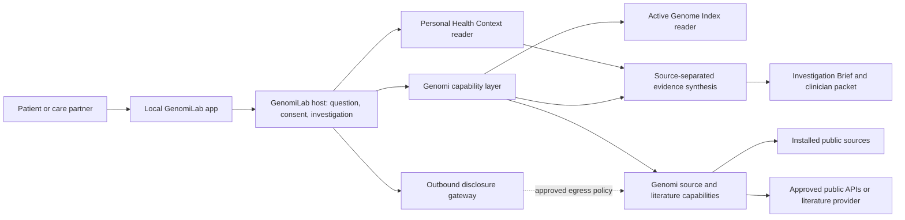

# GenomiLab Product Definition

- **Status:** product decision document with implemented developer-preview slice
- **Evidence snapshot:** 2026-08-08
- **Genomi baseline:** `master` at
  `47e0d0585073450a810d78a5235428b91b5d746d` (the checkout matched
  `origin/master` after `git pull --ff-only`)
- **Current package version:** 0.1.0

This document answers four questions:

1. What is GenomiLab, what does it do, and how do patients use it?
2. What can the current Genomi release already do?
3. What must be developed?
4. Who is the end user, what is the end-to-end experience, and how will we
   test whether it is genuinely the easiest good experience for that user?

### Implementation snapshot

The repository now includes a first executable vertical slice launched with
`genomi lab`. It provides local patient-profile workspaces, append-only health
facts, manual reported findings, bounded uncompressed VCF/gVCF intake, explicit
current-session genome approval, and a source-preserving known-variant
Investigation Brief. Two disjoint synthetic patient genomes exercise profile
isolation end to end.

This is deliberately labeled a developer preview for synthetic/public data.
It is not the complete patient MVP defined below: at-rest encryption, native
large-genome intake, transcript-HGVS normalization, broader public/literature
evidence, export/deletion UX, clinician packets, and independent patient and
security validation remain release gates. Paperclip is not needed for the
working local slice and no API key is requested.

The supplied comparison URL, `https://omanta.com/`, was verified directly on
2026-08-08. Its public site describes a concierge “research lab for one” for
complex patients: a disease-specific PhD case team, organization of records and
molecular data, diagnostic-gap analysis, evidence synthesis, physician
collaboration, and a living therapeutic roadmap. GenomiLab can learn from that
continuity and case-research model, but it is an open-source software product,
not a clone of a human scientific service and not a substitute for its clinical
or wet-lab collaboration.

### Decisions at a glance

| Question | First decision |
| --- | --- |
| What is the product? | A local-first, open-source case-research workspace that turns one patient question into an auditable Investigation Brief. |
| Who is first? | An adult with a rare, undiagnosed, or strongly heritable condition, an existing clinical finding or candidate gene/variant, and access to a clinician or genetic counselor. |
| What does the patient get? | An Investigation Brief with evidence and counterevidence kept separate by source, missing-data and confirmation needs, and a selective clinician packet—not a diagnosis or treatment plan. A candidate-mechanism section appears only when the evidence supports that shape. |
| What is reused? | Genomi's genome intake, Active Genome Index, source-specific evidence capabilities, evidence envelope, background jobs, libraries, journal, and dashboard components. |
| What is built first? | A one-click local app, Personal Health Context, consent/disclosure gateway, investigation state, provider-neutral literature adapter, Investigation Brief, security controls, and patient-product evaluations. |
| Which external systems enter the MVP? | BenchFlow for public/synthetic development evaluation. Paperclip is an internal public-evidence pilot only until commercial/privacy terms clear; Omanta is a UX comparator; Proto, Biohub ESM, and Benchling are deferred research-lab options. |

## 1. Product decision

GenomiLab is a **local-first personal research workspace for patients and care
partners**. It combines a person's genome, the health context they choose to
provide, and versioned public scientific evidence to produce auditable
**Investigation Briefs**. When the evidence supports a directional biological
explanation, the brief may include candidate molecular mechanisms.

Its promise is:

> Help me investigate one health question, see what my personal and public
> evidence supports or contradicts, identify a candidate mechanism when the
> evidence is ready for one, understand what is missing, and know what to ask a
> qualified professional to confirm.

GenomiLab is not a diagnostic system, a treatment recommender, or an autonomous
drug-design service. It must not turn an association, model prediction, absent
database hit, or unconfirmed raw-genome observation into a clinical conclusion.

The product should be built as a patient-facing application **on top of Genomi**,
not as a rewrite of Genomi's evidence engine:

- **Genomi remains the capability library.** It owns genome intake, the Active
  Genome Index, public-source retrieval, source-specific evidence operations,
  evidence envelopes, and local research memory.
- **GenomiLab becomes the host and product.** It owns onboarding, health-context
  capture, question decomposition, just-in-time consent, investigation state,
  patient presentation, and sharing.
- **The host synthesizes; tools do not choose a universal best gene.** Different
  source priors remain visible and separate.

This division preserves Genomi's core design while making it usable without an
MCP client, command line, or knowledge of genomic file formats.

## 2. What GenomiLab is

### 2.1 The product's core objects

| Object | Purpose |
| --- | --- |
| Person profile | Identifies whose data is active and records consent, proxy/caregiver authority, preferences, and sharing choices. |
| Active Genome Index | Genomi's local, queryable representation of the person's genome and its callability limits. |
| Personal Health Context | A local, longitudinal set of source-anchored conditions, symptoms/phenotypes, medications, allergies, measurements, procedures, family history, and relevant exposures. It is separate from the Active Genome Index. |
| Investigation | One patient question, its declared scope, the personal facts approved for use, the sources consulted, defaults applied, and resumable work state. |
| Evidence record | A source-specific observation with provenance, date/version, coverage state, and limitations. |
| Investigation Brief | The patient-facing synthesis: what was asked, evidence and counterevidence by source family, scope and missing evidence, confirmation needs, and next questions. It contains candidate mechanisms only when the evidence supports a directional biological hypothesis. |
| Clinician packet | A concise, user-approved export of relevant observations, citations, unresolved questions, and confirmation requests. |

“Personal Health Context” is a product/domain model, not an alias for the
genome. Genome reads must continue to cross the Active Genome Index reader
boundary. Health-history facts need their own narrow reader and access contract.

### 2.2 What “molecular driver” means

GenomiLab should not publicly promise to find “the molecular drivers of your
disease.” Germline sequence plus health history cannot generally establish that
level of causality. Common disease reflects multiple genetic and nongenetic
factors, while cancer treatment questions often require tumor/somatic and other
molecular measurements rather than inherited DNA alone.

The universal product output is an **Investigation Brief**, not a diagnosis.
Only when the consulted evidence supports a directional biological explanation
does it include a **candidate molecular-mechanism hypothesis**, which is not
necessarily a single gene. The word “driver” should be used only when a cited
source establishes that term in the relevant biological context. A mechanism
hypothesis may involve a variant, gene, regulatory element, pathway, cell type,
drug-response mechanism, or a combination of these.

Every mechanism hypothesis must show:

- the personal observations used, including genotype and callability support;
- the relevant health-context facts and their sources/dates;
- separate evidence streams such as ClinVar, gene–disease validity, HPO match,
  GWAS, PRS, population frequency, functional perturbation, pathway/cell-type,
  pharmacogenomic, and literature evidence;
- supporting evidence, counterevidence, conflicts, and missing coverage;
- whether the evidence supports an answer, only a scoped hypothesis, or no
  answer yet;
- what would materially strengthen or weaken the hypothesis;
- clinical or laboratory confirmation needed before health decisions; and
- citations and an “evidence current as of” timestamp.

There is no single cross-source “mechanism score.” Source-specific rankings can be
shown side by side, while the GenomiLab host explains why it gives one
hypothesis more attention in this investigation.

### 2.3 Patient-facing features

#### A. Question-first start

The first screen asks, “What are you trying to understand?” The user can start
with a diagnosed condition, a symptom cluster, a medication, a known variant,
or a previous finding. A public-evidence preview is available before private
data is required.

The first release should be deliberately narrower: “Could this existing
genetic finding or candidate help explain my condition, and what remains to be
confirmed?” for an adult who has a clinical report or candidate gene/variant
and can involve a clinician or genetic counselor. It is not an open-ended
genome-wide diagnostic scan.
Pharmacogenomics, common-disease/PRS, and cancer are separate investigation
lanes with different evidence and confirmation rules; they must not be hidden
behind one generic “health risk” workflow. Cancer treatment matching is not a
germline-genome feature and requires tumor/somatic and other disease-specific
molecular evidence.

#### B. Private data workspace

- For the first slice, accept manual entry of a reported finding and pre-called
  VCF/gVCF. The existing Genomi engine can also ingest consumer arrays, BAM,
  FASTQ, and genome bundles, but those become advanced product paths only after
  their setup, storage, coverage, and interpretation UX is validated.
- Show plain-language readiness: variants ready, full reference coverage still
  processing, source too sparse for a requested claim, or evidence library
  missing.
- Capture only the health context relevant to the current question first; do
  not require a complete medical-history upload before the user sees value.
- Later, import structured FHIR/US Core and GA4GH Phenopacket data, with a review
  step before imported facts become usable evidence.
- Keep source, event date, recorded date, status, and confidence for every
  health-context fact. Patient-reported, record-derived, clinician-entered, and
  inferred facts must remain distinguishable.

#### C. Guided investigation

- Translate the user's wording into explicit targets while preserving the
  original question.
- Explain which private facts would help and request access only when needed.
- Run the smallest useful source-specific Genomi operations first, then add
  orthogonal evidence when the first stream cannot answer the question.
- Search current literature, regulatory documents, and trials through a
  traceable external evidence adapter.
- Resume background genome and evidence jobs rather than starting duplicate
  work.

#### D. Evidence workspace

- An evidence map that shows source-specific connections among the condition,
  phenotypes, variants, genes, pathways, cells/tissues, medications, and
  publications.
- An evidence ledger with exact source records, versions, retrieval dates,
  defaults, and conflicts.
- Clear states: observed in this sample, supported by a public source,
  association only, model prediction, not assessed, blocked, and not observed
  in the consulted scope.
- A research notebook that records decisions and questions while keeping agent
  notes distinct from source evidence.

#### E. Results patients can use

The top layer of an Investigation Brief contains only:

1. what the investigation found;
2. what that could mean;
3. what remains uncertain or untested;
4. what not to conclude; and
5. the next useful questions or confirmation steps.

Technical identifiers, source records, methods, and full provenance remain one
click away. High-impact genetic findings and medication-response findings
always carry confirmation language. The product never tells a patient to start,
stop, or change a medication.

#### F. Continuity and updates

- Save the investigation, evidence snapshot, source versions, and unresolved
  questions locally.
- Allow a user to refresh an investigation and see only what changed.
- Report source freshness honestly. “Latest evidence” means current within the
  enumerated, successfully consulted sources and their update schedules—not all
  scientific knowledge everywhere.
- Offer user-controlled monitoring later; do not send private queries to a
  hosted service silently.

#### G. Collaboration and control

- Export a one- or two-page clinician-facing front section, a technical
  appendix, and a machine-readable evidence bundle.
- Let the user preview and remove facts before sharing.
- Show an access and disclosure log.
- Support export and deletion of profiles, health context, investigations, and
  Genomi-owned artifacts.

## 3. What the current Genomi baseline already supports

The inspected baseline registers **92 operations** across its runtime and
capability catalogs; that number includes internal and support operations, so it
is not a count of patient-visible features. The durable capability inventory is
below.

| Area | Current support | Reuse in GenomiLab | Important boundary |
| --- | --- | --- | --- |
| Local genome intake | Content-based detection and intake for VCF/gVCF, BAM, paired FASTQ, major consumer-array exports, compressed/archive forms, and `.genome/1.0` bundles. | Reuse directly. | Some formats require aligners/reference assets; long jobs can run in the background. |
| Active Genome Index | Local indexed alleles, zygosity, quality/depth/filter fields, reference blocks, region queries, exact-allele support, QC, and callability classification. | Core personal-genome substrate. | It is a technical evidence index, not a medical record or diagnosis. |
| Profile and access context | User nicknames, genome assignment/selection, default user, session approval/revocation, rename, list, and removal. | Starting point for person selection and consent. | It is not yet a patient identity, proxy-consent, or granular disclosure system. |
| Variant and ClinVar evidence | Variant resolution, allele/gene context, exact build-specific ClinVar matching, candidate review groups, and gnomAD frequency lookup. | Core rare/inherited-risk stream. | Empty or unmatched scope is not a clinical negative; optional libraries may be missing. The current resolver does not accept transcript-level coding/protein HGVS commonly printed on clinical reports. |
| Phenotype and disease evidence | Phenotype/HPO normalization and comparison; GenCC gene–disease retrieval; disease comparison; Open Targets disease/drug-target evidence; trait-to-gene records; risk-investigation planning. | Core condition and rare-disease streams. | The tools compare evidence and plan review; they do not select a diagnosis. |
| Pharmacogenomics | Medication review; ClinPGx, FDA, and PGxDB retrieval; PharmCAT preflight/run/import; specialized-call handling; pharmacogene requirement reporting. | Core medication workflow. | Current health context is passed per call; genotype/phenotype limitations and clinical confirmation remain material. |
| Polygenic scores | PGS Catalog search/metadata/import, overlap QC, raw weighted score calculation, and calibration boundaries. | Optional common-disease context. | A raw score without validated population calibration is not an individual risk percentile. |
| Ancestry context | 1000 Genomes panel inventory, overlap, PCA projection, nearest reference neighbors, and qualitative population-context explanation. | Quality/context input when relevant. | It is reference-panel similarity, not race or ethnicity prediction. |
| Nutrigenomics | Declared domains, curated marker retrieval, variant lookup, evidence tiers, and non-prescription boundaries. | Secondary research stream. | It must not become personalized diet or supplement prescribing. |
| GWAS | Source-specific gene and variant association comparison against GWAS Catalog records. | Association stream. | Association is not causality and must not override stronger source priors. |
| Functional genomics | BioGRID ORCS and DepMap retrieval, GEO discovery, local perturbation-table import, and source-specific candidate comparison. | Mechanistic support stream. | Experimental context and assay relevance must remain visible. |
| Pathway/cell/region grounding | Reactome/KEGG-style pathway members, cell-marker retrieval, and GENCODE/ENCODE region features. | Mechanism and tissue-context layer. | These are grounding records, not patient-specific proof. |
| Sequence utilities | Deterministic sequence analysis, reference matching, translation, ORFs, restriction sites, Kozak context, and primer checks. | Advanced evidence support. | Not a variant-effect or therapeutic-design engine. |
| Research and memory | Target packets, source catalog, reviewed-research store/search, evidence-scoped journal, journal summaries, and memory export. | Foundation for investigation provenance. | Journal entries are agent notes, not evidence; literature retrieval is not yet a full current-evidence pipeline. |
| Evidence contract | Canonical `evidence_envelope` with finding state, answer readiness, coverage, observations, negative-inference rules, guidance, and next actions. | Preserve as the contract behind every result card. | GenomiLab must not invent a second readiness or confidence contract. |
| Dashboard | Local, self-contained HTML dashboard across overview, variants, PGx, risk, ancestry, and nutrigenomics, with ready/empty/blocked/running states. | Reuse components and panel adapters. | It is a generated genome dashboard, not an interactive longitudinal patient workspace. |
| Installation and libraries | Apache-2.0 Python package; agent-guided install/update; managed public-library registry; idempotent refresh; missing-library states; and host response profiles. | Reuse runtime and library lifecycle. | The current install/MCP flow is still too technical for the primary patient user, and a full library profile can consume several gigabytes. |

Repository evidence for this inventory:

- Product and source support: [`README.md`](README.md),
  [`RELEASE_NOTES.md`](RELEASE_NOTES.md), and [`SKILL.md`](SKILL.md)
- Runtime and privacy surface:
  [`src/genomi/runtime/tool_catalog.json`](src/genomi/runtime/tool_catalog.json),
  [`src/genomi/active_genome_index/tool_catalog.json`](src/genomi/active_genome_index/tool_catalog.json), and
  [`src/genomi/evidence/envelope.py`](src/genomi/evidence/envelope.py)
- Capability definitions: the `tool_catalog.json` files under
  [`src/genomi/capabilities/`](src/genomi/capabilities/)
- Current patient-facing artifact:
  [`src/genomi/capabilities/decode/`](src/genomi/capabilities/decode/)

### 3.1 Present but not yet product-complete

The current runtime can accept phenotype terms, medication context, indication,
dose, current medications, and contraindication text in focused calls. The
README also recognizes optional phenotype, medications, and family history as
personal context. It does **not** yet provide a canonical longitudinal health
context with source reconciliation, dates, consent, provenance, and reusable
read operations.

The current user registry is sufficient to associate a nickname with one or
more genome artifacts. It is not sufficient for patient/caregiver relationships,
source-level permissions, or safe outbound-query approval.

The earlier release-blocking access mismatch is resolved in the developer
preview: a default user can still auto-select profile metadata, but that never
authorizes a genome read. Existing Active Genome Index data requires explicit
current-session approval, and switching GenomiLab profiles revokes the prior
grant. See the [governance rule](AGENTS.md),
[implementation](src/genomi/runtime/context/agi_access.py), and
[documented behavior](README.md).

The decode dashboard is a useful technical starting point, but the primary
experience still requires an agent host and Genomi-specific commands. It does
not begin with a patient question, collect/reconcile health history, maintain an
investigation, or create a clinician-ready Investigation Brief.

Current genome evidence is also not a full clinical interpretation pipeline.
There is no supported genome-wide consequence-annotation workflow, ACMG
classification, de novo/segregation analysis, or general CNV/SV, repeat,
mitochondrial, or HLA interpretation. The existing public/synthetic test matrix
validates software contracts, not clinical performance on real whole genomes.

## 4. What must be developed

### 4.1 P0: required for a credible patient MVP

| Capability | Required behavior | Why it is new |
| --- | --- | --- |
| Local GenomiLab application | A signed desktop shell over a local web service, with one-click setup, question entry, imports, progress, findings, evidence detail, settings, export, and deletion. MCP and direct localhost access remain advanced interfaces. | Genomi currently exposes CLI/MCP plus a generated dashboard, not a complete patient app. |
| Setup and library planner | Start with the small public-only path; explain disk, compute, network, and expected time before genome or library work; install only what the chosen investigation needs; resume interrupted setup. | The current installer and library profiles are capable but expose technical choices and a full installation can be several gigabytes. |
| Guided report/finding entry and normalization | Capture the lab's exact gene/variant text, transcript and coding/protein HGVS when present, classification, test scope, laboratory, report date, and confirmation status. Resolve transcript/HGVS, assembly, alleles, and VRS identity with explicit ambiguous/unresolved/review states; never silently choose a transcript, build, or allele. Retain an optional local report attachment without automatically extracting facts. | Genomi can resolve rsIDs and genomic coordinates/alleles but has no patient report/finding object or transcript-HGVS resolver. Automated document extraction belongs in P1 after a human-review contract exists. |
| Personal Health Context | Typed, temporal, source-aware facts for conditions, symptoms/HPO, medications, allergies, measurements/labs, procedures, family history, and exposures. Include review/reconciliation and narrow reader methods. | Today these facts are transient request parameters or agent notes. |
| Consent and disclosure gateway | Separate permission for local genome reads, local health-context reads, and each class of outbound query. Preview exactly what will leave the machine. | Current approval is centered on Active Genome Index reads, not health records or network disclosures. |
| Local identity boundary | Bind the workspace to an OS user or app unlock, isolate each person's data and sessions, expire sensitive access, and require reauthentication for export or deletion. | Current nicknames and selected-user state are routing context, not authentication or authorization. |
| Investigation state | Persist the original question, targets, approved context, plan, calls, background jobs, defaults, source coverage, evidence snapshot, and unresolved questions. | Journal and research storage provide pieces, but no patient investigation object/workflow exists. |
| Provider-neutral literature adapter | Search/read primary literature, regulatory documents, trials, and protein/drug databases through public APIs or an approved commercial provider; normalize claims, citations, corrections/retractions, source dates, source type, peer-review state, and retrieval coverage into the evidence contract. | Genomi has reviewed-source storage and targeted public adapters, not broad verified literature retrieval. No hosted provider may become the only path to evidence. |
| Investigation Brief composer | Patient summary, source-separated evidence views, conflicts, gaps, conditional mechanism hypotheses, confirmation needs, change history, and clinician export. | The decode dashboard is genome-panel-centric and does not synthesize a condition-specific investigation brief. |
| Patient-safe language layer | Progressive disclosure, plain-language definitions, teach-back checks for consequential findings, distress-aware presentation, and non-prescriptive medication language. | Response profiles exist, but patient workflow and comprehension verification do not. |
| Data protection controls | Encrypt personal data at rest by default with keys held in the OS credential store, use least-privilege file permissions, keep secrets outside reports/logs, disable sensitive telemetry, record disclosures, and implement tested export, backup, recovery, and deletion semantics. | Local-first storage alone is not a complete application security or breach-response design. |
| Product evaluation suite | Reproducible public/synthetic scenarios that score evidence use, source-prior separation, negative inference, privacy, comprehension, clinical-confirmation language, cost, and task completion. | Genomi has extensive capability tests, but not end-to-end patient-product evaluations. |

### 4.2 P1: needed after the thin vertical slice works

- FHIR R4/US Core patient-access import for conditions, observations/labs,
  medications, allergies, procedures, diagnostic reports, family history, and
  provenance.
- GA4GH Phenopacket v2 import/export for phenotypes, measurements, diseases,
  interpretations, medical actions, and linked genome files.
- PDF/CSV clinical-document import with extraction provenance and a mandatory
  human confirmation queue. Unreviewed extracted facts must not drive answers.
- Family/pedigree and caregiver/proxy workflows with explicit authority and
  relationship-aware privacy.
- Investigation refresh and source-change diffing.
- Secure, selective clinician collaboration rather than sharing an entire
  genome or health record.
- Separate, explicitly validated workflows for pharmacogenomics and calibrated
  common-disease risk; neither inherits rare-disease interpretation rules.
- A genome-wide rare-disease candidate pipeline only after supported consequence
  annotation, CNV/SV/repeat/mitochondrial handling, phase and segregation, test
  scope/callability, phenotype integration, and appropriately validated
  interpretation contracts exist. The MVP must not simulate this with a gene
  list or universal score.
- Multilingual content validated with native speakers, not direct machine
  translation alone.

### 4.3 P2: research-lab expansion, not default patient workflow

- Advanced variant-effect and protein-mechanism analyses after a candidate is
  established by source evidence.
- Optional Proto/proto-tools execution for researcher-approved computational
  experiments.
- Optional Biohub ESM inference for protein representation or structure
  hypotheses, with model/version/license and compute provenance.
- Optional Benchling export/connector for a collaborating wet lab or research
  organization.
- Somatic-variant, tumor, RNA, protein, pathology, and tissue-context contracts
  if GenomiLab later expands into cancer or multi-omics research. These data
  must not be treated as interchangeable with a germline Active Genome Index.
- Design-of-experiment and sequence-design campaigns in an explicitly separate
  researcher mode. Synthetic designs must never appear as patient treatment
  recommendations.

### 4.4 Proposed health-context contract

Each Personal Health Context fact should minimally carry:

- typed fact kind and normalized term/code when available;
- the user's original wording;
- value, units, explicit present/absent/unknown status, onset/event time,
  progression, and recorded time as applicable;
- source type and source identifier/document hash;
- biological relationship, affected status, and inheritance/segregation
  evidence when a family fact is relevant;
- assertion author: patient, caregiver, clinician, imported record, or model;
- verification state: unreviewed, user-confirmed, record-confirmed, or
  clinician-confirmed;
- supersession/reconciliation links rather than destructive overwrite;
- access scope and disclosure history; and
- the exact investigation(s) in which it was used.

No health-context importer should infer a diagnosis from a symptom or a
medication from an OCR fragment. Inference may create a review candidate, never
an accepted fact. “Clinician-confirmed” requires authenticated clinician input
or provenance from an appropriate signed clinical report; a patient or agent
cannot promote a fact to that state by selecting a label.

### 4.5 Safety-stage contract

Every patient-facing statement must occupy exactly one of four stages:

1. **Research observation** — a fact in a personal or public source, with
   provenance and coverage limits.
2. **Candidate hypothesis** — GenomiLab's source-linked synthesis of relevant
   observations and counterevidence.
3. **Clinically confirmed result** — a result confirmed through an appropriate
   clinical test or qualified professional and recorded with that provenance.
4. **Diagnosis or treatment decision** — a decision made in clinical care.

GenomiLab creates stages 1 and 2 and can record or prepare questions for stage
3. It does not make stage-4 decisions. A variant of uncertain significance is
never actionable by itself; a research or raw-data observation never silently
becomes “clinically confirmed”; and secondary findings require a separate
opt-in before analysis or display. Every screen must keep an urgent-care route
available for symptoms that cannot safely wait for research.

## 5. End-user profile

### 5.1 Primary user: the patient investigator

For the first release, an adult living with a rare, undiagnosed, or strongly
heritable condition who:

- already has a clinical report, known finding, or candidate gene/variant, and
  may also have a genome, exome, or VCF;
- has health information distributed across memory, reports, portals, and
  medication lists;
- is motivated to investigate but is not a bioinformatician;
- wants evidence and a better conversation with a clinician, not a black-box
  diagnosis;
- has access to a clinician or genetic counselor for confirmation and medical
  decisions;
- may be anxious, fatigued, visually impaired, cognitively overloaded, or using
  the product during a stressful period; and
- values local control over genomic and health data.

The primary job is: **“Help me turn my scattered personal data and the research
literature into a defensible set of hypotheses and questions I can take to the
right professional.”**

### 5.2 Secondary users

- A parent, spouse, or other care partner acting with explicit permission.
- A rare-disease caregiver coordinating phenotype and family evidence.
- A genetics-literate patient who wants full methods and source records.
- A genetic counselor, clinician, or researcher receiving a patient-approved
  packet. These experts are collaborators, not the primary owner of the local
  workspace.

### 5.3 Not the first target

- Emergency or acute-care decisions.
- Autonomous diagnosis, treatment selection, or medication dosing.
- Prenatal, embryo, or pediatric use without a separately designed consent and
  safeguarding model.
- Population/cohort research or biobank management.
- Wet-lab automation and therapeutic sequence design.
- General wellness optimization as the product's main promise.
- Cancer diagnosis or treatment matching from germline data alone.

## 6. End-to-end user experience

### 6.1 Recommended flow

| Step | What the patient experiences | What GenomiLab does |
| --- | --- | --- |
| 1. Ask | “What are you trying to understand?” plus examples. No file is required. | Preserves the original wording, proposes explicit entities/terms, and offers a public-only start. |
| 2. Set expectations | A short explanation of research vs clinical use and what kinds of results may be sensitive. | Records acknowledgment without using a blanket consent to cover later disclosures. |
| 3. See a public baseline | A brief overview of known evidence and which personal inputs could make the investigation more specific. If online retrieval is needed, the user first sees and approves the exact terms to be sent. | Starts with installed/cached public sources and does not search for old private context. A condition, symptom cluster, or rare variant remains sensitive even when the destination is a public database. |
| 4. Add only useful context | The user can import a genome, enter a few relevant symptoms/diagnoses/medications, or skip. | Requests the minimum evidence needed, shows source/readiness, and records provenance. |
| 5. Approve private access | A plain preview of the local data needed for the investigation. Any earlier or later network request has its own just-in-time egress preview. | Records one intelligible session/investigation-scoped grant; asks again only if the data class, purpose, or destination expands. Raw genome and full health history remain local. |
| 6. Investigate | A progress view says which evidence streams are complete, running, blocked, empty, or unavailable. | Runs source-specific tools, resumes jobs, records defaults, and keeps source priors separate. |
| 7. Review the brief | A layered Investigation Brief leads with findings, uncertainty, and next questions; it says “no supported mechanism yet” when appropriate. | Synthesizes only from evidence records; every answer-shaped statement links back to evidence. |
| 8. Confirm understanding | For consequential findings, the user answers a short “what this does and does not mean” check. | Uses health-literacy universal precautions and corrects misunderstandings before sharing. |
| 9. Take the next step | Save, refresh later, or create a clinician packet after removing anything they do not want to share. | Produces a scoped export and records the disclosure. |

### 6.2 Is this the best and easiest experience?

It is the strongest current product hypothesis, but it cannot honestly be
called “best” until representative patients use it.

The recommended first distribution is the signed desktop shell defined above:
it keeps the genome and health context local while hiding Python, MCP, Docker,
library names, and localhost lifecycle from the patient. A browser-accessible
local service can remain underneath for portability and expert access.

It is likely easier than the current Genomi flow because it is:

- **question-first, not installation-first;**
- **public-first, not upload-everything-first;**
- **progressive, not a wall of genomic panels;**
- **just-in-time about consent and missing data;**
- **layered for plain language and expert detail;** and
- **oriented toward a clinician conversation, not false certainty.**

The design deliberately does not start with “upload your whole genome and
medical record.” That creates delay, privacy anxiety, and cognitive burden
before the user knows whether the product can help.

### 6.3 Usability and safety launch gates

Test with patients/caregivers across genetics literacy, age, disability,
language, and diagnostic experience. Before a public patient release:

- at least 80% of representative participants should complete a first
  public-only investigation without facilitator help;
- median time to a useful public brief should be no more than five minutes;
- at least 80% should complete the supported end-to-end path—reported finding
  or pre-called VCF, minimum health context, investigation, and clinician
  packet—without facilitator intervention;
- completion, abandonment, elapsed time, error recovery, and support requests
  must be compared with both current Genomi and a realistic manual source-search
  workflow; the new path must improve completion or workload without weakening
  comprehension, privacy, or evidence fidelity;
- at least 90% should correctly distinguish “observed in my data,” “public
  association,” “research hypothesis,” and “requires clinical confirmation”;
- consequential-result teach-back errors must trigger clarification, not allow
  silent progression to sharing;
- all patient-facing paths should meet WCAG 2.2 AA;
- every answer-shaped claim in evaluation must have accessible evidence and
  source coverage;
- medication scenarios must never recommend an unsupervised dose or therapy
  change;
- uncertain variants must never be presented as actionable, and secondary
  findings must remain hidden until the user has explicitly opted in;
- source-unavailable, missing-library, low-overlap, and no-hit cases must never
  be scored as a broad clinical negative; and
- privacy tests must show that raw genome records and full health context are
  never sent to external evidence services; and
- blinded genetic-counselor or clinician review must find every front-section
  claim traceable and every material limitation retained, and must measure
  whether the packet is useful within a realistic review window.

Targets should be revised after formative studies; they are launch gates, not
claims about the current product.

## 7. External-system decisions

| System | Decision | Product role | Reason and boundary |
| --- | --- | --- | --- |
| Paperclip | **Use only for an internal public-evidence pilot now; gate any shipped dependency.** | Evaluate current literature, regulatory, trial, UniProt/PDB/ChEMBL search; full-text reading; claim/citation verification; and reproducible literature collections. | It directly addresses Genomi's broad current-evidence gap, but the public terms reviewed on 2026-08-08 do not fit an open-source patient product: they restrict commercial use/output sharing and allow service interactions to improve models unless the user opts out. No patient data or patient-derived query should be sent. Shipped use requires written commercial/output rights, a DPA, no-training terms, security review, incident/SLA terms, and a clean provider fallback. |
| BenchFlow | **Adopt as development/evaluation infrastructure, not a user feature.** | Run reproducible patient scenarios against agents, sandboxes, and verifiers; score evidence correctness, privacy, safety, cost, and task completion. | It addresses the explicit Genomi principle that tools must improve outcomes. Use public or synthetic fixtures only in CI. |
| Proto language | **Defer to researcher mode.** | Multi-objective DNA/RNA/protein design campaigns after a research target and experimental goal are explicitly defined. | It is strong open-source generative-biology infrastructure, but sequence design is not needed to develop a patient's candidate-mechanism hypotheses and would blur the product's safety boundary. |
| proto-tools | **Evaluate selectively after the MVP.** | Isolated optional tools for variant effect, splicing, sequence/structure, or protein analysis. | A narrow adapter may add mechanistic evidence without adopting the full generative loop. Each tool/model still needs scope, license, provenance, and evidence-status review. |
| Biohub ESM | **Defer; local execution only for patient-derived inputs.** | Protein embeddings and structure/mechanism hypotheses after a candidate protein is established. | Useful for mechanistic research, not clinical causality. Code is MIT-licensed, but weights and hosted terms vary and the hosted privacy notice permits submission storage. Start with local ESMC, consider ESMFold2 when structure materially helps, and isolate any later ESM3 use in expert mode. |
| Benchling | **No patient-data dependency; optional non-patient collaborator connector later.** | Export an approved, minimal experimental handoff to a research organization or wet lab. | It does not solve the patient's intake or interpretation problem, and Benchling's standard agreement treats identifiable health and genetic information as prohibited data. Under standard terms, send no patient sequence or health context; any broader use needs a negotiated agreement and security/privacy review. |
| Omanta | **Use as a service/UX comparator, not an integration.** | Learn from its persistent case team, organized record/molecular-data review, diagnostic-gap analysis, physician collaboration, and living research roadmap. | Its public site was active and reviewed on 2026-08-08. GenomiLab should borrow the continuity and “research lab for one” pattern while remaining transparent software; pricing, outcome evidence, API/licensing, and security terms were not public enough to support parity claims. |

### 7.1 Literature-provider integration contract

The adapter should expose small evidence verbs, not a second agent router or a
provider-shaped evidence model:

- search public sources using approved condition/gene/variant/mechanism terms;
- read exact records and sections;
- capture claim-level support or contradiction with line/section provenance;
- preserve peer-reviewed, preprint, regulatory, trial, and database source types;
- return source coverage, misses, unavailability, retrieval time, and query terms
  through the Genomi evidence envelope;
- materialize normalized evidence locally with source URLs and immutable
  identifiers; and
- provide primary-source API and manual reviewed-source paths that work without
  any commercial provider.

Retrieved publications and imported documents are untrusted evidence content,
never host instructions. The adapter must isolate them from system/tool control
and preserve quoted claims as source-authored content.

If Paperclip later clears the commercial, privacy, and security gates, its own
AI verification is useful process evidence, not independent scientific
replication. GenomiLab remains responsible for showing the underlying source
and uncertainty. Its Apache-licensed repository is a client for the hosted
service, not a self-hosted copy of the indexed backend, so it does not satisfy
the local/open-source data-plane requirement by itself.

### 7.2 BenchFlow evaluation tracks

Build patient-product evaluations around durable behaviors rather than UI
snapshots:

1. exact pathogenic-variant observation with and without clinical confirmation;
2. consumer-array no-call and sparse-coverage cases;
3. phenotype-driven rare-disease comparison with conflicting candidates;
4. PGx review with a missing specialized call or contraindication;
5. PRS with low overlap or no calibrated population context;
6. missing library and unavailable external source;
7. literature disagreement, retraction/preprint status, and stale evidence;
8. proxy/caregiver access and unauthorized health-context use;
9. external-query redaction;
10. prompt injection in imported/retrieved content; and
11. patient comprehension and clinician-packet fidelity.

Use the existing public sample-derived fixtures and synthetic health context.
Never mount private genomes into shared or cloud evaluation environments.

## 8. Product architecture and privacy boundary

The provider-neutral adapter belongs in Genomi as an evidence capability, so it
uses the same evidence envelope and the runtime library manager for managed
assets. The GenomiLab host owns consent, egress policy, and orchestration; it
does not invent a parallel retrieval store. Provider-generated claim checks are
process metadata. The underlying source record—not the provider's verdict—is
the evidence.

| Data class | Default boundary |
| --- | --- |
| Raw genome source | Local intake only; downstream code reads the Active Genome Index, not the original source. |
| Active Genome Index | Local and person-bound. Identity and index selection may persist, but read authorization is explicit and limited to the current session/investigation; a default selection never grants access. |
| Personal Health Context | Local and separately authorized from genome data. |
| External evidence query | Only the previewed, approved public target terms leave the machine; no raw records or full history. |
| Public evidence and citations | May be cached locally with source/version/retrieval metadata. |
| Investigation journal | Local agent/user memory; never promoted to evidence without a linked source record. |
| Reports | Local by default; sharing is an explicit export with a disclosure receipt. |
| Logs and telemetry | Local, minimized, and redacted by default; never contain raw variants, health-history text, or secrets. |

The legal/privacy program needs jurisdiction-specific review before distribution.
In the United States, a consumer health app may fall under the FTC Health
Breach Notification Rule even when it is not covered by HIPAA. “Local-first”
must not be marketed as a substitute for a security and breach-response plan.
Onboarding should also explain that genomic data is inherently identifying and
that U.S. GINA protections do not extend to life, disability, or long-term-care
insurance. There must be no advertising, data brokerage, silent model training,
or sensitive content in notifications.

Regulatory status is determined function by function and by intended use, not
by an “informational only” disclaimer. The January 2026 FDA clinical-decision-
support guidance specifically includes patient/caregiver software in its
analysis, while general-wellness policy applies to functions unrelated to the
diagnosis or treatment of disease. GenomiLab therefore needs specialist
regulatory review before a patient release and whenever a lane adds risk,
diagnosis, biomarker matching, or treatment-oriented behavior.

## 9. Delivery sequence

### Phase 0: contracts and tested thin slice

- Freeze this product boundary and threat model.
- Define Personal Health Context and investigation contracts.
- Add a question-first local application shell.
- Add reported-variant normalization for transcript/coding/protein HGVS,
  assembly, allele, and VRS identity, with an explicit human review path for
  ambiguity.
- Implement one existing-finding rare or unresolved heritable-condition
  investigation:
  public evidence → optional relevant health context → optional genome evidence
  → source-separated Investigation Brief.
- Build the provider-neutral literature adapter with primary-source and manual
  paths; evaluate Paperclip only on public, nonpatient topics until its product
  gates are cleared.
- Create BenchFlow tasks for the thin slice and its failure states.

### Phase 1: patient MVP

- Guided genome import/readiness and resumable progress.
- Manual structured health-context entry and reconciliation.
- Existing-finding rare/undiagnosed inherited-condition investigations, with a
  separate secondary-findings opt-in and persistent urgent-care route. Do not
  expose open-ended genome-wide candidate discovery until its P1 interpretation
  contracts and validation are complete.
- Evidence ledger, conditional mechanism section, clinician packet, export,
  deletion, access log,
  and refresh-on-demand.
- Patient comprehension testing, WCAG 2.2 AA validation, security review, and
  public/synthetic end-to-end evaluations.

### Phase 2: connected health context

- FHIR/US Core and Phenopacket import/export.
- Reviewed PDF/CSV ingestion.
- Caregiver/proxy and family context.
- Evidence change monitoring and selective collaboration.

### Phase 3: researcher lab

- Advanced variant-effect/protein-mechanism tools.
- Proto/proto-tools and Biohub ESM under a separate experimental-computation
  contract.
- Optional Benchling connection and wet-lab handoff.

## 10. MVP definition of done

The first GenomiLab release is done when a nontechnical patient can:

1. install/open the local application without configuring MCP;
2. ask a public question and, after any required egress consent, receive a
   sourced brief before uploading data;
3. enter a known reported finding or optionally import a pre-called VCF/gVCF
   and understand its readiness/limits;
4. add and verify the minimum health context needed for that question;
5. understand and approve a session/investigation-scoped private-data grant and
   each external destination, with re-consent whenever data class, purpose, or
   destination expands;
6. receive an Investigation Brief that separates personal observation,
   source-specific public evidence, hypotheses, conflicts, missing evidence,
   and confirmation needs;
7. inspect every source and “as of” date;
8. resume interrupted work without duplicated parsing/retrieval;
9. create a selective clinician packet;
10. export or delete all GenomiLab-owned personal data; and
11. use private mode only after the threat model, at-rest encryption and key
    handling, signed distribution/update path, local user boundary, backup and
    recovery behavior, log/cache redaction, and deletion semantics have passed
    independent security review. Until then, the release remains public-only.

The release is not done if the primary path still requires the user to know an
rsID, HPO ID, genome build, command-line argument, MCP operation, evidence
envelope field, or optional-library name.

## 11. Open product decisions

These questions should be resolved through user research and technical spikes,
not silently assumed during implementation. The initial existing-finding,
rare/undiagnosed inherited-disease wedge is a product decision, not an open
question.

- Which health-context facts are mandatory for that wedge, and which can remain
  question-specific?
- What encrypted storage and key-recovery model is acceptable without making
  local setup harder than the current Genomi flow?
- What written commercial, output-use, privacy, security, and service terms must
  a hosted literature provider satisfy before it can enter the shipped product?
- What evidence refresh interval is useful without creating alarm fatigue?
- What export format will clinicians actually review in practice?
- Which evidence and UX contracts must differ across rare disease,
  pharmacogenomics, common-disease/PRS, and cancer/somatic lanes?
- Which jurisdictions and age groups are explicitly supported at launch?

## 12. External evidence and standards consulted

- [Paperclip documentation](https://paperclip.gxl.ai/docs) and
  [client repository](https://github.com/GXL-ai/paperclip) — current search,
  reading, MCP/SDK/CLI, source coverage, literature-repo, claim-verification,
  and hosted-client boundaries.
- [GXL terms of service](https://gxl.ai/terms-of-service/) and
  [privacy notice](https://gxl.ai/privacy-notice/) — current Paperclip use,
  output, content-license, training, collection, and retention boundaries.
- [Omanta](https://omanta.com/) and its
  [clinician workflow](https://omanta.com/clinicians.html) — current public
  description of its case-team, data-review, physician-collaboration, and
  living-roadmap service pattern.
- [Proto documentation](https://proto.evodesign.org/docs/introduction),
  [Proto language repository](https://github.com/evo-design/proto-language),
  [proto-tools repository](https://github.com/evo-design/proto-tools), and the
  [Proto preprint](https://www.biorxiv.org/content/10.64898/2026.06.22.733870v1).
- [Biohub ESM repository](https://github.com/Biohub/esm) — ESMC, ESMFold2,
  local/Hugging Face and hosted inference, tutorials, and code license.
- [Biohub privacy policy](https://biohub.org/privacy-policy/) — collection and
  storage of user submissions and the instruction not to submit patient or
  regulated data without express permission.
- [BenchFlow repository](https://github.com/benchflow-ai/benchflow) — agent
  environments, verifiers, scored trajectories, sandboxes, and Apache-2.0
  license.
- [Benchling AI](https://www.benchling.com/ai) and
  [Benchling Developer Platform](https://www.benchling.com/developer-platform)
  — structured R&D data, notebooks, models, APIs, events, App Canvas, and MCP.
- [Benchling Main Services Agreement](https://www.benchling.com/main-services-agreement)
  — the reviewed standard prohibited-data boundary for identifiable health and
  genetic information.
- [HL7 FHIR R4 resources](https://hl7.org/fhir/R4/resourcelist.html),
  [FHIR Provenance](https://hl7.org/fhir/R4/provenance.html), and
  [ONC patient-access developer guidance](https://healthit.gov/patient-access-to-health-records/developers/).
- [GA4GH Phenopacket v2](https://phenopacket-schema.readthedocs.io/en/latest/phenopacket.html).
- [GA4GH Variation Representation Specification](https://vrs.ga4gh.org/en/stable/)
  and [Machine Readable Consent Guidance](https://www.ga4gh.org/product/machine-readable-consent-guidance/).
- [NHGRI complex-disease definition](https://www.genome.gov/genetics-glossary/Complex-Disease)
  and [NCI cancer biomarker-testing guidance](https://www.cancer.gov/about-cancer/treatment/types/biomarker-testing-cancer-treatment)
  — why common disease and cancer cannot be reduced to a germline single-driver
  workflow.
- [ACMG/AMP sequence-variant interpretation standard](https://pmc.ncbi.nlm.nih.gov/articles/PMC4544753/)
  — including the boundary that a variant of uncertain significance should not
  drive clinical decisions.
- [NHGRI direct-to-consumer genetic testing FAQ](https://www.genome.gov/For-Health-Professionals/Provider-Genomics-Education-Resources/Healthcare-Provider-Direct-to-Consumer-Genetic-Testing-FAQ)
  — coverage limits, counseling, false positives, and clinical confirmation.
- [AHRQ Health Literacy Universal Precautions Toolkit](https://www.ahrq.gov/health-literacy/improve/precautions/index.html)
  — plain communication and confirming understanding.
- [W3C WCAG 2.2](https://www.w3.org/TR/WCAG22/) — accessibility target.
- [FTC Health Breach Notification Rule guidance](https://www.ftc.gov/business-guidance/resources/complying-ftcs-health-breach-notification-rule-0)
  — consumer health-app privacy and breach-notification considerations.
- [HHS health-app/API privacy guidance](https://www.hhs.gov/hipaa/for-professionals/privacy/guidance/access-right-health-apps-apis/index.html)
  and [NHGRI genetic-discrimination guidance](https://www.genome.gov/about-genomics/policy-issues/Genetic-Discrimination)
  — limits of HIPAA and GINA protections for a consumer product.
- [FDA Clinical Decision Support Software guidance](https://www.fda.gov/regulatory-information/search-fda-guidance-documents/clinical-decision-support-software)
  and [General Wellness guidance](https://www.fda.gov/regulatory-information/search-fda-guidance-documents/general-wellness-policy-low-risk-devices)
  — current U.S. regulatory framing for patient/caregiver software functions.
