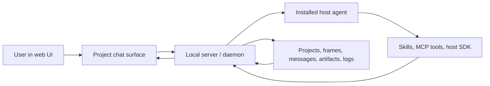

# Chat Routing And Runtime State

This note distills how the inspected systems make a web chat surface feel like
the host agent without sending the user back to the host-agent CLI/UI.

## Core Model

The web UI is not a separate LLM client. It is a projection over local
host-agent state owned by the local server/daemon.



The browser owns the interaction surface. The local server owns durable state
and starts or resumes host-agent work. The host agent still reasons and calls
tools, but the browser renders the resulting messages, tool events, artifacts,
and provenance from server state.

## Claude Science Findings

Visual references:

- Project workspace: `screenshots/61-claude-science-project-reopen.png`
- Library pane: `screenshots/62-claude-science-library-pane.png`
- Artifact split pane: `screenshots/63-claude-science-library-artifact-split.png`
- Artifact actions: `screenshots/64-claude-science-split-artifact-actions.png`
- Provenance Code: `screenshots/65-claude-science-library-provenance-pane.png`
- Provenance Execution Log: `screenshots/66-claude-science-library-execution-log.png`
- Provenance Messages: `screenshots/67-claude-science-library-provenance-messages.png`
- Session step stack: `screenshots/129-claude-science-session-step-stack.png`
- Step command detail: `screenshots/130-claude-science-step-command-detail.png`
- Step output expanded: `screenshots/131-claude-science-step-output-expanded.png`
- Artifact library split pane: `screenshots/132-claude-science-artifacts-split-pane.png`
- Artifact actions menu: `screenshots/134-claude-science-artifact-actions-menu.png`
- Provenance Code tab: `screenshots/135-claude-science-artifact-provenance-code-tab.png`
- Provenance Execution Log tab: `screenshots/136-claude-science-artifact-provenance-execution-log-tab.png`
- Provenance Messages tab: `screenshots/137-claude-science-artifact-provenance-messages-tab.png`
- Provenance Environment tab: `screenshots/138-claude-science-artifact-provenance-environment-tab.png`
- Provenance Review tab: `screenshots/139-claude-science-artifact-provenance-review-tab.png`

Observed submit/read path in the shipped web bundle:

- Existing frame chat posts through
  `conversations.sendMessage -> POST /frames/:frameId/message`.
- Project-level new-session chat posts through
  `projects.submitRequest -> POST /projects/:pid/request`.
- Generic frame request submission also exists as
  `frames.submitRequest -> POST /request`.
- The browser reads durable transcript state through
  `frames.getMessages -> GET /frames/:id/messages`.
- The browser recovers in-flight state through
  `frames.getStreamingBuffer -> GET /frames/:id/streaming` and
  `frames.getStreamingBuffers -> POST /frames/:id/streaming-batch`.
- Artifact lists come from
  `projects.listArtifacts -> GET /projects/:pid/artifacts`.
- Export/provenance downloads use frame and artifact endpoints such as
  `/frames/:id/bundle` and `/artifacts/:versionId/script-bundle`.

Observed live-update model in the shipped web bundle:

- WebSocket endpoint: `/api/ws`.
- Registry names include `frames`, `framesGlobal`, `messagesDelta`,
  `artifacts`, `textStream`, `toolStdout`, `executionCells`, `jobLog`,
  `managedTranscript`, `fileWatch`, `compaction`, `frameActivity`,
  `rateLimitNotice`, `projectDeleted`, `folders`, `notes`,
  `connectorUpdate`, `connectorSnapshot`, `networkAccessGranted`, and
  `verificationUpdate`.
- Event names visible in the bundle include `frame_update`,
  `frame_messages_delta`, artifact lifecycle events, execution-cell updates,
  activity updates, and verification updates.

Observed persistence model in the local SQLite database:

- `projects`
- `frames`
- `frame_messages`
- `execution_log`
- `artifacts`
- `artifact_versions`
- `artifact_dependencies`
- `events`
- `host_call_log`
- `verification_checks`

For the inspected project state:

- 8 frames
- 7 artifacts
- 136 persisted frame messages on the selected frame
- 40 execution-log cells on the selected frame

The UI behavior follows directly from that model. The transcript is rendered
from `frame_messages`; artifacts are rendered from artifact/version records;
the Execution Log tab is rendered from `execution_log` or artifact
`cell_sources`; the Messages provenance tab is a slice through the same
host-agent transcript. Artifact versions carry richer provenance fields:
`lineage_messages`, `dependency_mappings`, `environment_snapshot`,
`producing_cell_id`, and `cell_sources`.

## Open Design Comparison

Open Design uses the same architectural shape with a clearer daemon naming
boundary:

- The web UI submits a run request to the daemon.
- The daemon starts or resumes the selected host agent.
- The host agent receives Open Design skills/plugins/MCP configuration.
- The daemon normalizes host-agent output into run events, project events,
  conversation messages, files, and artifacts.
- The browser consumes events and refetches public state.

The useful split is two event planes:

```text
GET /api/runs/:run_id/events
GET /api/projects/:project_id/events
```

Run events are the active reasoning loop: assistant text, tool calls, tool
results, status, and terminal state. Project events are the workspace loop:
files, artifacts, conversation creation, and refresh signals that should
survive route changes and page reloads.

Source anchors from the local Open Design checkout:

- `apps/web/src/providers/daemon.ts` builds a daemon transcript from chat
  history, posts `ChatRequest` to `POST /api/runs`, receives `runId`, then
  consumes `GET /api/runs/:runId/events?after=<lastEventId>`.
- `apps/daemon/src/routes/runs.ts` creates the run with `design.runs.create`,
  pins/persists the assistant message, starts host-agent work with
  `design.runs.start(run, () => startChatRun(meta, run))`, exposes
  `GET /api/runs/:id`, `GET /api/runs/:id/events`, and
  `POST /api/runs/:id/cancel`.
- `apps/daemon/src/runtimes/runs.ts` keeps per-run event ids, streams missed
  events to reconnecting clients, fans new events out to SSE clients, writes an
  optional run event log, and guarantees a terminal event to reattached
  clients.
- `apps/web/src/providers/project-events.ts` connects to
  `/api/projects/:projectId/events`, listens for `file-changed`,
  `live_artifact`, `live_artifact_refresh`, and `conversation-created`, and
  reconnects with exponential backoff.
- `apps/web/src/components/workspace/useConversationChat.ts` proves secondary
  chat surfaces are not separate agents. They reuse `streamViaDaemon`,
  immediately add local user/assistant messages for responsiveness, stream
  deltas into the assistant message, persist terminal messages, and keep the
  daemon run id for retry/reattach.
- `apps/web/src/runtime/tool-renderers.ts` and
  `apps/web/src/artifacts/renderer-registry.ts` are the extension seams:
  per-tool renderers for agent events and manifest-based artifact renderers
  for HTML, deck HTML, React component, Markdown, and SVG.

### Open Design Host-Agent Processing Details

Additional source inspection on 2026-07-04 confirmed the important processing
sequence:

1. The browser does not call a model directly in local-agent mode. It posts a
   chat/run request to the daemon and renders the returned run/conversation
   state.
2. `apps/daemon/src/routes/runs.ts` is the public run boundary. `POST /api/runs`
   creates a durable run record, pins or creates the assistant message, returns
   `runId`, starts `startChatRun`, and exposes `GET /api/runs/:id/events` for
   replayable SSE. The older `POST /api/chat` path is the direct streaming
   variant, but it still creates a daemon run and starts the same host-agent
   path.
3. `apps/daemon/src/server.ts` composes the actual host-agent prompt from
   project metadata, skill bodies, plugin snapshots, memory, design-system
   context, selected files, workspace hints, and the user's message. The browser
   does not assemble that prompt.
4. `apps/daemon/src/runtimes/defs/*.ts` defines how each host CLI is launched.
   Claude Code, Codex, Gemini, Qoder, Copilot, and others differ in stdin
   shape, stream parser, session-resume flags, sandbox flags, and permission
   mode, but the daemon hides those differences behind one run/event contract.
5. `apps/daemon/src/runtimes/runs.ts` owns event ids, SSE replay, terminal
   status, cancellation, child-process cleanup, and optional event-log files.
   This is why browser refresh/reattach can recover a running or completed
   host-agent turn.
6. Artifact and file surfaces are downstream of the run. The daemon parses
   host-agent output, reconciles generated files, computes result packages, and
   emits project events. The browser renders artifacts and files as project
   objects, not as raw CLI stdout.

Open Design's clarifying-question flow is also instructive but should not be
copied literally for permissions. The model emits a `<question-form>` block as
assistant text; the web UI parses it into a Questions surface; submitted answers
become the next normal chat message through the same `/api/chat` or `/api/runs`
path. There is no separate `AskUserQuestion` tool callback. For Genomi,
permission requests are different because a blocked host-agent run must be
retried with an approved tool boundary. The transferable pattern is: render a
product-owned UI object, persist the user's decision on the server, and continue
through the same run contract.

One non-transferable implementation choice: Open Design often launches
non-interactive CLIs with bypass or auto-approval flags so web runs do not hang
on terminal prompts. Genomi should not globally copy that posture because genome
access, source installs, and MCP tool boundaries are product semantics. Genomi's
translation is a visible approval object plus server-owned retry, not silent
permission bypass.

The follow-up source comparison added one important product distinction:
Open Design treats projects, conversations, files, runs, and result packages
as daemon-owned objects that every surface routes through. The web UI, CLI, and
MCP surfaces are not parallel backends. They call the same daemon contracts,
and the daemon resolves the workspace directory, validates host-agent context,
persists run events, and returns public file/artifact state.

Genomi already has the local-first shape, but should not overclaim parity.
Current gaps versus that daemon pattern:

- `POST /api/runs` now exists for browser chat submission, and base
  `genomi.*` sidecar operations can start, poll, cancel, page events, and
  package portal runs through the same project/frame run service when invoked
  against the live portal process; the run-control/readback operations are not
  safe to run in detached short-lived MCP background workers because active
  portal run state is process-local;
- run result packages and event pages now exist at
  `GET /api/runs/:id/result-package` and `GET /api/runs/:id/event-page`, but
  run events are not yet normalized into execution-cell objects with exact
  producing-step links;
- project file tree/search/read now exists for the Genomi-owned workspace, but
  not richer generated-session Library grouping;
- no productized frame fork, side chat, or handoff endpoint;
- sidecar operations are base tools, not a dedicated CLI wrapper with
  higher-level commands yet.

## Genomi Contract

Genomi should keep the same local-first bridge:

1. Browser submits a message to the Genomi portal server.
2. Server creates a project run/frame and persists the user turn.
3. Server sends the prompt, selected material, and current project state to the
   configured host agent.
4. Host agent uses Genomi skills and MCP tools.
5. Server records assistant messages, Genomi tool calls, tool results, artifact
   records, background jobs, and evidence envelopes.
6. Browser streams run events and project refresh events.
7. Browser refetches public REST state for messages, artifacts, provenance,
   and project metadata.

Genomi-specific constraints:

- Do not make `/start` a product route. Setup belongs in install onboarding.
- Do not make the portal a dashboard-first decode flow. Decode utilities can
  render artifacts, but chat/artifact/provenance is the primary workspace.
- Do not let the browser directly own LLM conversation state. Persist every
  visible state transition through the local server.
- Keep selected material typed: artifact, genome context, assistant checklist,
  result node, evidence panel, evidence ledger, or tool intent.
- Keep persisted-redacted history display-only until a fresh tool re-check is
  run.
- Keep artifact files versioned. The version id, checksum, content type, and
  provenance should be visible; local snapshot paths should stay private.

## Practical UI Rule

Every visual inspection note in this directory should have a screenshot beside
it. The expected documentation shape is:

```text
Observation -> screenshot path -> source/API/DB evidence -> Genomi implication
```

That keeps the design discussion anchored in the actual behavior of Claude
Science/Open Design instead of drifting into a speculative dashboard rewrite.
